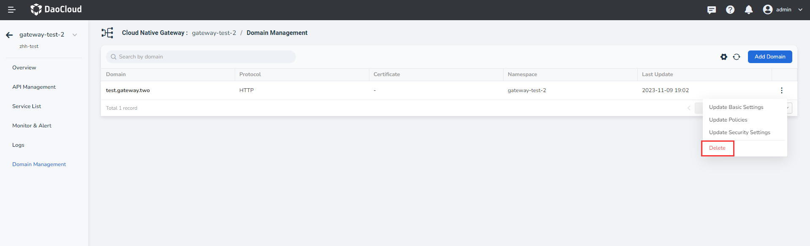
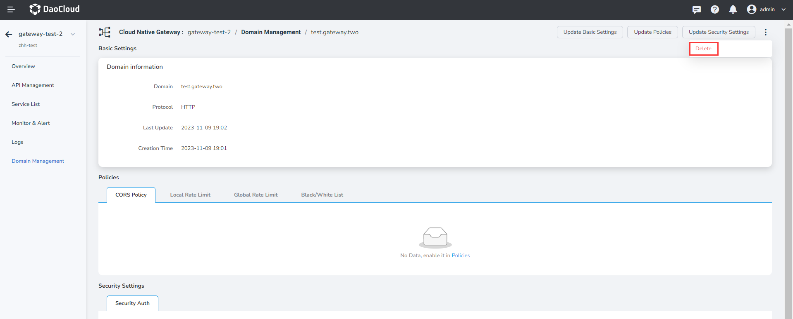
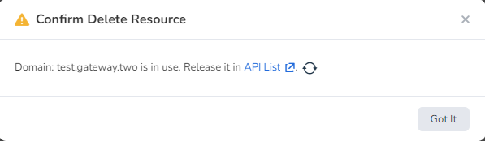

# Delete a domain name

The microservice gateway supports the full lifecycle management of domain names, including adding, updating, and deleting domain names. Through domain name management, you can apply a domain name to multiple apis of the gateway and configure gateway policies at the domain name level.

!!! danger

    - A domain name that is being used by the API cannot be deleted. You need to delete the API before deleting the domain name.
    - The domain name cannot be restored after being deleted.

You can delete a domain name in two ways.

- In the `Domain Management` page to find the need to delete the domain name, the click ** `ⵗ` ** and select `Delete`.

    

- Click on the page to enter details of the domain name, domain name at the upper right corner of the page by clicking on the ** `ⵗ` ** hold and select `Delete`.

    

    If the domain name is being used by an API, click `Check Service Details` to delete the corresponding API. 

    
