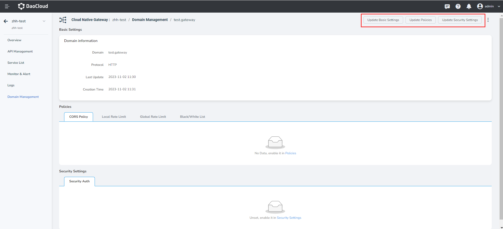

# Update domain name

The microservice gateway supports the full lifecycle management of domain names, including adding, updating, and deleting domain names. Through domain name management, you can apply a domain name to multiple apis of the gateway and configure gateway policies at the domain name level.

You can modify the basic information and policy configuration of a domain name in two ways.

- In the `Domain Management` page find need to update the domain name, on the right side click ** `ⵗ` ** choose `Edit Basic Settings` or `Edit Policy Settings` or `Edit Security Settings`.
     
     

- Click the domain name to go to the domain name details page. Click `Edit Basic Settings` at the upper right corner of the page to update basic information and `Edit Policy Settings` to update policy and `Edit Security Settings` to update security settings.

    
