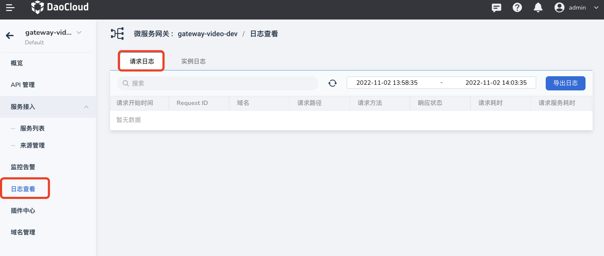
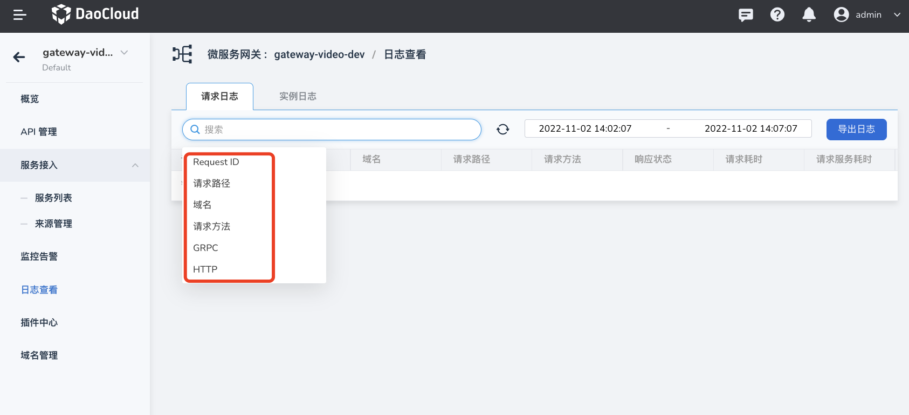
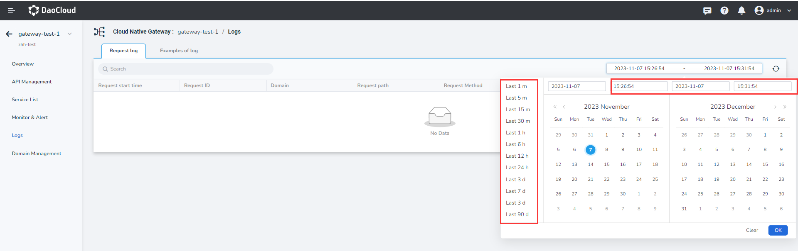
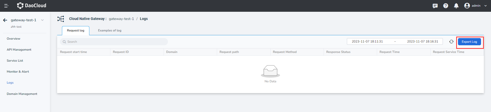

# Request log

The microservice gateway supports viewing request logs and instance logs. This page describes how to view instance logs and how to view logs.

## Viewing mode

Click the name of the target gateway to enter the gateway overview page, and then click `Check Logs` -> `Request Logs` in the left navigation bar.

## Related operation

- Filtering logs: Logs are filtered by Request ID, request path, domain name, request method, HTTP, and GRPC. Logs are sorted by request start time, request time, and request service time.

    

- Set a time range: You can select logs that last 5 minutes, 15 minutes, or 30 minutes, or set a time range.

    

- Export logs: You can export log files to a local PC.

    
