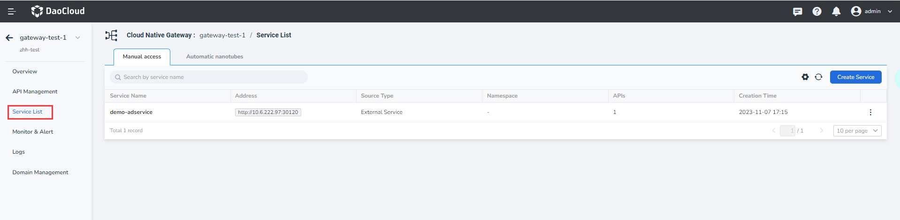
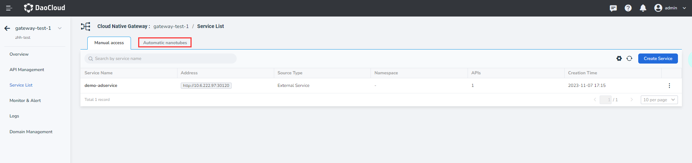
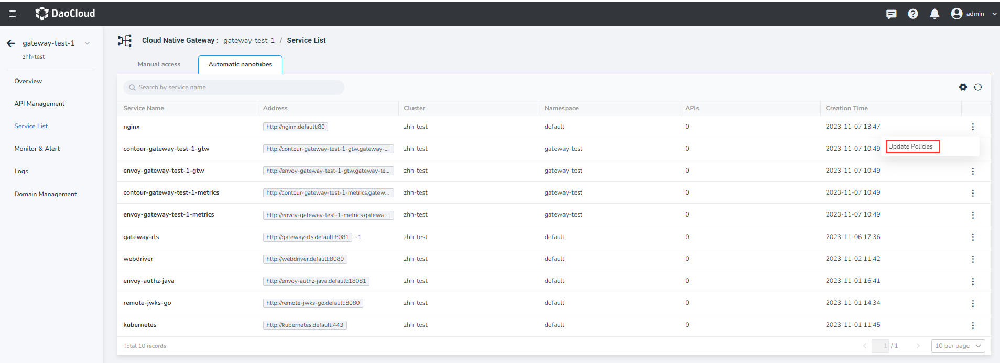
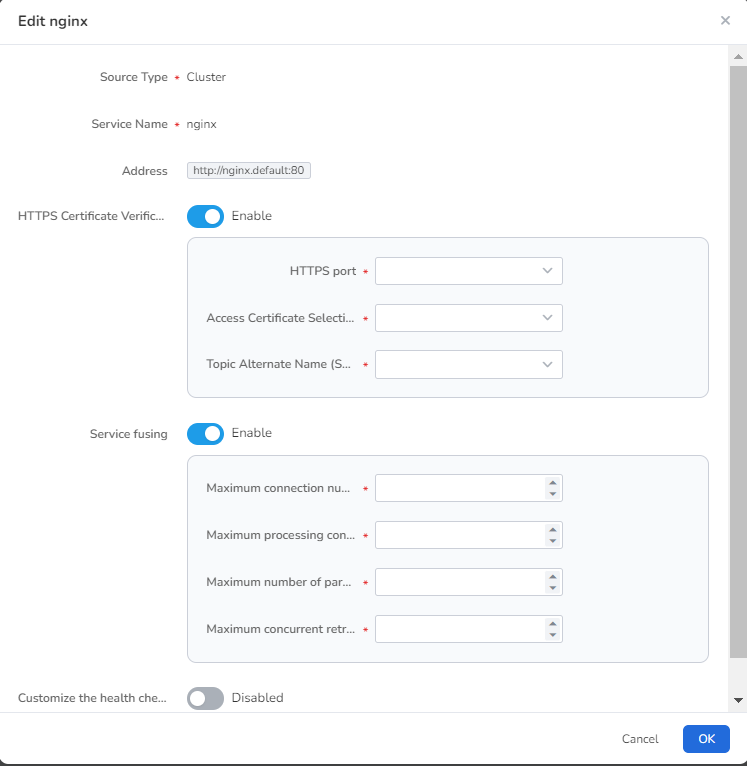
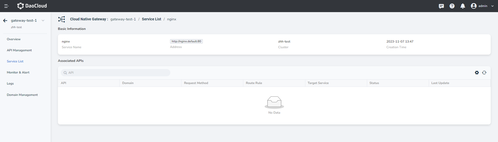

# Automatic management service

The services that are successfully added will be displayed on the service list page. You can also select the services in the list as the target back-end services when adding apis. The microservice gateway supports manual access and automatic management to add services. This page describes how to automatically manage services.

After [created a gateway](../index.md) succeeds, the services in the service source are automatically added to the service list of the gateway instance without manual addition.

## View automatic managed services

1. In the `Gateway List` page click the name of the target gateway, enter the gateway overview page, in the left navigation bar click `Add Service` -> `Service List`.

    

2. On the `Service List` page click `Auto Add`.

    

## Configure service policy

1. In the `Service List` -> `Auto Add` page to find the target service, on the right side click  `ⵗ`  choose `Policy Settings`.

    

2. To adjust the service policy configuration as required, click `OK` in the lower right corner of the pop-up box.

    - HTTPS certificate verification: After HTTPS is enabled, you must pass certificate verification to access the service successfully.
    - Service circuit breaker: When the maximum number of connections, processing connections, parallel requests, and parallel retries  Any one  reaches the threshold, service calls are automatically cut off to protect the overall system availability. When the metric drops to a set threshold, calls to the service are automatically resumed.

    

## View service details

1. Locate the target service on the `Service List` -> `Auto Add` page and click the service name.

    

2. View information such as the service name, source, and associated API. Supports sorting by installing `Last Update`.

    

!!! info
    
    For automatically managed services, only the preceding operations are supported. Update or delete services are not supported
