# Manual access service

The services that are successfully added will be displayed on the service list page. You can also select the services in the list as the target back-end services when adding apis. The microservice gateway supports manual access and automatic discovery to add services. This page describes how to manually add services.

** Prerequisites **

You need to add the corresponding service source in Source management so that you can select the corresponding service source type when manually adding services.

## Access service

1. In the `Gateway List` page click on the name of the target gateway, enter the gateway overview page, in the left navigation bar click `Add Service` -- > `Service List`.

    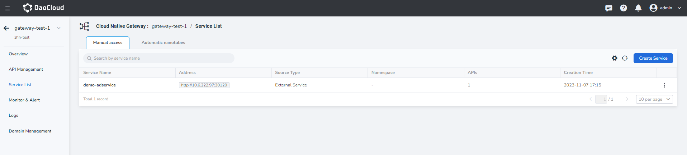

2. Select the service source, configure the service connection information and click `OK`.

    === "Cluster/Service Mesh"

        Select the cluster and namespace where the target service resides, and enter the access protocol, address, and port number.

        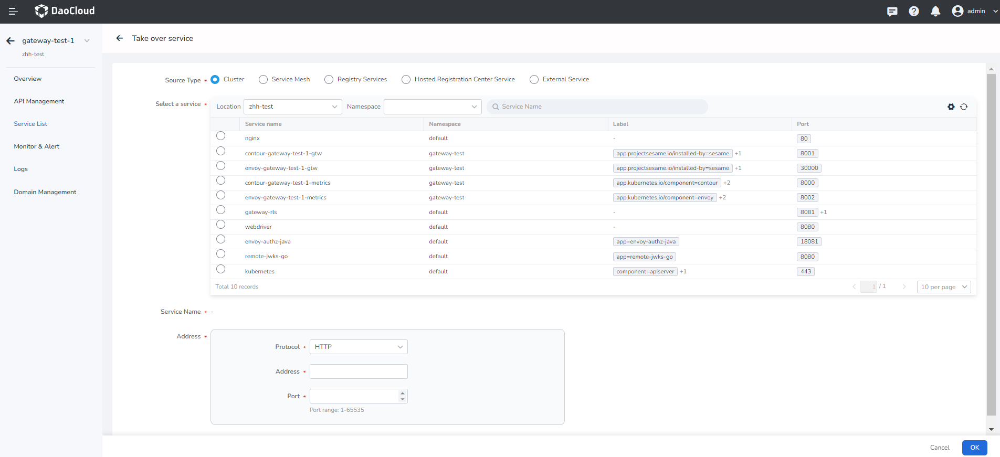

        For the cluster service access, can be in the `Container Management` -- > `Container Network` -- > `Services` click on the service name to view:

        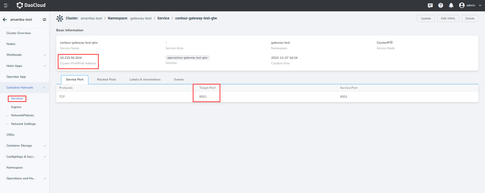

    === "Registry Service/Hosted Registration Center Service"

        - Registry Service: Select the registry where the target service resides, and enter the access protocol, address, and port number.

        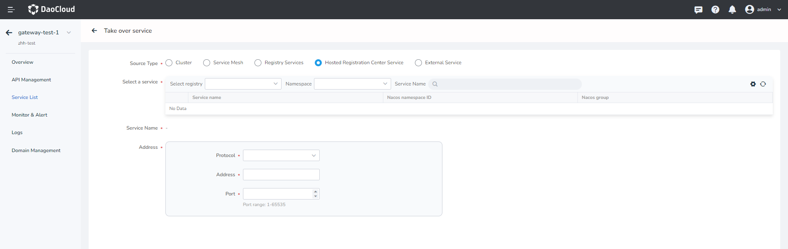

    === "External service" 
         
        Enter the service name, access protocol, address, and port number.
  
        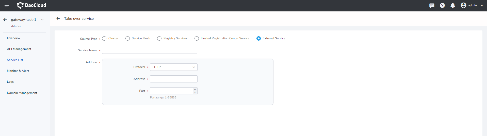

## Viewing service details

1. On the service list page, click the name of the target service to access the service details page.

    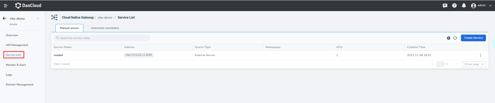

2. View service sources, connection information, and associated apis.

    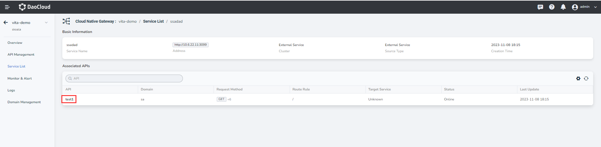

## Update service

### Update basic information

1. In the `Service List` page find need to update the service, in the service of right click ** `ⵗ` **, choose `Basic Info`.

    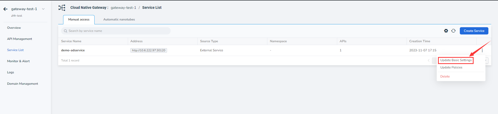

2. To update the basic information, click `OK`.

    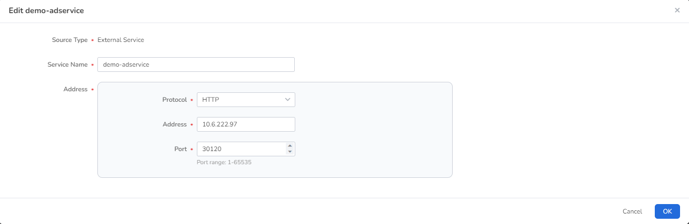

!!! danger
  
    If you choose other services or modify the connection information of external services when updating the basic configuration, the original services will be deleted, which is equivalent to adding a new service. However, the APIs associated with the original service will be automatically associated with the new service.

<!--screenshots-->

### Update policy configuration

1. In the `Service List` page find need to update the service, in the service of right click ** `ⵗ` **, choose `modifying policy settings`.

    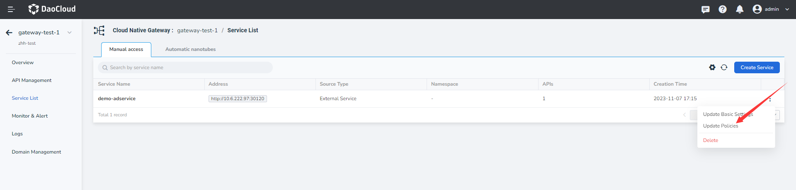

2. To update policy configuration, click `OK`.

    

## Deletion service

In the `Service List` page to find the need to delete the service, in the service of right click ** `ⵗ` **, choose `Delete`.

Before deleting a service, you need to make sure that no apis are using the service. If the service is being used by an API, click `API Management` to delete the associated API as prompted before deleting the service.

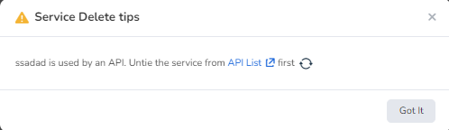
