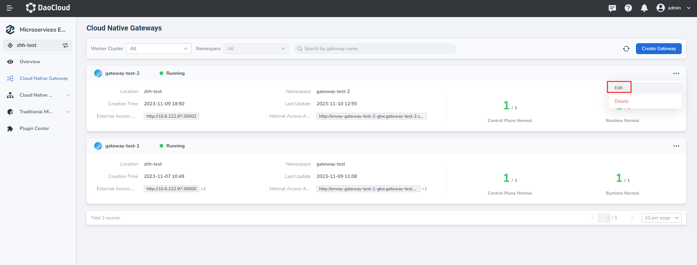
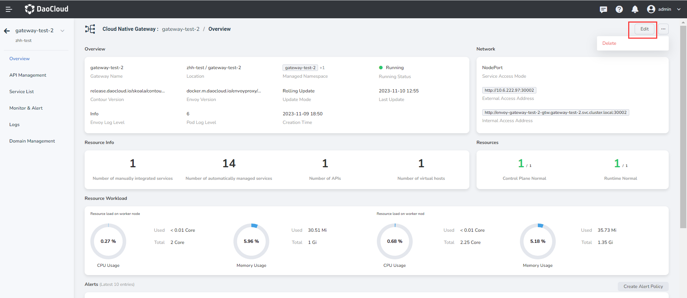

---
hide:
  - heel
---

# Update the microservice gateway

The micro-service gateway supports the high-availability architecture of multi-tenant instances and is compatible with the unified gateway access capabilities of micro-services in various modes. This page describes how to update a microservice gateway instance.

## Update gateway configuration

There are two ways to update the gateway configuration.

- In the `Gateway List` page choose the gateway instance needs to be updated, at the instance of right click ** `⋯` ** and select `Edit`.

    

- Click the gateway name to access the overview page. In the upper right corner, click `Edit`.

    
