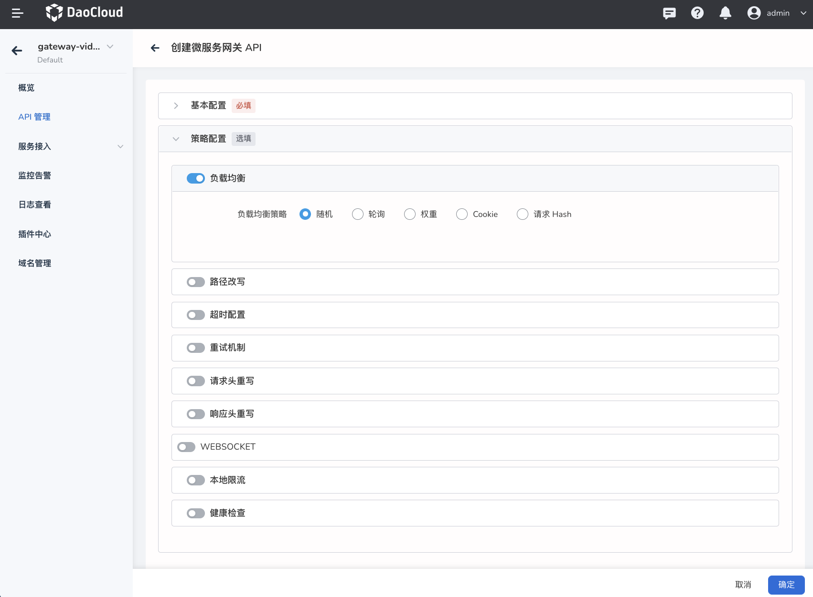

# Add API

The microservice gateway supports the full lifecycle management of the API of the gateway instance, including the addition, update, and deletion of APIs. This page describes how to add APIs.

**Prerequisites**

- There are optional domain names, you can refer to [Domain Name Management](../domain/add-domain.md) to create a domain name.
- If the target service of the API is a backend service, you need to ensure that there is an optional backend service, you can refer to [manual](../service/manual-integrate.md) or [automatic](../service/ auto-manage.md) to access the service.

The steps to create an API are as follows:

1. Click the gateway name to enter the gateway overview page, then click `API Management` in the left navigation bar, and click `Add API` in the upper right corner of the page to enter the API creation page.

    

2. Fill in the configuration information.

    The configuration is divided into two parts: basic configuration and policy configuration. Note when filling in the basic configuration information:

    - API name: Contains lowercase letters, numbers and special characters (- .), cannot start and end with special characters.
    - API Group: Select the group name to which the API belongs. If you enter a group name that does not exist, a new group will be created automatically.
    - Associated domain name: After filling in the associated domain name, you can access the API through `domain name + port number`. You can add a new domain name when the domain name cannot be found, please refer to [Add Domain Name](../domain/add-domain.md).
    - Matching rule: Only requests matching the rule are allowed to pass. If multiple rules are set, all rules must be satisfied at the same time before release. If you add a request header, you need to add the corresponding request header when accessing the API.
    - Request Method: Select the HTTP protocol request method. For detailed descriptions of various request methods, refer to W3C's official document [Method Definitions](https://www.rfc-editor.org/rfc/rfc9110.html#name-method-definitions).
    - Destination Service: Choose to send the request directly to the backend service, or redirect to another service, or return the HTTP status code directly.
    - If you select a backend service, you need to configure the weight. The greater the weight, the more traffic the gateway distributes to it.

        

    Supports nine API strategies: load balancing, path rewriting, timeout configuration, retry mechanism, request header rewriting, response header rewriting, Websocket, local current limiting, and health check. For configuration instructions of each policy, please refer to [API Policy Configuration](api-policy.md).

    

3. Click `OK` in the lower right corner of the page.

    After clicking `OK`, if all configurations are normal, a prompt message `Create gateway API successful` will pop up in the upper right corner. You can view the newly created API on the `API Management` page.

    

4. API launch

    After the API is successfully created, it is offline by default and cannot be accessed at this time. The API needs to be adjusted to be online for normal access. There are two ways to launch the API.

    - Find the API that needs to be updated on the `API Management` page of the API, click **`ⵗ`** on the right side of the API and select `API Launch`.

        

    - Click the API name to enter the API details page, click **`ⵗ`** in the upper right corner of the page and select `API Launch`.

        

!!! info

    Click the API name to enter the API details, and you can view the detailed configuration information of the API, such as online and offline status, domain name, matching rules, target service, policy configuration, etc.