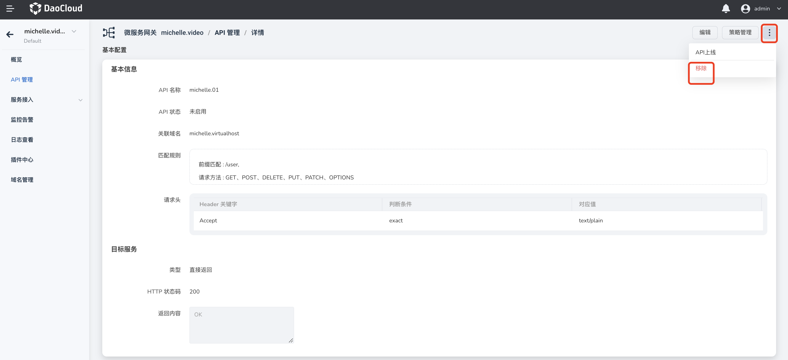

# remove API

The microservice gateway supports the full lifecycle management of the API of the gateway instance, including the addition, update, and removal of APIs. This page describes how to remove the API.

APIs can be removed in two ways.

!!!danger

    Note: Delete operations are irreversible. Deletion is immediately invalid and irreversible, regardless of whether the API is online or not.

- Find the API that needs to be deleted on the `API Management` page, click **`ⵗ`** on the right side of the API and select `Remove`.

    

- Click the API name to enter the API details page, click the **`ⵗ`** operation in the upper right corner of the page and select `Remove`.

    