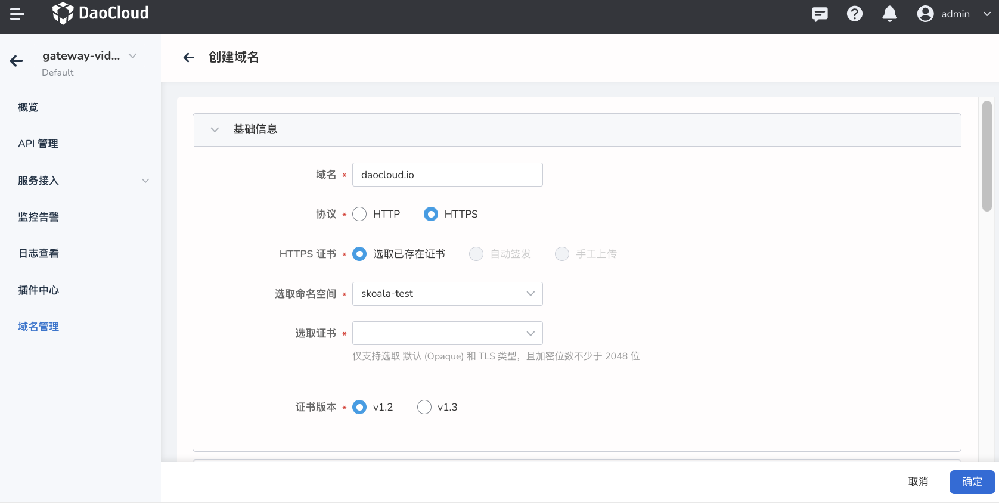

# add domain name

The microservice gateway supports full lifecycle management of domain names hosted in a unified manner, including adding, updating, and deleting domain names. Through domain name management, a domain name can be applied to multiple APIs in the gateway, and gateway policies at the domain name level can be configured. This page describes how to add a domain name.

The steps to add a domain name are as follows:

1. Click the name of the target gateway to enter the gateway overview page, then click `Domain Management` in the left navigation bar, and click `Add Domain Name` in the upper right corner of the page.

    

2. Fill in the configuration information

    Domain name configuration information is divided into two parts: `basic information` (required) and `policy configuration` (optional).

    - Domain name: After the domain name is created, it cannot be modified.
    - Protocol: HTTP is selected by default. If you choose HTTPS, you need to provide the corresponding HTTPS certificate.

        > At present, only the selection of existing certificates is supported, and the functions of automatically issuing certificates and manually uploading certificates are under development.

        

    - Local current limit: refer to [Local current limit](../api/api-policy.md#_6)
    - Cross-domain: refer to [Cross-domain](domain-policy.md#_2)

        

    <!--
    - HTTPS only: When enabled, the gateway will reject HTTP requests for this domain name
    - Policy configuration: refer to [Configure domain name policy](domain-policy.md)
    -->

3. Click `OK` in the lower right corner of the page

    After clicking `OK`, it will automatically jump to the `Domain Name Management` page, and you can see the newly created domain name in the domain name list.

    