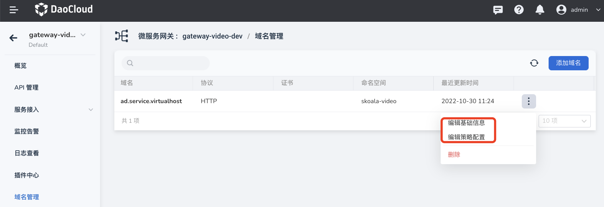

# update domain name

The microservice gateway supports full lifecycle management of domain names hosted in a unified manner, including adding, updating, and deleting domain names. Through domain name management, a domain name can be applied to multiple APIs in the gateway, and gateway policies at the domain name level can be configured.

There are two ways to modify the basic information and policy configuration of the domain name.

- Find the domain name that needs to be updated on the `Domain Name Management` page, click **`ⵗ`** on the right side and select `Edit Basic Information` or `Edit Policy Configuration`.

    

- Click the domain name name to enter the domain name details page, click `Modify Basic Configuration` in the upper right corner of the page to update the basic information, and click `Modify Policy` to update the policy.

    