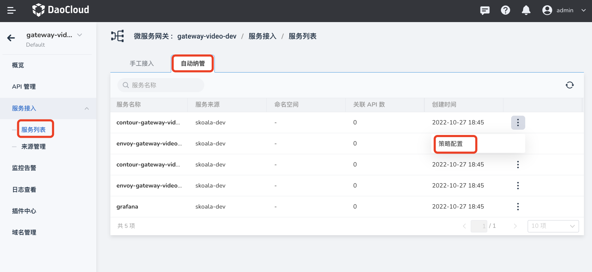
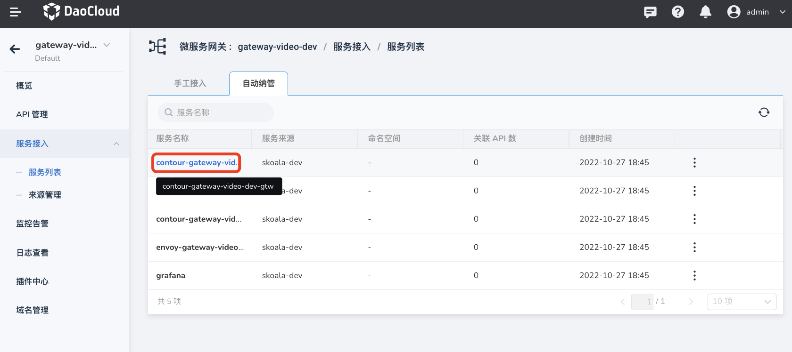

# Automatic management service

The successfully added service will appear on the service list page, and you can also select the service in the list as the target backend service when adding an API. The microservice gateway supports adding services through manual access and automatic management. This page describes how to automatically manage services.

After [Gateway instance creation](../gateway/create-gateway.md) is successful, the services in the service source <!--link to be added--> will be automatically added to the service list of the gateway instance, no need to manually Add to.

## View automatically managed services

1. Click the name of the target gateway on the `Microservice Gateway List` page, enter the gateway overview page, and click `Service Access`-->`Service List` in the left navigation bar.

    

2. On the `Service List` page, click `Automatic Management`.

    

## Configure service policy

1. Find the target service on the `Service List`->`Automatic Management` page, click **`ⵗ`** on the right side and select `Policy Configuration`.

    

2. Adjust the service policy configuration as needed, and click `OK` in the lower right corner of the pop-up box.

    - HTTPS certificate verification: After it is enabled, the service must pass the certificate verification to successfully access the service.
    - Service fusing: When any of the maximum number of connections, maximum number of processed connections, maximum number of parallel requests, and maximum number of parallel retries **any one** indicator reaches the set threshold, the call to the service is automatically cut off to protect the overall system availability. When the indicator drops to the set threshold, the call to the service is automatically resumed.

        

## View service details

1. Find the target service on the `Service List`->`Automatic Management` page, and click the service name.

    

2. Check the service name, source, associated API and other information. Support installation sorting by `last update time`.

    

!!! info

    For automatically managed services, only the above operations are supported, and operations to update and delete services are not supported.