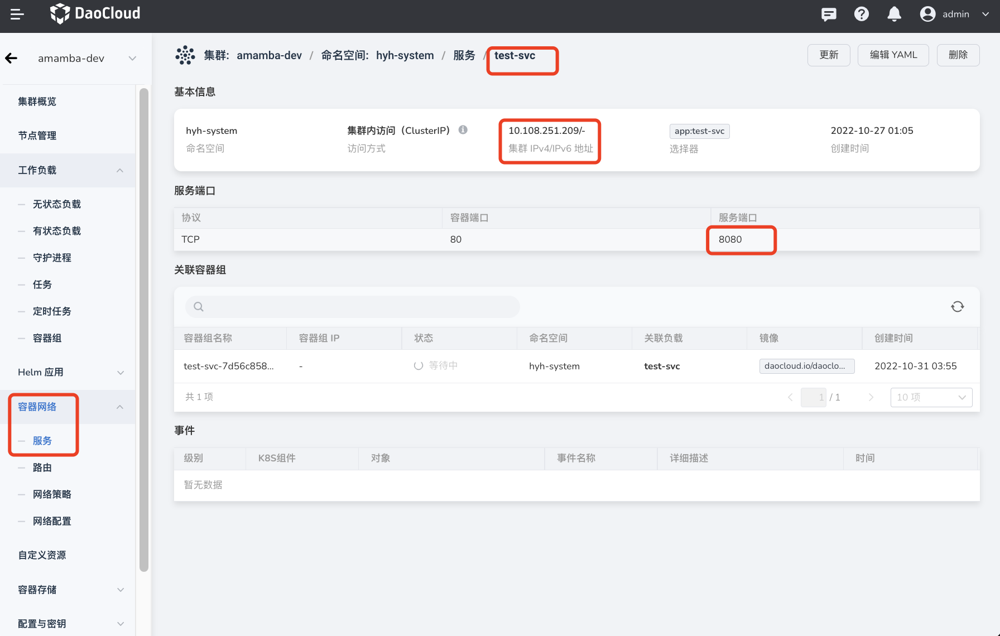
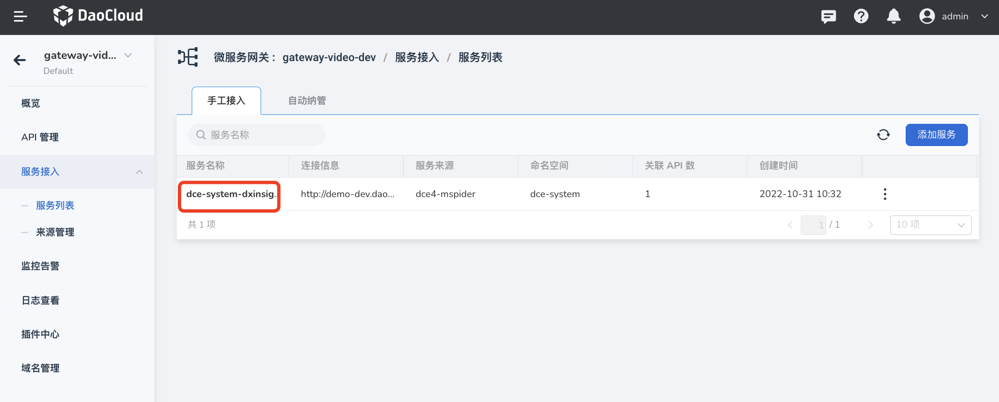
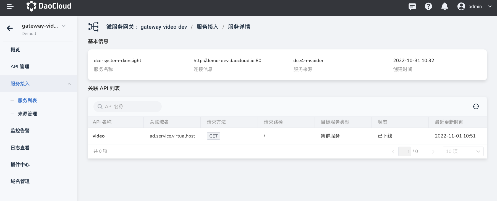
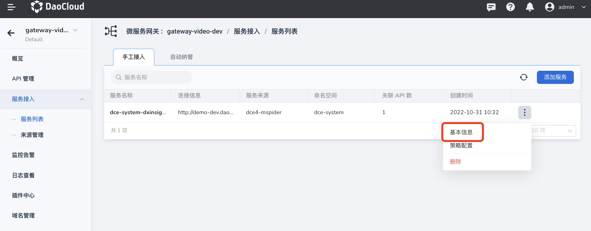

# Manually access the service

The successfully added service will appear on the service list page, and you can also select the service in the list as the target backend service when adding an API. The microservice gateway supports adding services through manual access and automatic discovery. This page describes how to manually access the service.

**Prerequisites**

You need to add the corresponding service source in the source management <!--to-be-supplemented link--> in advance, so that you can select the corresponding service source type when manually accessing the service.

## access service

1. Click the name of the target gateway on the `Microservice Gateway List` page, enter the gateway overview page, and click `Service Access`-->`Service List` in the left navigation bar.

    

2. On the `Service List` page, click `Manual Access`-->`Add Service`.

    

3. Select the service source, configure the service connection information, and click `OK`.

    - Cluster service: Select the cluster and namespace where the target service is located, and fill in the access protocol, address, and port.

        

        For the access method of the cluster service, you can click the service name in `Container Management`->`Container Network`->`Service` to view:

        

    - mesh Services:

        The function of accessing mesh services is under development, so stay tuned.

    - Registration Center Service: Select the registration center where the target service is located, and fill in the access protocol, address and port.

        

    - External service: fill in service name, access protocol, address, port.
  
        

## View service details

1. Click the name of the target service on the service list page to enter the service details page.

    

2. Check the service source, connection information, associated API and other information.

    

## Update service

### Update basic information

1. Find the service that needs to be updated on the `Service List` page, click **`ⵗ`** on the right side of the service, and select `Basic Information`.

    

2. Update the basic information and click `OK`.

    

!!! danger

    If other services are selected when updating basic information, the original service will be deleted, which is equivalent to adding a new service. But the API associated with the original service will be automatically associated with the new service.

### Update policy configuration

1. Find the service that needs to be updated on the `Service List` page, click **`ⵗ`** on the right side of the service, and select `Policy Configuration`.

    

2. Update the policy configuration and click `OK`.

    

## delete service

Find the service to be deleted on the `Service List` page, click **`ⵗ`** on the right side of the service, and select `Delete`.

Before deleting a service, you need to make sure that no APIs are using the service. If the service is being used by an API, you need to follow the page prompts and click `API Management` to delete the associated API before deleting the service.

