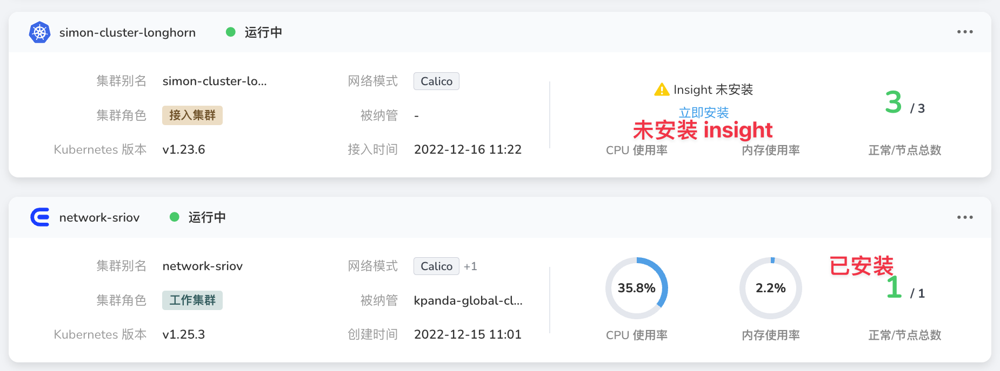

# Install microservice engine

## Preface

This tutorial is intended to complement the manual installation and upgrade methods.

Install via the installer first [https://docs.daocloud.io/install/intro/](https://docs.daocloud.io/install/intro/) , please refer to the official tutorial document.

### Installer v0.3.28 and before

The default installation does not support; during installation planning, you can modify mainfest.yaml to enable automatic installation of Skoala

```bash
./dce5-installer install-app -m /sample/manifest.yaml
```

### Installer v0.3.29 and later

> When installing, pay attention to check the current latest version number: [Go to the download page to view the latest version](../../download/dce5.md)

Support for installing Skoala by default; however, it is still recommended to check mainfest.yaml to ensure that Skoala will be installed by the installer.

enable needs to be true, and the corresponding helmVersion needs to be specified:

```yaml
...
components:
   skoala:
     enable: true
     helmVersion: v0.12.2
     variables:
...
```

Important: The default installer version carries the latest tested version at that time; if there are no special circumstances, it is not recommended to update the default helm installation version.

## Pre-installation detection

### Skoala Deployment Structure


### Detect skoala installation

Check whether there are the following corresponding resources in the namespace skoala-system. If there are no resources, it means that Skoala is indeed not installed.

```bash
~ kubectl -n skoala-system get pods
NAME READY STATUS RESTARTS AGE
hive-8548cd9b59-948j2 2/2 Running 2 (3h48m ago) 3h48m
sesame-5955c878c6-jz8cd 2/2 Running 0 3h48m
ui-7c9f5b7b67-9rpzc 2/2 Running 0 3h48m
 
~ helm -n skoala-system list
NAME NAMESPACE REVISION UPDATED STATUS CHART APP VERSION
skoala skoala-system 3 2022-12-16 11:17:35.187799553 +0800 CST deployed skoala-0.13.0 0.13.0
```

### Depends on the installation of common-mysql

skoala needs to use mysql to store the configuration during installation, so the database must exist; in addition, check whether common-mysql has the skoala database.

```bash
~ kubectl -n mcamel-system get statefulset
NAME READY AGE
mcamel-common-mysql-cluster-mysql 2/2 7d23h
```

The recommended database information for skoala is as follows:

- host: mcamel-common-mysql-cluster-mysql-master.mcamel-system.svc.cluster.local
- port: 3306
- database : skoala
- user: skoala
-password:

### About insight-agent

All monitoring information of Skoala needs to rely on the capability of Insight, and the corresponding insight-agent needs to be installed in the cluster;



Impact on Skoala:

- service-monitor will not be installed if skoala-init is installed without first installing insight-agent
- If you need to install service-monitor, please install insight-agent first, and then install skoala-init.

## Installation process

### Initialize the database table

If the skoala database in common-mysql is empty, please log in to the skoala database and execute the following SQL:

```sql
CREATE TABLE `registry` (
`id` bigint(20) unsigned NOT NULL AUTO_INCREMENT,
`uid` varchar(32) DEFAULT NULL,
`name` varchar(50) NOT NULL,
`type` varchar(50) NOT NULL,
`addresses` varchar(1000) NOT NULL,
`namespaces` varchar(2000) NOT NULL,
`deleted_at` timestamp NULL COMMENT 'Time deleted',
`created_at` timestamp NOT NULL DEFAULT current_timestamp(),
`updated_at` timestamp NOT NULL DEFAULT current_timestamp() ON UPDATE current_timestamp(),
PRIMARY KEY (`id`),
UNIQUE KEY `idx_uid` (`uid`),
UNIQUE KEY `idx_name` (`name`)
) ENGINE=InnoDB AUTO_INCREMENT=1 DEFAULT CHARSET=utf8mb4;
 
CREATE TABLE `book` (
`id` bigint(20) unsigned NOT NULL AUTO_INCREMENT,
`uid` varchar(32) DEFAULT NULL,
`name` varchar(50) NOT NULL,
`author` varchar(32) NOT NULL,
`status` int(1) DEFAULT 1 COMMENT '0: off the shelf, 1: on the shelf',
`isPublished` tinyint(1) unsigned NOT NULL DEFAULT 1 COMMENT '0: unpublished, 1: published',
`publishedAt` timestamp NULL DEFAULT NULL COMMENT 'publishedAt',
`deleted_at` timestamp NULL COMMENT 'Time deleted',
`createdAt` timestamp NOT NULL DEFAULT current_timestamp(),
`updatedAt` timestamp NOT NULL DEFAULT current_timestamp() ON UPDATE current_timestamp(),
PRIMARY KEY (`id`),
UNIQUE KEY `idx_uid` (`uid`),
UNIQUE KEY `idx_name` (`name`)
) ENGINE=InnoDB AUTO_INCREMENT=1 DEFAULT CHARSET=utf8mb4;
 
CREATE TABLE `api` (
`id` bigint(20) unsigned NOT NULL AUTO_INCREMENT,
`is_hosted` tinyint DEFAULT 0,
`registry` varchar(50) NOT NULL,
`service_name` varchar(200) NOT NULL,
`nacos_namespace` varchar(200) NOT NULL COMMENT 'Nacos namespace id',
`nacos_group_name` varchar(200) NOT NULL,
`data_type` varchar(100) NOT NULL COMMENT 'JSON or YAML.',
`detail` mediumtext NOT NULL,
`deleted_at` timestamp NULL COMMENT 'Time deleted',
`created_at` timestamp NOT NULL DEFAULT current_timestamp(),
`updated_at` timestamp NOT NULL DEFAULT current_timestamp() ON UPDATE current_timestamp(),
PRIMARY KEY (`id`),
UNIQUE KEY `idx_registry_and_service_name` (`registry`, `service_name`)
) ENGINE=InnoDB AUTO_INCREMENT=1 DEFAULT CHARSET=utf8mb4;
 
INSERT INTO `book` VALUES (1,'book-init','MicroService Pattern','daocloud',1,1,'2022-03-23 13:50:00',null,now(),now() );
 
alter table registry add is_hosted tinyint default 0 not null after namespaces;
alter table registry add workspace_id varchar(50) not null DEFAULT 'default' after uid;
alter table registry add ext_id varchar(50) null after workspace_id;
 
drop index idx_name on registry;
create unique index idx_name on registry (name, workspace_id);
```

  After completing the above operations, there will be 3 tables in the Skoala database. Pay attention to check whether all the corresponding SQLs are valid.

### Configure skoala helm repo

After configuring the skoala warehouse, you can view and obtain the application chart of skoala

```bash
~ helm repo add skoala-release https://release.daocloud.io/chartrepo/skoala
~ helm repo update
```

> Requires Helm to be installed first

Key content: After the Skoala-release is added, there are 2 charts that need attention:

- Skoala is the console service of Skoala,
    - After the installation is complete, you can see the entrance of the microservice engine on the web page
    - Contains 3 components ui, hive, sesame
    - need to be installed in the global management cluster
- Skoala-init is the Skoala component Operator
    - Install only to designated working clusters
    - Contains components: skoala-agent, nacos, contour, sentinel
    - When not installed, a missing component will be prompted when creating the registry and gateway

By default, after installing skoala to kpanda-global-cluster (global management cluster), you can see the entry of the corresponding microservice engine in the sidebar.

### View the latest version of skoala components

Upgrade the deployment script and deploy all components with one click.

Manage the cluster globally, view the latest version of Skoala, and update directly through the helm repo to get the latest;

```bash
~ helm repo update skoala-release
~ helm search repo skoala-release/skoala --versions
NAME CHART VERSION APP VERSION DESCRIPTION
skoala-release/skoala 0.13.0 0.13.0 The helm chart for Skoala
skoala-release/skoala 0.12.2 0.12.2 The helm chart for Skoala
skoala-release/skoala 0.12.1 0.12.1 The helm chart for Skoala
skoala-release/skoala 0.12.0 0.12.0 The helm chart for Skoala
 …
```

> When deploying skoala, it will carry the latest front-end version at that time. If you want to specify the version of the front-end ui,
> You can go to the front-end code warehouse to get the corresponding version number:

In the working cluster, check the latest version of Skoala-init, and update directly through the helm repo to get the latest

```bash
~ helm repo update skoala-release
~ helm search repo skoala-release/skoala-init --versions
NAME CHART VERSION APP VERSION DESCRIPTION
skoala-release/skoala-init 0.13.0 0.13.0 A Helm Chart for Skoala init, it includes Skoala...
skoala-release/skoala-init 0.12.2 0.12.2 A Helm Chart for Skoala init, it includes Skoala...
skoala-release/skoala-init 0.12.1 0.12.1 A Helm Chart for Skoala init, it includes Skoala...
skoala-release/skoala-init 0.12.0 0.12.0 A Helm Chart for Skoala init, it includes Skoala...
 …
```

### Execute the deployment (also applies to upgrades)

Execute the command directly, pay attention to the corresponding version number

```bash
~ helm upgrade --install skoala --create-namespace -n skoala-system --cleanup-on-fail\
     --set ui.image.tag=v0.9.0 \
     --set sweet.enable=true \
     --set hive.configMap.data.database.host=mcamel-common-mysql-cluster-mysql-master.mcamel-system.svc.cluster.local \
     --set hive.configMap.data.database.port=3306\
     --set hive.configMap.data.database.user=root\
     --set hive.configMap.data.database.password=xxxxxxxx \
     --set hive.configMap.data
```
