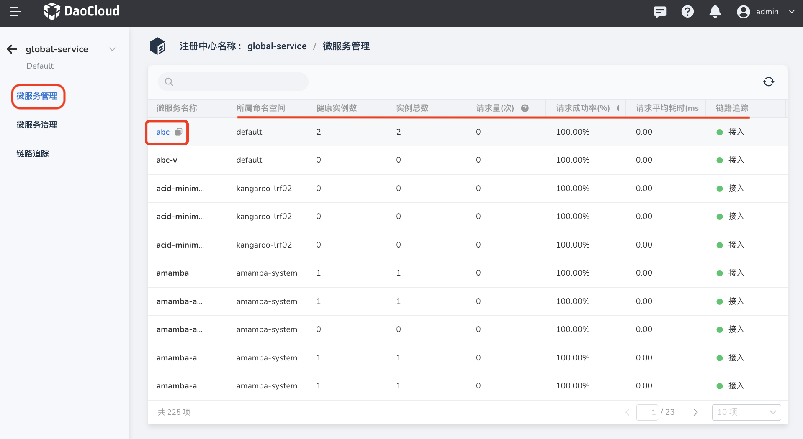
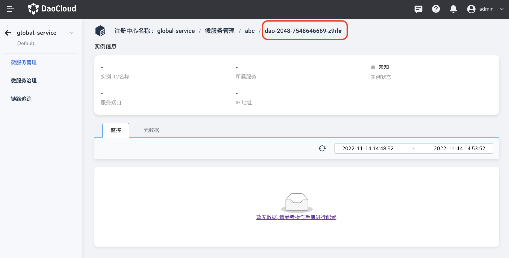
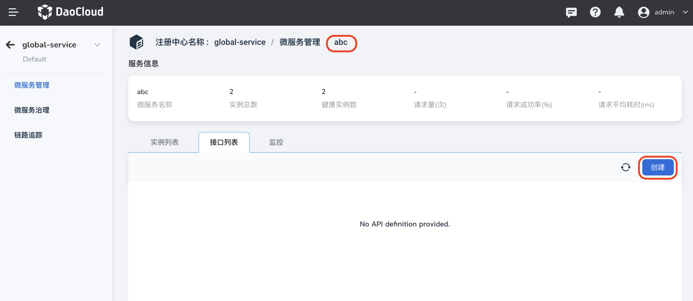
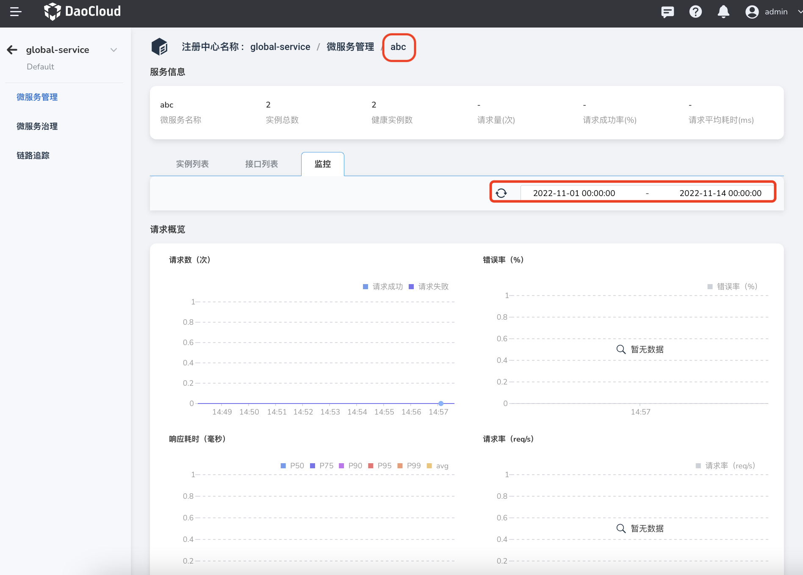

---
hide:
  - toc
---

# Microservice Management

After [connecting to the registry](integrate-registry.md), the microservices in it can be managed through the registry. Microservice management mainly refers to viewing the microservices under the registration center,

!!! note

    Access-type registries only support basic management operations. For more complex management scenarios, it is recommended to create a [managed registry](../managed/registry-lcm/create-registry.md) to perform more advanced operations.

1. On the `Access Registry List` page, click the name of the target registry.

    

2. Click `Microservice Management` on the left navigation bar to view the microservice list and basic information.

    On the current page, you can copy the name of the microservice, and you can view all microservices under the current registration center, as well as the namespace, instance status, and request statistics of each microservice.

    

3. Click the name of the microservice to view the instance list, interface list, monitoring information, etc. of the microservice.

    

    - Instance list: View instance status, IP address, service port, etc.

        Click the instance name to further view the monitoring information and metadata of the instance.

        

    - Interface list: view the interfaces that the microservice already has, or create new interfaces.

        

    - Monitoring information: View the monitoring information of microservices, including the number of requests, error rate, response time, request rate, etc.

        Support custom time range.

        