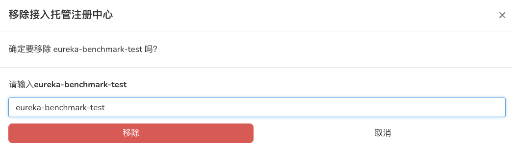

---
hide:
  - toc
---

# remove registry

1. On the `Access Registration Center List` page, select the registration center to be removed, click **`⋯`** on the right and select `Remove`.

    

2. Enter the name of the registry and click `Remove`.

    

!!! note

    Access-type registries only support `remove` operations, while managed-type registries only support `delete` operations. The difference between the two is:

    - Removal: just remove the registration center from the microservice engine of DCE 5.0, and will not delete the original registration center and data, and you can access the registration center again later.
    - Delete: delete the registration center and all the data in it, the registration center cannot be used again later, and a new registration center needs to be recreated.