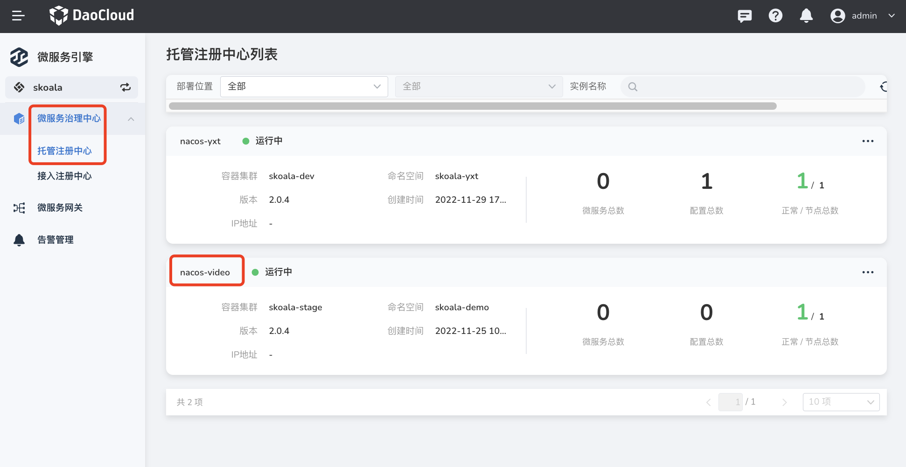
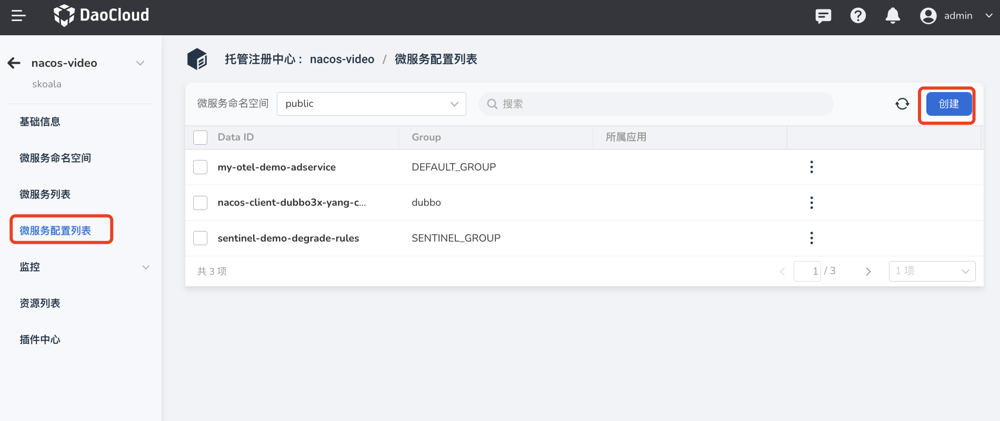
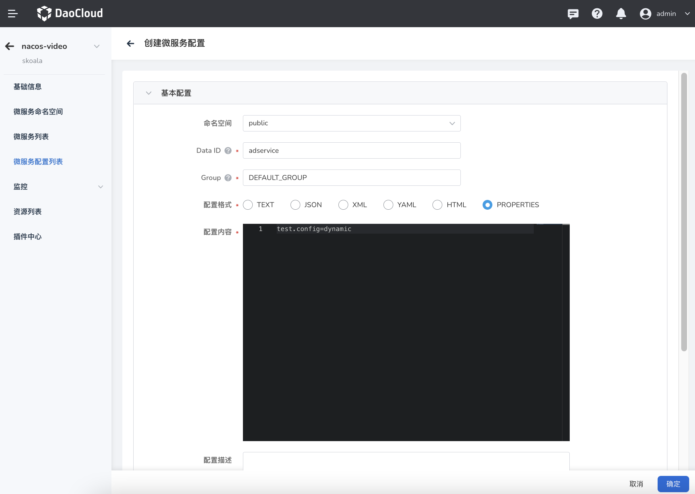
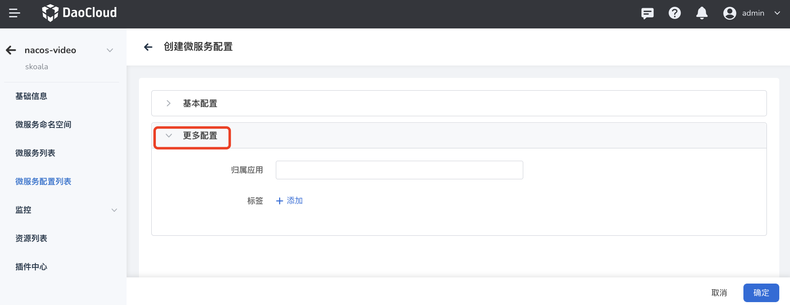
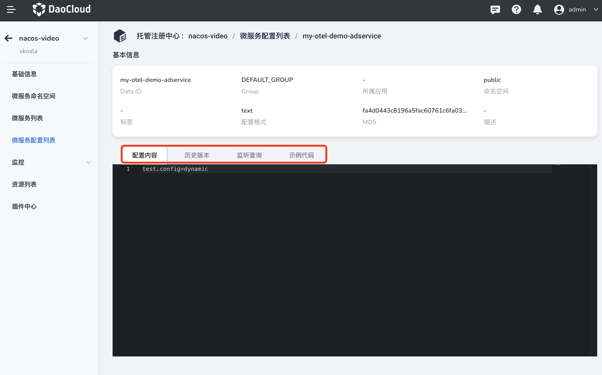

# Microservice configuration list

The microservice engine supports group management of microservices based on the microservice namespace, so as to flexibly manage microservices and a large number of configurations of Spring according to the environment, application, and modules according to their own needs. The configuration list mainly provides core management capabilities such as adding, deleting, modifying and querying microservice configurations, viewing historical versions, rolling back, and querying subscribers.

## New configuration

1. Enter `Microservice Engine` -> `Microservice Governance Center` -> `Hosted Registry` module, click on the name of the target registry.

    

2. Click `Microservice Configuration List` in the left navigation bar, and then click `Create` in the upper right corner.

    

3. Fill in the configuration information

    

    - Namespace: Select the microservice namespace to which the current configuration belongs, the default is `public`

        > **Services and configurations under different namespaces are strictly isolated and cannot refer to each other. For example, services under the A namespace cannot reference configurations under the B namespace. **

    - Data ID: Equivalent to the name of the current configuration file. Data IDs under the same group cannot be repeated.

        The full format is: `${prefix}-${spring.profiles.active}.${file-extension}`.

        - `prefix` defaults to the value of `spring.application.name`, and can also be configured through the ConfigMap `spring.cloud.nacos.config.prefix`.
        - `spring.profiles.active` is the profile corresponding to the current environment. For details, please refer to the Spring Boot documentation. Note: When `spring.profiles.active` is empty, the corresponding connector `-` will not exist, and the splicing format of the Data ID becomes `${prefix}.${file-extension}`.
        - `file-exetension` is the data format of the configuration content, which can be configured through the ConfigMap `spring.cloud.nacos.config.file-extension`.

    - Group: Select the group to which the current configuration belongs, the default is `DEFAULT_GROUP`.

        > **Usually use namespaces to isolate environments, and use groupings to distinguish projects**.

    - Configuration format: set the format of the current configuration file,

    - Configuration content: Enter the ConfigMaps annotated with `@Value` in the service source code.

        - Supports format verification. If there is a format error in the configuration content, the system will automatically prompt the error.
        - ConfigMaps annotated with `@RefreshScope` in the service source code support dynamic updates.

    - More Configurations -> Belonging Application (optional): Select the application to which the current configuration belongs.

        

4. Click `OK` in the lower right corner of the page.

## View configuration

1. Enter `Microservice Engine` -> `Microservice Governance Center` -> `Hosted Registry` module, click on the name of the target registry.

    

2. Click `Microservice Configuration List` on the left navigation bar, and click the Data ID of the target configuration.

    

3. View the basic information, configuration content, historical version, listener, sample code and other information of the configuration.

    - Novices can use the sample code to quickly use the client programming to consume the configuration, lowering the threshold for novices.
    - Support querying the currently configured listener and MD5 check value, so as to know the microservices that are using this configuration and whether the configuration changes have been successfully pushed to the client.

        

## Roll back the historical version

The microservice configuration list will record the historical version of the configuration file, and support one-click rollback to a specific historical version, which is convenient for users to quickly recover when changing the wrong configuration, and reduces the risk of configuration availability in the microservice system. When rolling back, it supports version difference comparison, which is convenient for comparing the difference between the current version and the target rollback version, verifying the modified content, and reducing the risk of error correction.

1. Enter `Microservice Engine` -> `Microservice Governance Center` -> `Hosted Registry` module, click on the name of the target registry.

    

2. Click `Microservice Configuration List` on the left navigation bar, and click the Data ID of the target configuration.

    

3. Click the `Historical Version` tab, find the corresponding record, click `ⵗ` on the right side of the record and select `Rollback`.

    

4. Compare the version differences and confirm, then click `Rollback` in the lower right corner.

    

## update/delete config`

1. Enter `Microservice Engine` -> `Microservice Governance Center` -> `Hosted Registry` module, click on the name of the target registry.

    

2. Click `Microservice Configuration List` on the left navigation bar, and click the `ⵗ` button on the right side of the target configuration to select update or delete as required.

    