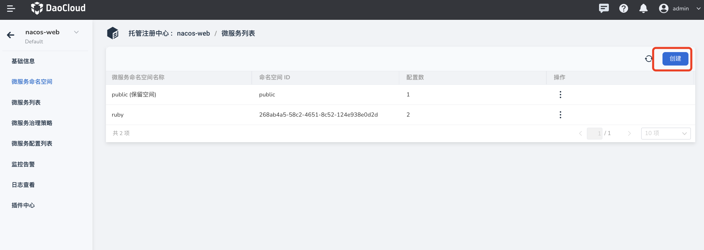
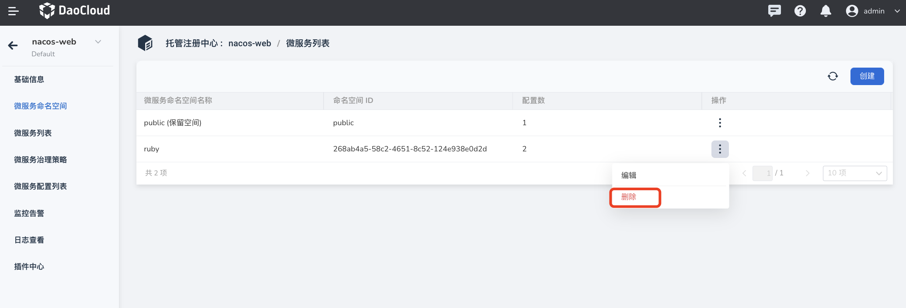

# Microservice Namespace

The microservice namespace can be used to isolate resources such as services and configurations in different environments such as production, development, and testing. The namespace in the microservice engine module refers to the microservice namespace, that is, the namespace in the context of [Nacos](https://nacos.io/docs/what-is-nacos.html), It is not a namespace in the Kubernetes scenario.

!!! note

    - When a managed registry instance is created, a default namespace named **public** is automatically created. This namespace cannot be edited or deleted, and belongs to the reserved namespace that comes with the system.
    - Services and configurations under different namespaces are strictly isolated and cannot refer to each other. For example, services under the A namespace cannot reference configurations under the B namespace.

## Create a microservice namespace

1. Enter `Microservice Engine` -> `Microservice Governance Center` -> `Hosted Registry` module, click on the name of the target registry.

    

2. Click `Microservice Namespace` in the left navigation bar, and then click `Create` in the upper right corner.
  
    

3. Fill in the ID, name and description information of the namespace, and click `OK` in the lower right corner of the page.

    If you do not fill in the ID, the system will automatically generate an ID. **Namespace ID cannot be changed after creation**.

    

## Update the microservice namespace

1. Click `Edit` under the right operation column of the corresponding namespace to enter the update page.

    

2. Modify the name and description of the namespace, and click `OK`.
  
    

## Delete the microservice namespace

Click `Delete` under the right operation bar of the corresponding namespace, and then click `Delete Now` in the pop-up box.

!!! note
  
    Before deleting a namespace, all resources under the namespace must be cleaned up, otherwise the namespace cannot be deleted.

