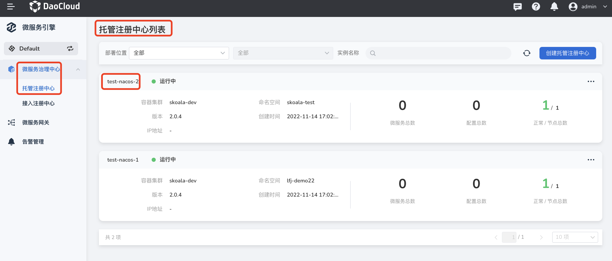
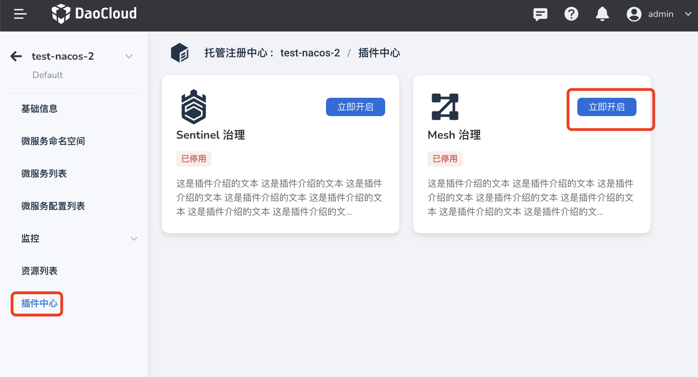

# Enable the Mesh Governance plugin

<!--## prerequisites-->
## Steps

1. On the Managed Registry List page, click the name of the target registry, and then click .

    

2. Click `Plugin Center` on the left navigation bar, and click `Open Now` on the `Mesh Governance` card.

    

3. Select the service mesh you want to bind, and click `OK` at the bottom of the pop-up box.

    If you can't find the service mesh you want, you can go to the service mesh module [create a mesh](../../../../mspider/03UserGuide/servicemesh/create-mesh.md).

    

4. If the prerequisites are met and the configuration is correct, a message "Enabling the Mesh Plugin Successfully" will pop up in the upper right corner of the page.

    