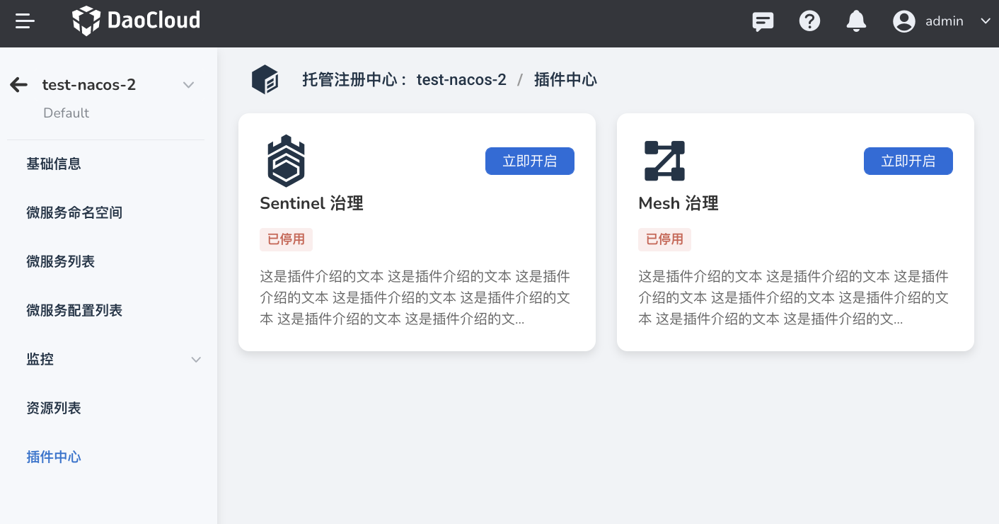

# Plugin Center

The plug-in center provides two plug-ins, Sentinel Governance and Mesh Governance, which support visual configuration through the user interface. After installing the plug-in, the microservice governance capability can be expanded to meet business demands in different scenarios.

!!! info

    The same registry instance cannot enable both plug-ins at the same time, but they can be switched according to different scenarios.

## Sentinel Governance

The Sentinel plug-in is mainly applicable to the governance scenarios of traditional microservices, and supports various governance rules such as flow control rules, circuit breaker rules, hotspot rules, system rules, and authorization rules.

After opening the Sentinel governance plug-in, a Sentinel instance will be created for which resource quotas, deployment mode (single node/high availability) and access methods need to be selected.

## Mesh Governance

The Mesh plug-in is mainly applicable to the governance scenarios of cloud-native microservices, providing governance rules such as virtual services, target rules, gateway rules, peer-to-peer authentication, request identity authentication, and authorization policies.

To enable the Mesh governance plug-in, you need to bind a mesh instance, add microservices to the mesh, and configure resources such as sidecars according to the requirements of the service mesh.