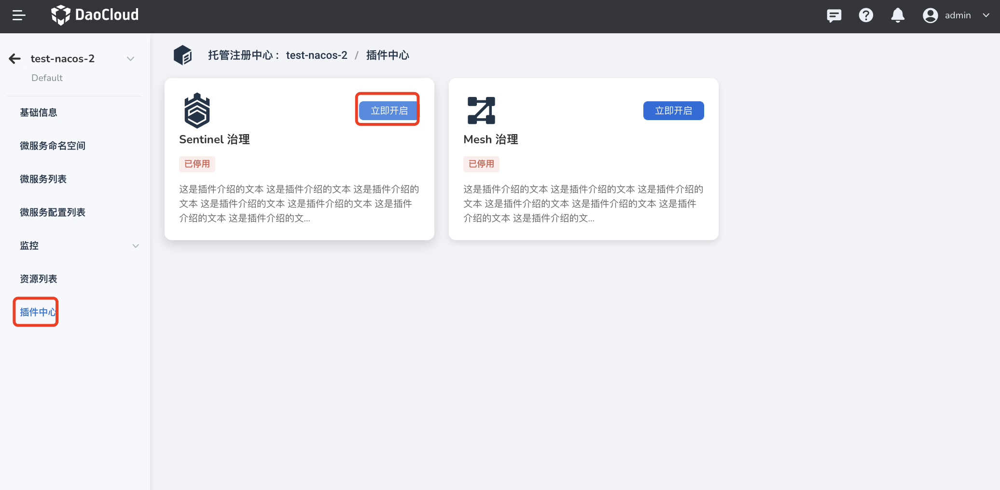
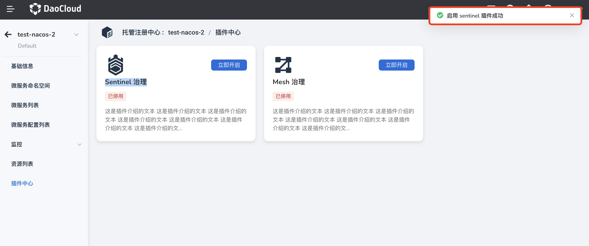

# Enable Sentinel governance plugin

Sentinel is a traffic management component for distributed, multilingual and heterogeneous service architectures. It mainly takes traffic as the entry point, and provides various services from traffic routing, traffic control, traffic shaping, circuit breaker downgrading, system adaptive overload protection, hotspot traffic protection, etc. dimensions to help developers ensure the stability of microservices.

<!--## prerequisites-->

## Steps

1. On the Managed Registry List page, click the name of the target registry, and then click .

    

2. Click `Plugin Center` on the left navigation bar, and click `Open Now` on the `Sentinel Governance` card.

    

3. Fill in the configuration information, and click `OK` at the bottom of the pop-up box.

    

4. If the prerequisites are met and the configuration is correct, a message "Enable Sentinel plugin successful" will pop up in the upper right corner of the page.

    