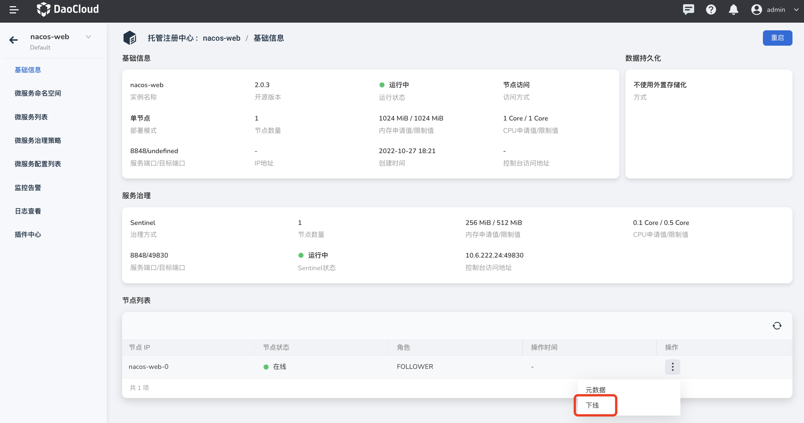
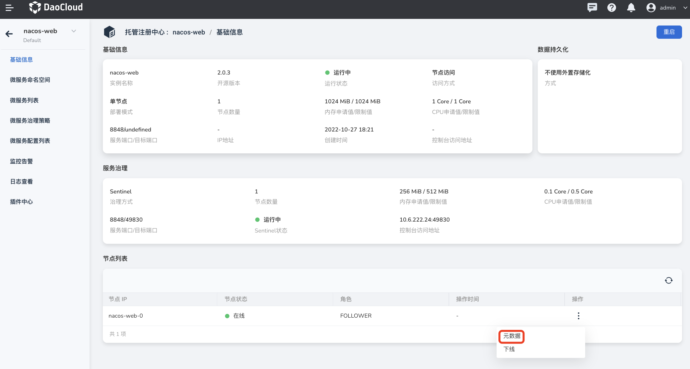

---
hide:
  - toc
---

# View registry details

Find the registry instance whose details need to be viewed on the managed registry list page, and click the instance name to enter the basic information page.

On the basic information page, you can view the registration center's `basic information`, `service governance information` (need to enable the service governance function), `node list`, `data persistence` information, etc.
"Running Status" is part of the registry instance information and is used to reflect the status of the registry instance.

**Related operations**:

- Restart the registry instance: Click `Restart` in the upper right corner of the page to restart the entire managed registry instance.

    

- Node offline: Select the target node in the node list to modify the node status.

    - offline

        Click "Offline" in the "Operation" column to change the status of the node instance to "Offline"

    - online

        Click "Online" in the "Operation" column to change the status of the node instance to "Online"

        

- View node metadata

    