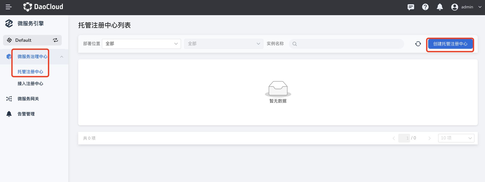
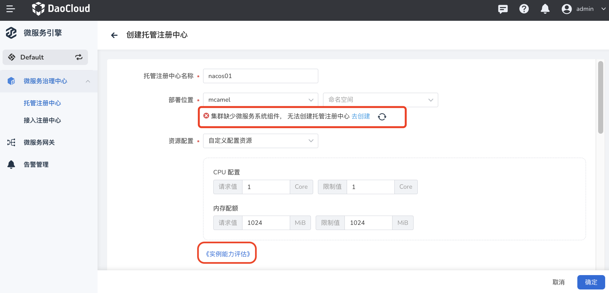
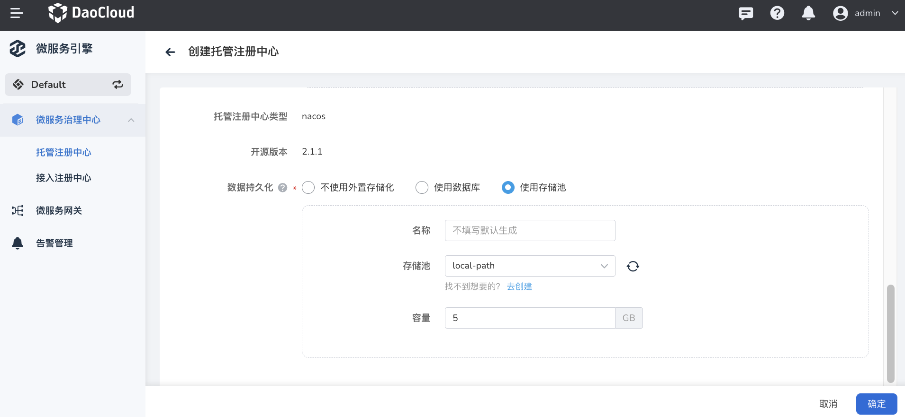

---
hide:
  - toc
---

# Create hosting registry

The microservice engine supports hosting the Nacos registry, that is, a new registry of Nacos type is created from scratch in the microservice governance center, and the registry can be fully managed through the microservice governance center. Compared with the [access registry](../../integrated/integrate-registry.md), the managed registry supports more operations, including viewing the basic information of the registry instance, microservice namespace management , microservice list, microservice configuration list, monitoring alarm, log view, plug-in center, etc.

!!! note

    - The skoala-init component needs to be installed in the **skoala-system** namespace of the target cluster in advance. For specific steps, please refer to [Managing Helm Applications](../../../../kpanda/07UserGuide/helm /helm-app.md).
    - If there is no **skoala-system** namespace in the selected cluster, you can refer to [Create a Namespace](../../../../kpanda/07UserGuide/Namespaces/createns.md) to create one Namespace for **skoala-system**.

The steps to create a hosted registry are as follows.

1. In the left navigation bar, click `Microservice Governance Center`->`Hosted Registry`, and then click `Create Managed Registry` in the upper right corner of the page to enter the creation page of a managed registry instance.

    

2. Fill in the configuration information.

    have to be aware of is:

    - Registry name: supports input of letters, numbers and separators (-), the name cannot be changed after the registry is created.
    - Deployment location: The system will automatically check whether the skoala-init component is installed in the **skoala-system** namespace under the selected cluster.

        - If not installed, registry cannot be created. You can install the component according to the prompt on the page.
        - The deployment location cannot be changed after the registration center is created.

    - Resource configuration: You can directly choose `1 core 2G`, `2 core 4G` and other configurations, or you can customize the configuration resource limit.

        - `1 core 2G` means that the request value and limit value of CPU are 2 cores, the request value and limit value of memory are 2 G, and so on.

        - Click "Instance Capacity Evaluation" to view the throughput (TPS) of mainstream specifications such as 2 Core 4 GiB, 4 Core 8 GiB, and 8 Core 16 GiB.

        

    - Access method: Select `node access` to access the registration center from the outside through **service port + target port**, and select `internal access` to access the registration center only through the service port within the cluster. The default service port is 8848.
    - Deployment mode: When the high availability mode is selected, the number of nodes should not be less than 3. It is recommended to use the `high availability` mode in a production environment.

        

    - Data persistence: It is recommended to use external storage.

        - Do not use external storage: data is stored in the file system of the Pod where Nacos is located. The data will be lost after the pod is restarted, so it is recommended to use external storage.
        - Use database: fill in the name, address, port, user name and password of the database

            

        - Use a storage pool: Select an existing storage pool in the cluster where the registration center resides and configure storage capacity. <!--If you can't find the storage pool you want, you can [create a storage pool] through the container management module. -->

            

3. Click `OK` at the bottom of the page.

    If the operation is correct, a successful creation message will pop up in the upper right corner of the page, and the `Hosted Registry List` page will display the newly created registry instance.

    

!!! info

     - It takes a while to initialize the new registration center, during which it is in the "starting" state. After the initialization is complete, it enters the "Running" state.
     - Click the name of the registration center to view basic information such as the cluster/namespace, running status, resource quota, service port, storage configuration, and node list.