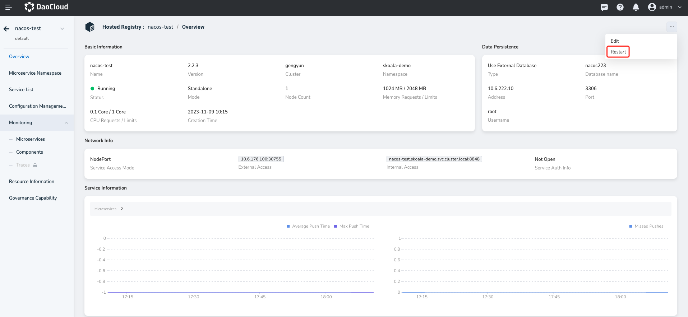
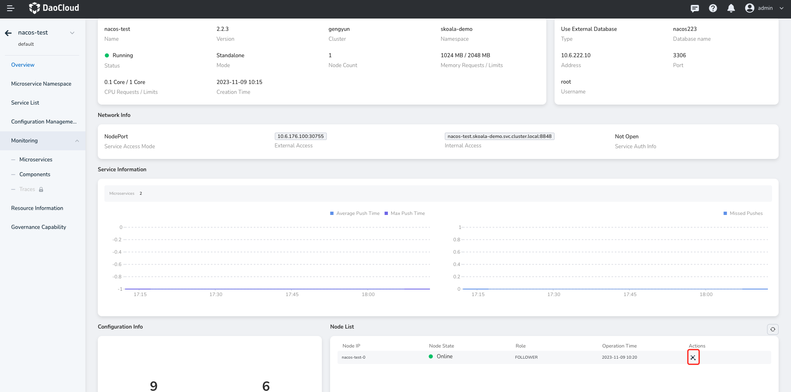

---
hide:
  - heel
---

# View registry details

On the Managed Registry list page, locate the registry instance for which you want to view details and click the instance name to go to the Basic information page.

In basic information page to view the registry `Basic Info`, `Governance Info` (need to open service governance features), `Node List`, `Data Persistence` information, etc. Health Status is the part of the registry instance information that reflects the status of the registry instance.

** Related operation **：

- Restart the registry instance: Click `Restart` in the upper right corner of the page to restart the entire managed registry instance.

  

- View node metadata

  
