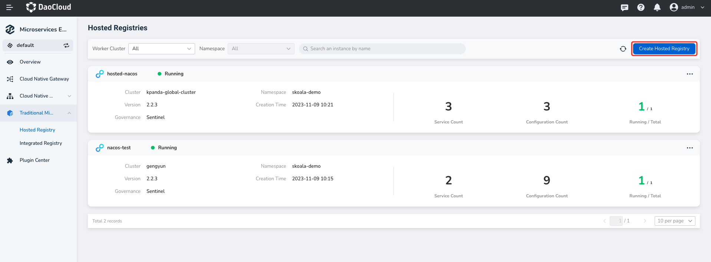
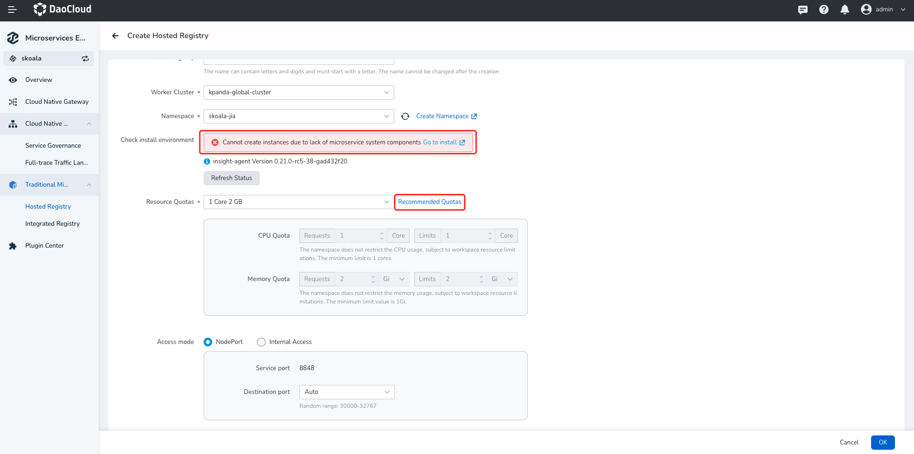
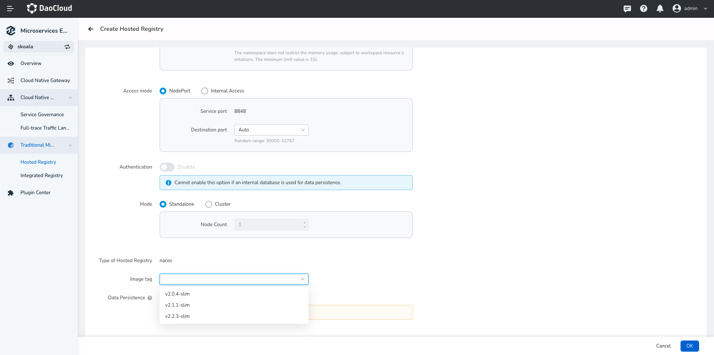
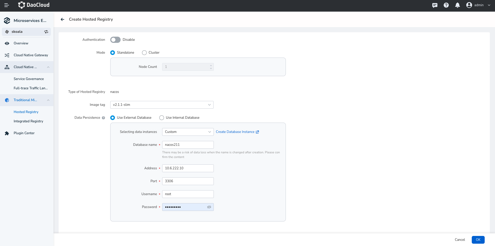
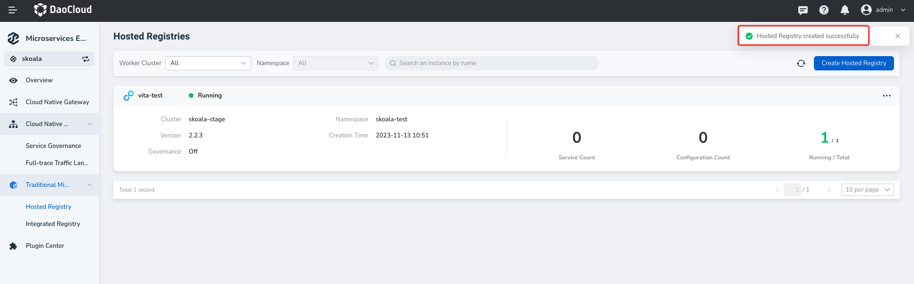

---
hide:
  - heel
---

# Create a managed registry

The microservices engine supports hosting the Nacos registry, which creates a new NacOS-type registry from scratch in the microservices governance Center and can be fully managed through the microservices Governance Center. The managed registry supports more operations than [Integrated Registry](../integrated/integrate-registry.md), including viewing the basic information of the registry instance, microservice namespace management, microservice list, microservice configuration list, monitoring alerts, log viewing, plug-in center, and more.

!!! note

    - Install the skoala-init component in the ** skoala-system ** namespace of the target cluster. For details, see [Manage Helm App](../../../kpanda/user-guide/helm/helm-app.md).
    - If the selected group does not have a ** skoala-system ** namespace, refer to [Create Namespace](../../../kpanda/user-guide/namespaces/createns.md) to create a namespace named ** skoala-system **.

The steps to create a managed registry are as follows.

1. Click `Traditional Microservices`-> `Hosted Registry`in the left navigation bar, and then click `Create Hosted Registry` in the upper right corner of the page to enter the page for creating the hosting registry instance.

   

2. Enter the configuration information.

    What should be noted is:

    - Registry name: Letters, numbers, and delimiters (-) are supported. The registry name cannot be changed after it is created.
    - Deployment location: The system automatically verifies whether the skoala-init component is installed in the **skoala-system** namespace of the selected group.

        - If it is not installed, the registry cannot be created. Follow the prompts on the page to install the component.
        - The deployment location cannot be changed after the registry is created.

    - Resource configuration: You can directly set `1Core2G`, `2Core4G`, or customize the resource quota.

        -  `1Core2G` indicates that the request value and limit value of CPU are 2 cores respectively, the request value and limit value of memory are 2 G respectively, and so on.

        - Click `Recommended Quotas` to see throughput (TPS) for mainstream specifications such as 2 Core 4 GiB, 4 Core 8 GiB, and 8 Core 16 GiB.

      

    - Access mode: If `NodePort` is selected, the registry can be accessed externally through ** Service port + destination port **. If `Internal Access` is selected, the registry can be accessed through service ports only in the cluster where the registry resides. The default service port is 8848.
    - Deployment mode: If high availability mode is selected, the number of nodes must be at least three. In the production environment, the `High Availability` mode is recommended.

      

    - Data persistence: External storage is recommended.

        - No external storage is used: The data is stored in the Pod file system where Nacos resides. Data is lost after the Pod restarts, so external storage is recommended.
        - Using the database: Enter the name, address, port, username, and password of the database

          

3. At the bottom of the page click `OK`.

    If the operation is correct, a message indicating that the registry is created successfully is displayed in the upper right corner of the page. The `Managed Registry List` page displays the new registry instance.

   

!!! info

     - A new registry takes a period of time to initialize and is in the "Starting" state. After the initialization, the system enters the Running state.
     - You can click the registry name to view basic information such as the cluster/namespace, running status, resource quota, service port, storage configuration, and node list.