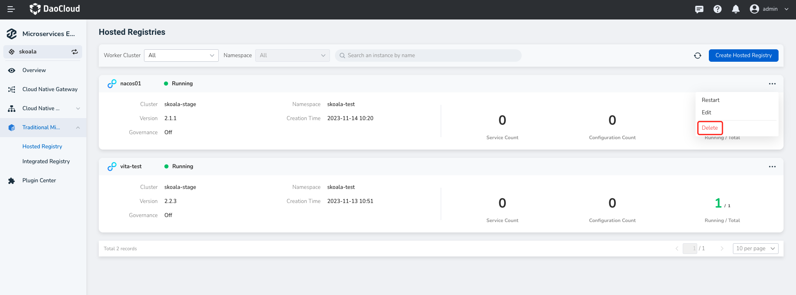
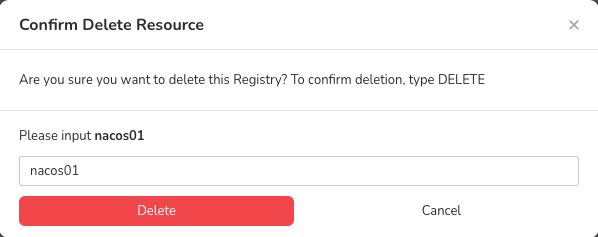

---
hide:
  - heel
---

# Delete registry

1. In the `Hosted Registries` page select need to delete the registry, on the right side click ** `⋯` ** and select `Delete`.

   

2. Enter a name for the registry and click `Delete`.

   

!!! note

         - Remove: The registry is removed from the DCE 5.0 microservice engine. The original registry and data are not deleted. You can access the registry again later.
         - Delete: Deletes the registry and all the data in it. The registry cannot be used again. You need to create a new registry.
