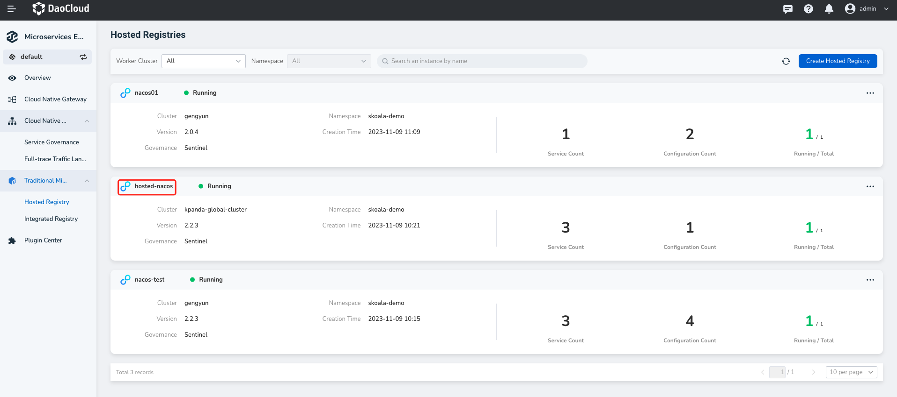
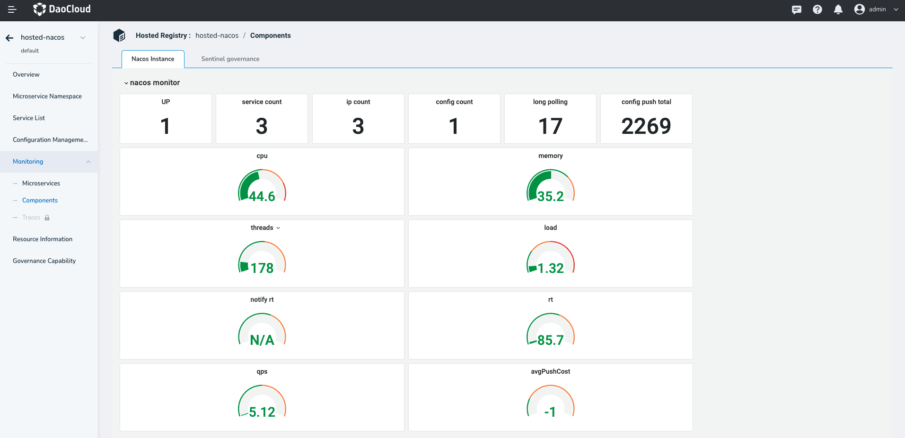
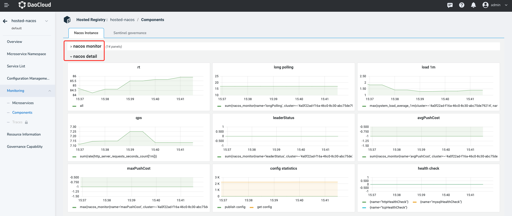
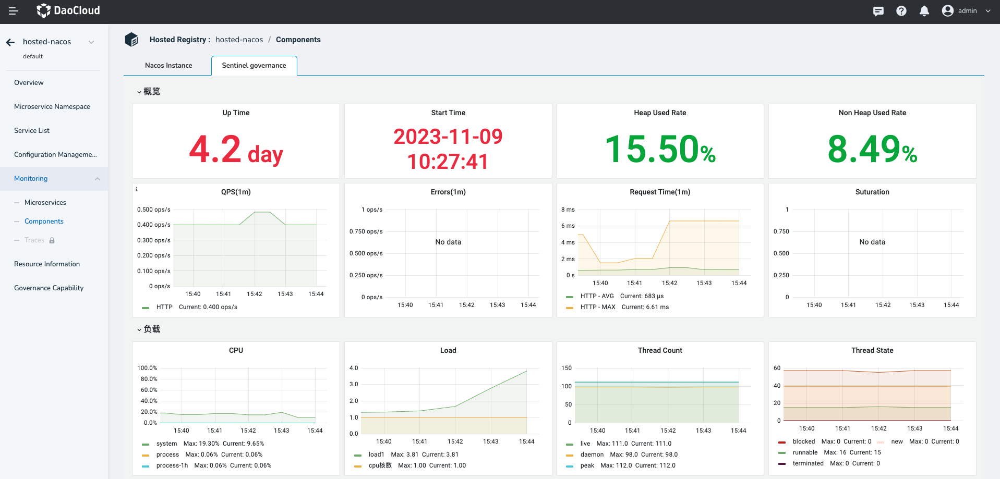

# Component monitoring

The Microservice engine provides a full range of Grafana monitoring capabilities covering various microservices, system components, and service invocation traces. Among them, the component monitoring feature can provide monitoring information for Nacos and Sentinel, including the number of nodes, the number of services, CPU/ memory consumption, the number of JVM threads, the total time of http requests and other dimensions.

To view component monitoring, perform the following steps:

1. Go to the Microservices Engine module and click the name of the target registry.

    

2. In the left navigation bar, click `Monitoring` -> `Components`.

    

3. Click the `Naocs Instances` Tab to view the Nacos instance monitoring information.

    > On the drop-down list page, you can view the statistics about request time and request counts.

    

4. Click the `Sentinel Instances` Tab to view the Sentinel instance monitoring information.

    > On the drop-down list page, you can view the statistics about request time and request counts.

    

## Component Monitoring Metrics Explanation

**Nacos Instance**

| Metric | Meaning    |
| :----- | :--------- |
| Nodes | Number of Nacos nodes |
| Services | Total number of services registered in Nacos |
| IP Count | Number of service instances registered in Nacos |
| Configurations | Total number of configurations in Nacos |
| Config Connections | Number of long-lived connections established and maintained between Nacos instances and servers |
| Read Configs | Statistics on the number of read operations performed on configurations |
| CPU | CPU usage of Nacos instances |
| Memory | Memory usage of Nacos instances |
| JVM Threads | Number of threads running in the JVM of Nacos instances |
| System Load | System load of Nacos |
| Config Notify Time | Time taken to notify all clients subscribed to a configuration when a change is made |
| HTTP Request Time | Total time taken to process an HTTP request, including sending the request, server processing, and response |
| HTTP Requests | Total number of HTTP requests sent by clients to Nacos servers |
| Average Push Time | Average time taken to push service information to all clients subscribed to the service in Nacos registration |
| Config Connections | Number of long-lived connections established and maintained between Nacos instances and servers |
| System Load | System load of Nacos |
| HTTP Requests | Number of HTTP requests sent by clients to Nacos servers within a specific time period |
| Role Status | Role status information of nodes in Nacos servers |
| Average Push Time | Average time taken to push service information to all clients subscribed to the service in Nacos registration |
| Maximum Push Time | Maximum time taken to push service information to all clients subscribed to the service in Nacos registration |
| Read/Write Configs | Statistics and records of read and write operations on configurations in Nacos system |
| Health Check | Health check of Nacos services |

**Sentinel Instance**

| Metric | Meaning |
| :----- | :------ |
| Process Uptime | Uptime of the Sentinel instance |
| Process Start Time | Start time of the Sentinel instance |
| Heap Memory Usage | Percentage of allocated and used heap memory |
| Non-Heap Memory Usage | Percentage of allocated and used non-heap memory |
| QPS (Average 1 min) | QPS (Queries Per Second) of Sentinel |
| Error Count (Average 1 min) | Number of errors (5xx status codes) per minute in Sentinel |
| Request RT (Average 1 min) | Request response time (5xx status codes) per minute in Sentinel |
| Saturation | Number of busy threads currently processing requests in the Tomcat server |
| CPU Usage | CPU usage of the system |
| Load | System load |
| Thread Count | Number of threads |
| Thread States | Statistics of threads in different states |
| Logback Log Count | Number of Logback logs |
| File Descriptors | File descriptors |
| Heap Memory | Heap memory |
| Non-Heap Memory | Non-heap memory |
| Total Memory | Total memory |
| JVM Process Memory | JVM process memory |
| Eden Space | Eden space |
| Survivor Space | Survivor space |
| Tenured Gen | Tenured generation |
| Metaspace | Metaspace |
| Compressed Class Space | Compressed class space |
| Code Cache | Code cache |
| Direct Buffers | Direct buffers |
| Mapped Buffers | Mapped buffers |
| GC Count | Rate of change in JVM garbage collection pauses |
| GC Pause Time | Duration of JVM garbage collection pauses |
| Memory Allocation/ Promotion | Rate of change in allocated memory bytes / rate of change in promoted memory bytes by JVM |
| Loaded Class Count | Number of currently loaded classes |
| Loaded Class Count Delta | Incremental change in loaded class count |
