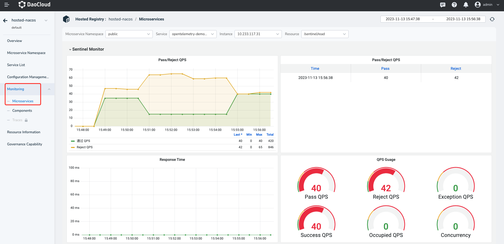
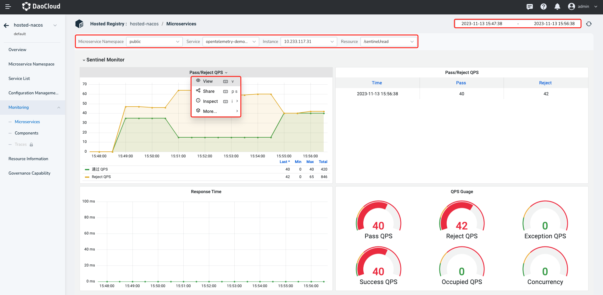

# Microservice monitoring

The Microservice engine provides a full range of Grafana monitoring capabilities covering various microservices, system components, and service invocation traces. The micro-service monitoring feature can provide monitoring information of each micro-service in the managed registry, including service response time, concurrency, abnormal QPS, blocked QPS, passed QPS, successful QPS and other dimensions.

!!! note

    To use the monitoring functionality in the cluster, you need to install the `insight-agent` component. You can follow the installation instructions for the `insight-agent` component by referring to the documentation provided at the following path: `insight/quickstart/install/install-agent.md`.

To view microservice monitoring, perform the following steps:

1. Go to the Microservices Engine module and click the name of the target registry.

    

2. In the left navigation bar, click `Monitoring` -> `Microservices`.

    

3. Select a microservice namespace, service, instance, and resource to view the microservice monitoring data in the namespace.

    > Click the dashboard name to further view or share the monitoring information. You can switch the statistics time window and refresh period in the upper right corner of the page.

    

## Microservice Monitoring Metrics Explanation

| Metric | Meaning  |
| :----- | :------- |
| Throughput/Rejection QPS | QPS (Queries Per Second) of resource requests that were accepted/rejected  |
| Response Time  | Real-time response time of resource requests |
| QPS Dashboard  | QPS (Queries Per Second) of accepted/rejected/abnormal/successful/occupied resource requests and concurrency |
| JDK  | JVM (Java Virtual Machine) information metrics  |
| Status | Health status of application instances  |
| State  | Health status of application instances over a continuous period  |
| Uptime | Running time of the instance  |
| Start time | Start time of the instance  |
| CPU Cores  | Number of available CPU cores |
| Total RAM  | Total size of physical memory |
| Total SWAP | Total size of swap space  |
| Open file descriptors  | Number of open file descriptors |
| Class Loading count  | Number of classes loaded by the application |
| Classes Loaded | Current number of loaded JVM classes |
| CPU Time | CPU time of the current process |
| CPU System load average  | System CPU load average  |
| CPU Process Load (1m avg)  | Average CPU load of the process over 1 minute  |
| CPU System Load (1m avg) | Average system CPU load over 1 minute  |
| Memory Utilization | Percentage of available physical memory used by the instance  |
| SWAP Utilization | Percentage of available swap space used by the instance
| CPU load | CPU usage of the system during runtime |
| Open File Descriptors  | Number of open file descriptors by the process |
| Physical memory  | Size of physical memory  |
| Process Memory | Memory usage by the process  |
| JVM Memory Used [heap] | Used heap memory in the JVM  |
| JVM Memory Used [nonheap]  | Used non-heap memory in the JVM  |
| JVM Memory Usage [heap]  | Percentage of JVM heap memory used relative to the maximum available memory and as a percentage of the total physical memory |
| JVM Memory Usage [nonheap] | Percentage of JVM non-heap memory used relative to the total physical memory  |
| JVM Memory committed | Committed memory size in the JVM |
| Memory pool [Code Cache] | Code cache memory pool in the JVM  |
| Memory pool [Compressed Class Space] | Compressed class space memory pool in the JVM  |
| Memory pool [Eden Space] | Eden space memory pool in the JVM  |
| Memory pool [Metaspace]  | Metaspace memory pool in the JVM  |
| Memory pool [Survivor Space] | Survivor space memory pool in the JVM  |
| Memory pool [Tenured Gen]  | Tenured generation memory pool in the JVM |
| GC count increase  | Incremental count of garbage collection (GC) cycles  |
| GC count rate  | Rate of garbage collection (GC) cycles |
| GC Time increase | Incremental time spent on garbage collection (GC)  |
| GC Time rate | Average rate of garbage collection (GC) cycles |
| JVM Threads current  | Current number of active threads in the JVM  |
| JVM Threads current increase | Incremental change in the current number of active threads in the JVM  |
| JVM Threads current rate | Rate of change in the current number of active threads in the JVM  |
| Class Loading count  | Current number of loaded classes in the JVM  |
| Classes Loaded | Total number of loaded classes in the JVM  |
| Classes Loaded increase  | Incremental change in the number of loaded classes in the JVM  |
| Classes Loaded rate  | Average rate of change in the number of loaded classes in the JVM  |