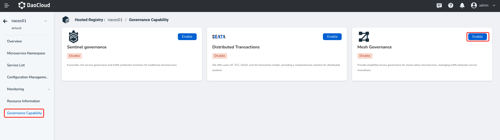
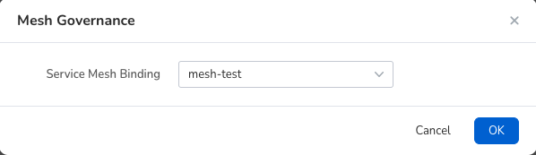

# The Mesh governance plug-in is enabled

## Operation procedure

1. Click the name of the target registry on the Hosting Registry list page, and.

   

2. In the left navigation bar, click `Plugins`, and on the `Service Mesh` card, click `Enable`.

   

3. Select the service mesh you want to bind to and click `OK` at the bottom of the box.

    If you can"t find the service mesh you want, go to the service mesh module [Create Service Mesh](../../../../mspider/user-guide/service-mesh/README.md).

   

4. If the prerequisites are met and the configuration is correct, the "Mesh plug-in enabled successfully" message is displayed in the upper right corner of the page.

   
