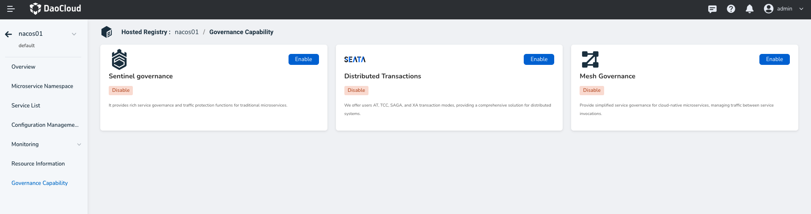

# Plug-in center

The plug-in Center provides two plug-ins, Sentinel governance and Mesh governance, and supports visual configuration through the user interface. After the plug-in is installed, the micro-service governance capability can be expanded to meet service requirements in different cases.

!!! info

## Sentinel governance

Sentinel plug-in is mainly applicable to the governance scenario of traditional micro services, and supports a variety of governance rules, such as flow control rules, circuit breaker rules, hotspot rules, system rules and authorization rules.

When the Sentinel governance plug-in is enabled, a Sentinel instance is created for which you need to set resource quotas, select deployment mode (single node/high availability), and access mode.

## Mesh governance

Mesh plug-in is mainly applicable to the governance scenario of cloud native micro services, providing governance rules such as virtual services, target rules, gateway rules, peer authentication, request authentication, and authorization policies.

To enable the Mesh governance plug-in, bind a mesh instance, add micro-services to the mesh, and configure resources such as sidecar according to the requirements of the service mesh.
