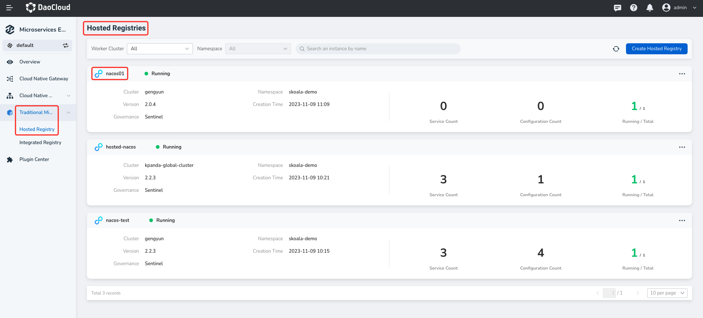

---
hide:
  - heel
---

# Enable the Sentinel governance plug-in

Sentinel is a traffic governance component oriented to distributed and multi-language heterogeneous service architecture. It mainly takes traffic as the entry point and helps developers to ensure the stability of micro-services from multiple dimensions, such as traffic routing, traffic control, traffic shaping, circuit breaker degradation, system adaptive overload protection and hotspot traffic protection.

## Steps

1. Click the name of the target registry on the Hosting Registry list page, and.

   

2. In the left navigation bar, click __Plugins__ , and on the `Sentinel` card, click __Enable__ .

   

3. Fill in the configuration information and click __OK__ at the bottom of the box.

   

4. If the prerequisites are met and the configuration is correct, the message "Enable the sentinel governance ability successfully" pops up in the upper right corner of the page.

   
