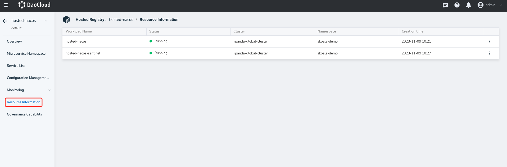

# Resource Information

The Microservice Engine supports viewing the operational status, deployment position, and running logs of the workloads representing the hosted registry and the traffic governance plugins enabled in the registry.

- The workload with the same name as the current registry represents the registry itself.
- If Sentinel governance capabilities are enabled, another instance representing the corresponding Sentinel instance will appear.

