# View microservice details

Click the micro-service name on the service list page to view the service details and further view the instance list, subscribers, monitoring, interface list, metadata, service governance and other information.

## Instance list

Log in to the target registry, click `Microservice List` in the left navigation bar, click the name of the target micro-service, and perform subsequent operations before going to the page for details of the micro-service.

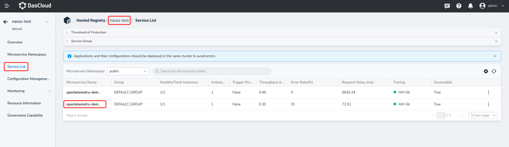

- Adjusting the service traffic weight

    Provides traffic weight control and threshold protection for service traffic, which helps users protect the service provider cluster from unexpected breakdown. You can click the Edit button of the instance to change the weight of the instance. To increase the traffic volume of the instance, increase the weight. To prevent the instance from receiving traffic, set the weight to 0.

  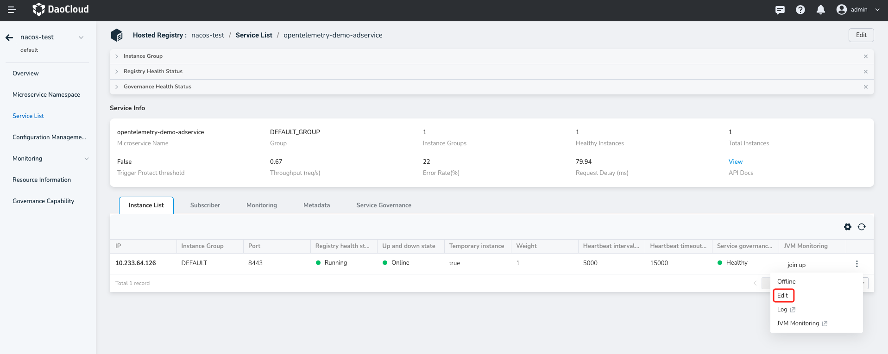

- Instance up and down

    Provides online and offline operations for service instances. In the operation column of the instance list, click `Online` or `Offline` of the instance. Offline instances are not included in the healthy instances list.

  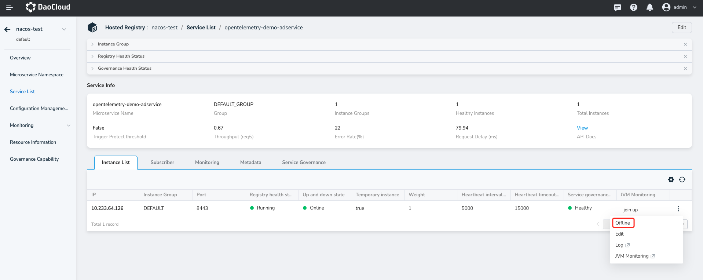

- Instance details

    Click the instance name to access the instance details and view the monitoring and metadata of the instance.

  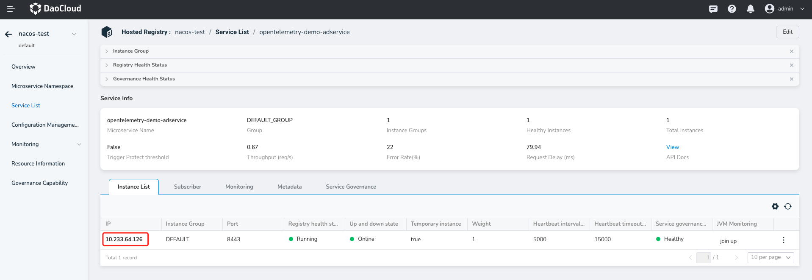

    - Instance monitoring

        The instance monitoring feature monitors the status of the service instance, such as the time sequence curves of the request number, error rate, response time, request rate, CPU metric, memory metric, read/write rate, and receive/send rate of the service instance.

        > In response time, p95 represents that 95% of online requests take less than a certain time.

      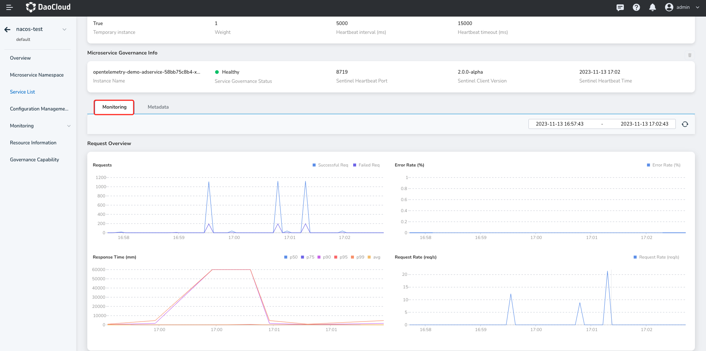

    - Instance metadata

      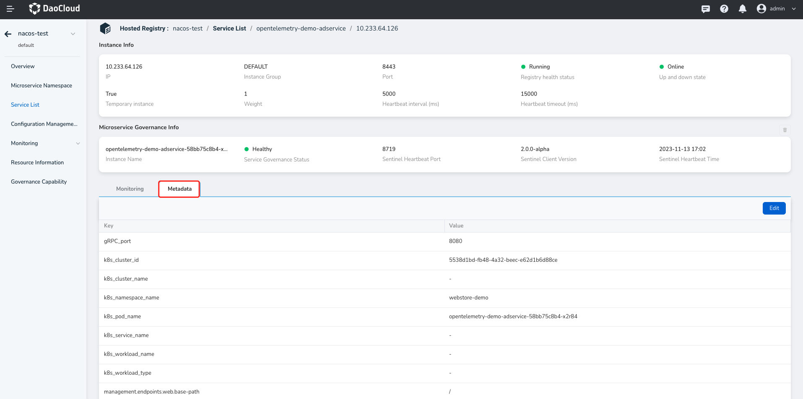

## subscriber

On the subscriber list page, you can view subscriber information, including IP address, port number, client version, and application name.

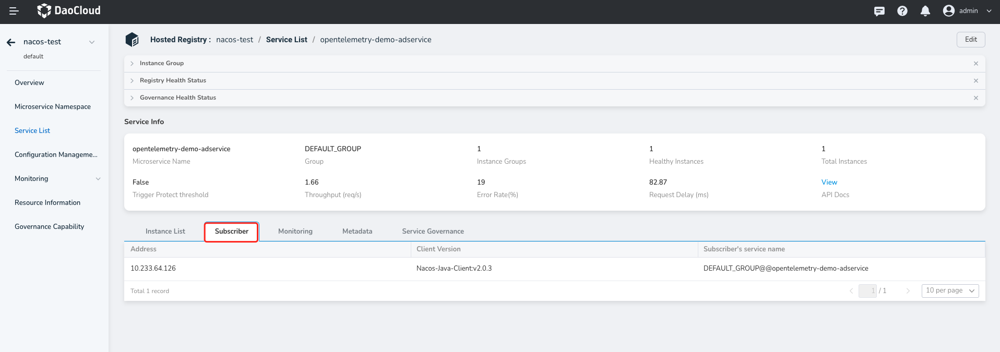

## Service monitoring

Service monitoring Displays the running status of a micro-service in a namespace within a specific time range and determines whether an exception occurs based on micro-service monitoring metrics (number of requests, error rate, response time, and request rate).

> You can change the time range of monitoring data in the upper right corner of the monitoring chart.

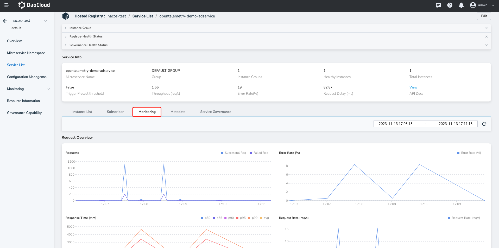

## Microservice metadata

Provides multiple dimensions of service metadata to help users store customized information. This information is stored as a Key-Value data structure and displayed on the console in the format k1=v1,k2=v2.

Click `Edit` on the right to modify the metadata.

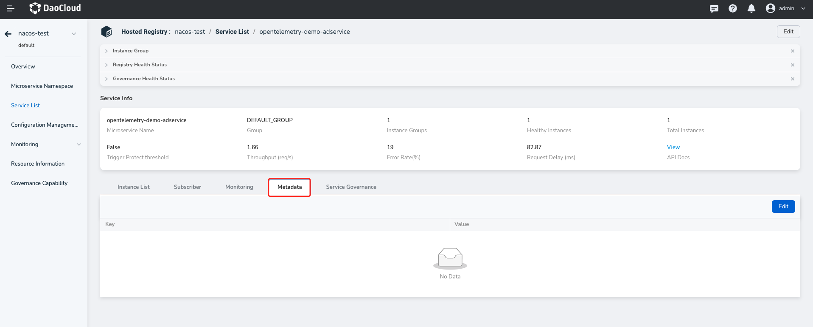

## Microservice governance

With the micro-service governance plug-in enabled, you can create three kinds of governance rules for services: virtual service, target rules, and gateway rules through YAML files or page forms. For more information on micro-service governance, see [Traffic Governance](../../../../mspider/user-guide/traffic-governance/README.md).

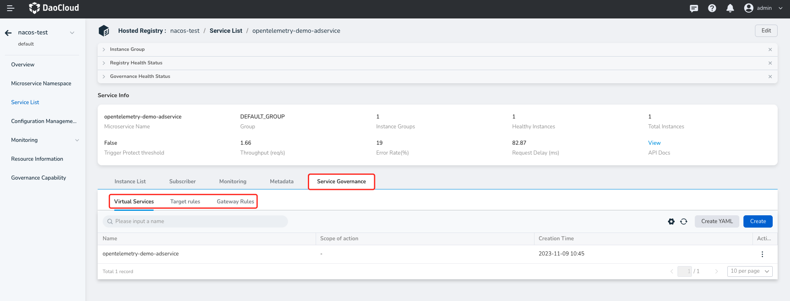

## API Docs

The interface documentation displays the list of APIs exposed by the service. Click on "Import API Docs" on the right to manually enter the API. There are two ways to import: Address to Import and Manual Import.

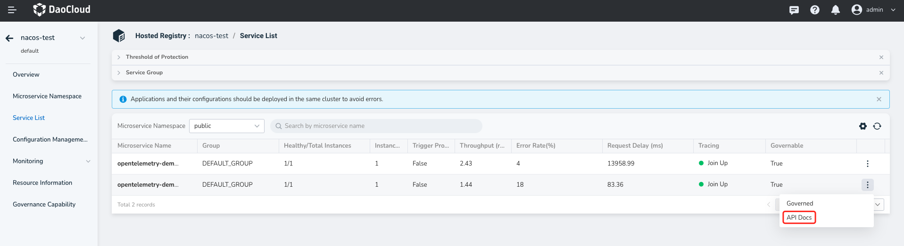