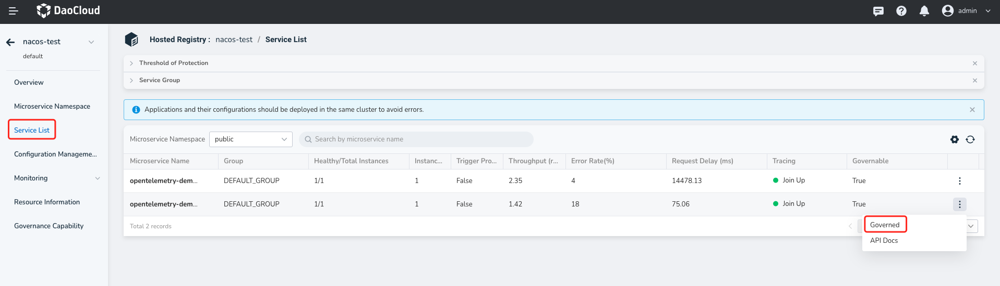
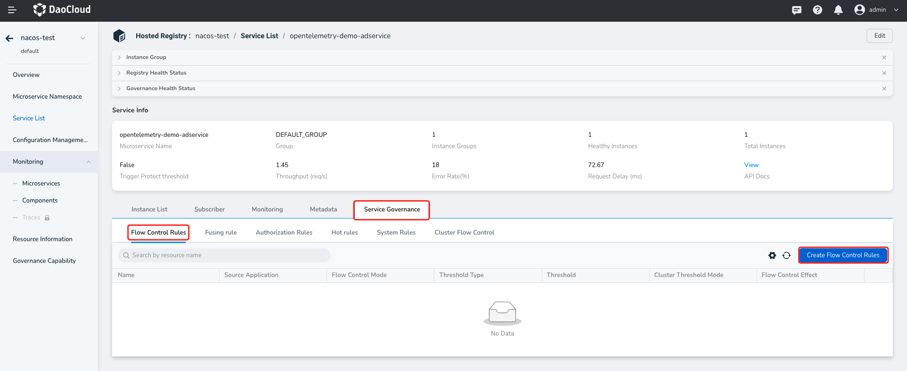
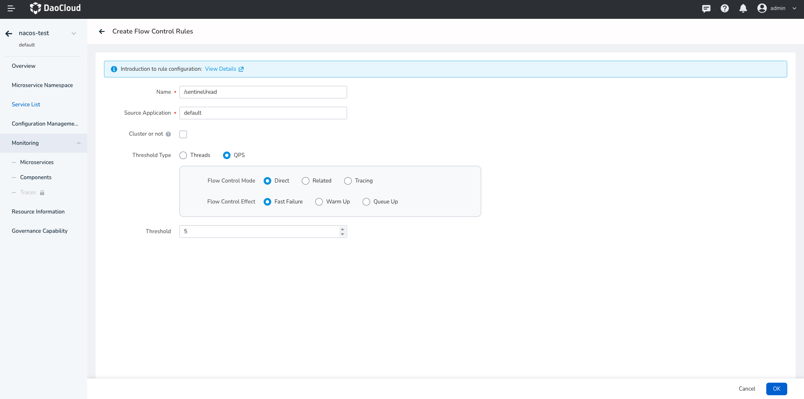
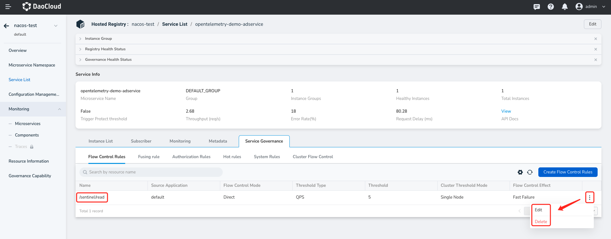

---
hide:
  -Toc
---

# Create a flow control rule

The principle of the flow control rule is to monitor the QPS metric of application or service traffic. When the metric reaches the threshold, the traffic is controlled according to the preset rule, preventing application crashes due to excessive traffic processing in a short period of time. After the flow control rule is used, the system can gradually process the accumulated requests in the following idle period. When the metric falls below the threshold again, normal traffic request control is resumed.

You can create a flow control rule as follows:

1. Click the name of the target hosting registry, then click `Microservice List` in the left navigation bar, and click more buttons on the far right to select `Traffic Governance`.

    > Notice that the incognito to be controlled should be displayed as `Yes` in the column `Traffic Governance` before you proceed to the subsequent steps.

   

2. Select `Flow Control Rules` and click `Create Rules` on the right.

   

3. Follow the instructions below to fill in the rule configuration and click `OK` in the lower right corner.

    - Name: Specifies the name of the resource. Resource refers to the domain of the rule. That is, the rule is created to govern the traffic of the service. Must be a resource that does exist.

    - Source Application: Sentinel can limit streams for callers. The default value is default, which means it does not distinguish sources and is applicable to all callers.

    - Threshold Types: When the current resource reaches the threshold, the current flow is restricted directly.

    - Flow Control Mode: When the associated resource reaches the threshold, the resource is restricted to traffic.

    - Flow Control Mode: Records only the traffic on the specified link. If the inbound traffic of the specified resource reaches the threshold, the traffic can be restricted.

      

4. After the rule is created, you can view it in the flow control rule list. Click More on the right to edit the update rule or delete it.

   

