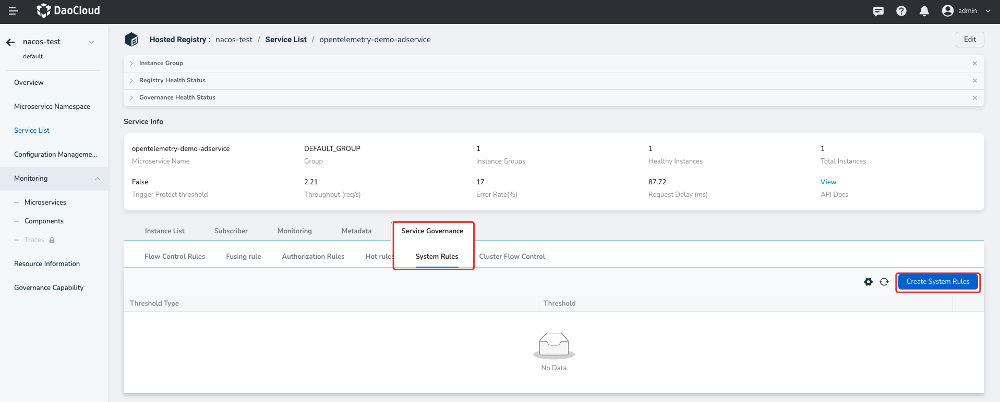
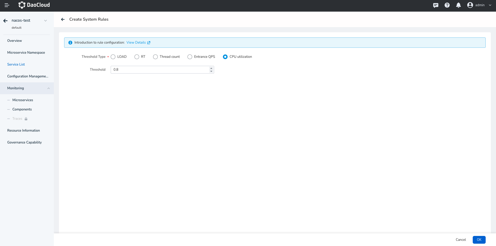
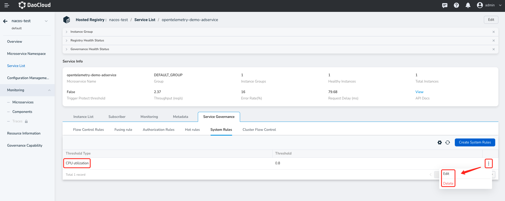

---
hide:
  -toc
---

# Create System Rules

System rules control the application's incoming traffic from a holistic perspective. By combining monitoring metrics such as application load, overall average response time (RT), incoming QPS (Queries Per Second), and thread count, system rules aim to balance the incoming traffic and system load, allowing the system to run at maximum throughput while ensuring overall stability.

System rules are applied to the entire application, not individual resources, and only affect incoming traffic.

Follow the steps below to create a system rule:

1. Click the name of the target managed registry, then click `Microservices` in the left sidebar and click the `Governance` option on the right side.

    > Note that the microservice you want to govern should have the "Can be governed" status set to "Yes" in order to proceed with the following steps.

    

2. Select `System Rules`, then click `Create System Rule` on the right side.

    

3. Fill in the rule configuration based on the instructions below and click `OK` in the bottom right corner.

    - Resource Name: Specify the name of the resource that needs traffic control.
    - Load: Trigger system protection when the system load1 (average load in 1 minute) exceeds the threshold and the current concurrent thread count exceeds the system capacity. The system capacity is calculated by `maxQps * minRt`. The recommended value is usually CPU cores * 2.5.
    - RT: Trigger system flow control rule when the average response time of all incoming traffic on a single machine reaches the threshold (in milliseconds).
    - Thread Count: Trigger system flow control rule when the concurrent thread count of all incoming traffic on a single machine reaches the threshold.
    - Incoming QPS: Trigger system flow control rule when the QPS of all incoming traffic on a single machine reaches the threshold.
    - CPU Usage: Trigger system flow control rule when the system's CPU usage exceeds the threshold (range 0.0-1.0).
   
      

4. After creating the rule, you can view it in the list of system rules. Click the more options button on the right side to update or delete the rule.

    
