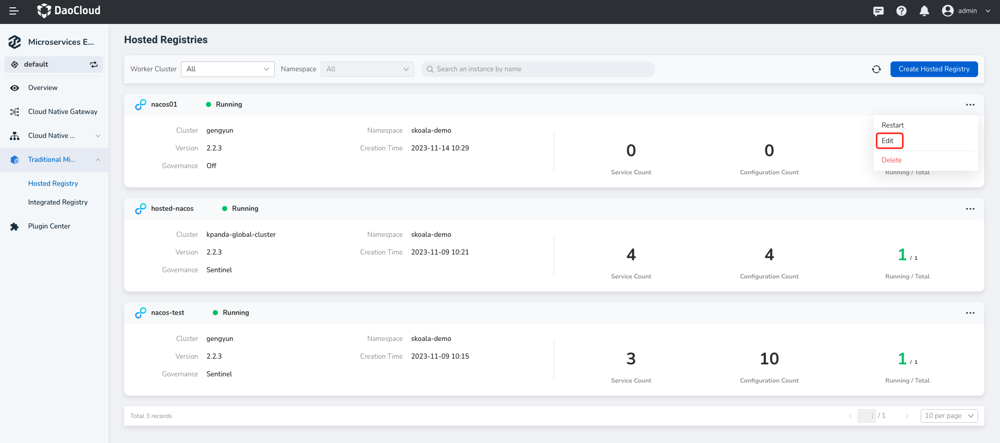
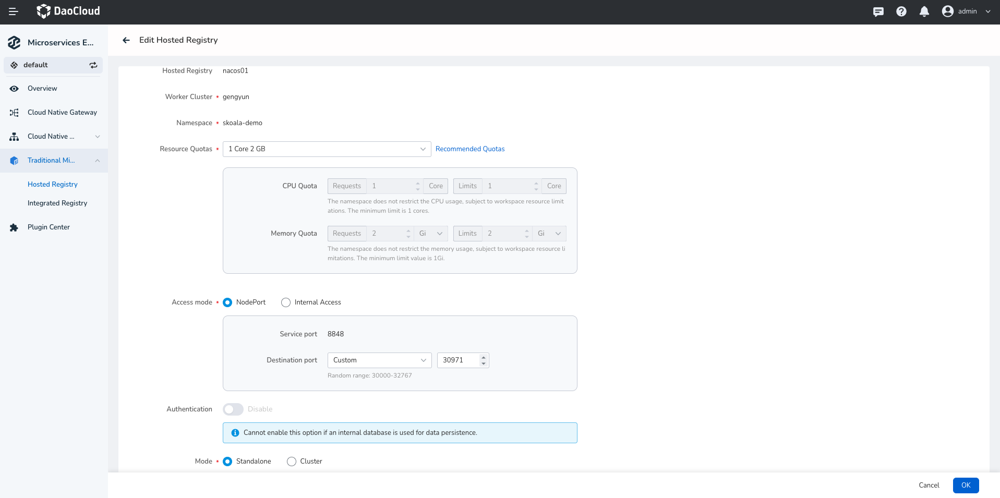

---
hide:
  - heel
---

# Update the managed registry

1. In the `Managed Registry List` page choose need to update the registry, on the right side click ** `⋯` ** and select `Edit`.

   

2. Update the registry configuration, then click `OK` at the bottom of the page.

    !!! warning

        - Modify the StorageClass/database. After the storage location is changed, the previous data will not be migrated.
        - The managed registry name and deployment location are not editable.

   
