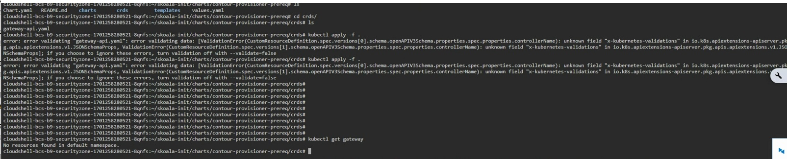
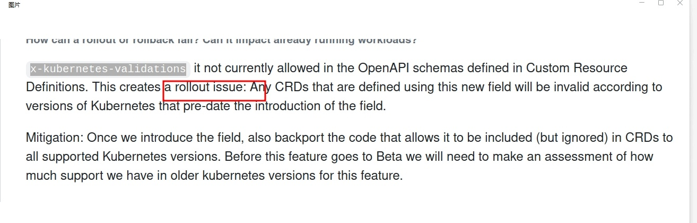

# skoala-init x-kubernetes-validations Error

When upgrading skoala-init from v0.11.0 to v0.12.0, an error occurred that prevented the upgrade:

```console
unknown field "x-kubernets-validations" in io.k8s.apiextensions-apiserver....
```



## Troubleshooting Process

1. Q: Is the operation procedure correct?

    A: Apply the CRD(s) first, then perform the helm upgrade. The operation procedure is correct, ruling out operation issues.

1. Q: Is the version tested and passed by QA, and was the upgrade function tested successfully during internal testing?

    A: Confirm that it is correct.

1. Q: Confirm that the version being used matches the version of the Kubernetes cluster used for testing?

    A: v1.21 (version being used), v1.26 (version used for testing).

1. Q: Based on the error screenshot and the above information, it is initially inferred that the customer's
   Kubernetes cluster version does not match the corresponding CRD. Additionally, skoala-init provides initial
   conditional configurations for all microservices, which includes multiple CRDs. According to the
   skoala-init v0.12.0 ChangeLog, the Gateway-API CRD has been upgraded. Therefore, the inference is:

    A: The issue is caused by the upgrade of the Gateway-API.

## Reference Documents

- [Rollout, Upgrade and Rollback Planning](https://github.com/kubernetes/enhancements/blob/master/keps/sig-api-machinery/2876-crd-validation-expression-language/README.md#rollout-upgrade-and-rollback-planning)

    

- [KEP-2876: Use Common Expression Language (CEL) for CRD Validation](https://docs.daocloud.io/blogs/230412-k8s-1.27.html#kep-2876cel-crd)

    

- [CRD validation error for x-kubernetes-preserve-unknown-fields: true #88252](https://github.com/kubernetes/kubernetes/issues/88252#issuecomment-587250746)

## Solution

Choose the appropriate solution based on the actual situation.

- Solution 1: Upgrade the Kubernetes cluster version being used to at least v1.25.
- Solution 2: Follow the instructions in [CRD validation error for x-kubernetes-preserve-unknown-fields: true #88252](https://github.com/kubernetes/kubernetes/issues/88252#issuecomment-587250746) and add:

    ```shell
    –validate=false
    ```
