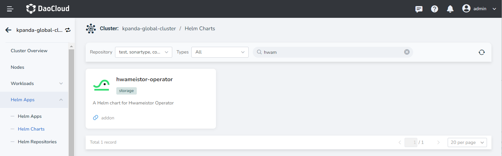
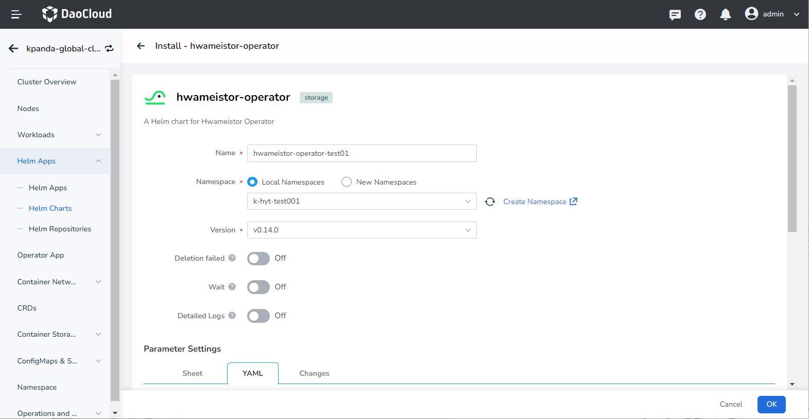
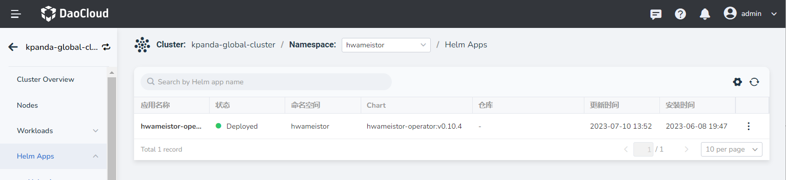
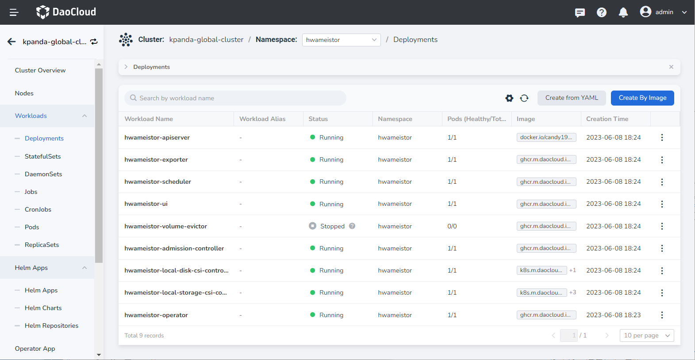

---
hide:
   - toc
---

# Install with Operator

This article introduces how to install Hwameistor through the Hwameistor Operator on the platform interface. After installing the Operator, it will automatically launch the Hwameistor-related components. The HwameiStor Operator is responsible for the following:

- Full lifecycle management (LCM) of all components:
    - LocalDiskManager
    - LocalStorage
    - Scheduler
    - AdmissionController
    - VolumeEvictor
    - Exporter
    - Apiserver
    - Graph UI
- Configuring node disks for different purposes and use cases
- Automatically discovering the type of node disks and creating HwameiStor StorageClass accordingly
- Automatically creating corresponding StorageClasses based on the configuration and features of the HwameiStor system

## Prerequisites

- Nodes intended for use with Hwameistor must have sufficient free HDD and SSD disks.
- Ensure that all prerequisites in the [Preparation](prereq.md) documentation are met.
- If you plan to use highly available data volumes, complete the [DRBD installation](drbdinstall.md) process beforehand.
- If deploying to a production environment, please review the [Resource Requirements for Production Environment](proresource.md) documentation beforehand.
- If your Kubernetes distribution uses a different `kubelet` directory, confirm the `kubeletRootDir` parameter beforehand. For more details, refer to [Customize Kubelet root directory](customized-kubelet.md).

!!! info

    If there are no available clean disks, the Operator will not automatically create a StorageClass.
    During the installation process, the Operator will automatically manage the disks and add available disks to the pool of LocalStorage.
    If the available disks are provided after the installation, you need to manually issue a LocalDiskClaim to manage the disks in LocalStorageNode.
    Once there are disks in the pool of LocalStorageNode, the Operator will automatically create the StorageClass.
    In other words, if there is no capacity, the StorageClass will not be created automatically.

## Steps

Ensure that your cluster has successfully connected to the container management platform before proceeding with the following steps to install Hwameistor.

1. In the left navigation bar, click `Container Management` -> `Cluster List`, and find the name of the cluster where Hwameistor will be installed.

2. In the left navigation bar, select `Helm Apps` -> `Helm chart`, find and click `Hwameistor Operator`.

    

3. Within the `Version Selection` section, choose the version to install, and then click `Install`.

4. On the installation interface, fill in the required installation parameters.

    

    The parameters in `Value.yaml` are as follows and can't be modified by default:

    ```yaml
    global:
      targetNamespace: hwameistor
      hwameistorImageRegistry: ghcr.io
      k8sImageRegistry: registry.k8s.io
      hwameistorVersion: v0.9.2
    operator:
      replicas: 1
      imageRepository: hwameistor/operator
      tag: ''
    localDiskManager:
      tolerationOnMaster: true
      kubeletRootDir: /var/lib/kubelet
      manager:
        imageRepository: hwameistor/local-disk-manager
        tag: ''
      csi:
        registrar:
          imageRepository: sig-storage/csi-node-driver-registrar
          tag: v2.5.0
        provisioner:
          imageRepository: sig-storage/csi-provisioner
          tag: v2.0.3
        attacher:
          imageRepository: sig-storage/csi-attacher
          tag: v3.0.1
    localStorage:
      tolerationOnMaster: true
      kubeletRootDir: /var/lib/kubelet
      member:
        imageRepository: hwameistor/local-storage
        tag: ''
      csi:
        registrar:
          imageRepository: sig-storage/csi-node-driver-registrar
          tag: v2.5.0
        provisioner:
          imageRepository: sig-storage/csi-provisioner
          tag: v2.0.3
        attacher:
          imageRepository: sig-storage/csi-attacher
          tag: v3.0.1
        resizer:
          imageRepository: sig-storage/csi-resizer
          tag: v1.0.1
        monitor:
          imageRepository: sig-storage/csi-external-health-monitor-controller
          tag: v0.8.0
    scheduler:
      imageRepository: hwameistor/scheduler
      tag: ''
    admission:
      imageRepository: hwameistor/admission
      tag: ''
    evictor:
      imageRepository: hwameistor/evictor
      tag: ''
    apiserver:
      imageRepository: hwameistor/apiserver
      tag: ''
    exporter:
      imageRepository: hwameistor/exporter
      tag: ''
    ui:
      imageRepository: hwameistor/hwameistor-ui
      tag: ''
    ha:
      module: drbd
      deployOnMaster: 'yes'
    ```

    - `hwameistorImageRegistry`:

        Set the registry address of the Hwameistor mirror, and the available online registrys have been filled in by default.
        If it is a privatized environment, it can be modified to a private registry address.

    - `K8s container registry`:

        Set the address of the K8S container registry, and the available online registry has been filled in by default.
        If the environment is privatized, it can be modified to a private registry address.

5. After confirming that the parameters are correct, click `OK` to complete the installation. After the installation is complete, you can click `Helm Apps` to view the installation status of `Hwameistor Operator`.

    

6. After the Operator is installed, the Hwameistor components (Local Storage, Local Disk Manager, etc.) will be installed by default!
    You can click `Workload`-->`Stateless Workload`, select the corresponding namespace, and view the status of the Hwameistor component.

    

    To verify the installation effect through the command line, please refer to [Post-installation Check](./post-check.md).
