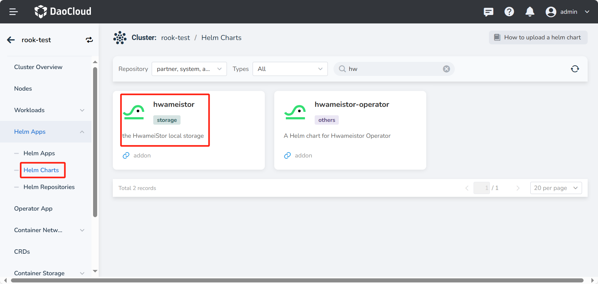
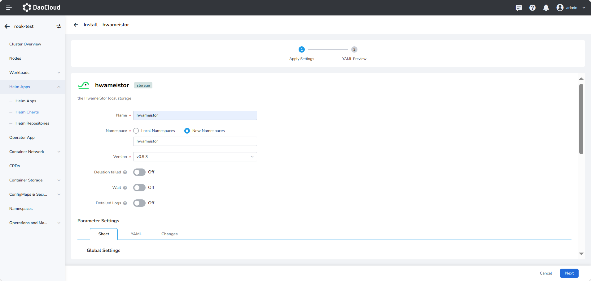
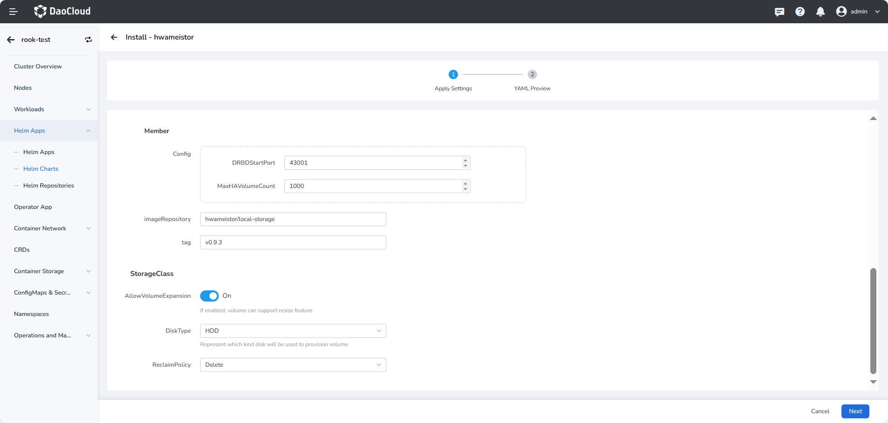

# Install HwameiStor on UI

This page describes how to install HwameiStor on UI.

## Prerequisites

- Free HDD and SSD disks have been prepared on the nodes to be used
- Completed the items in [Preparation](prereq.md)
- If you need to use high-availability data volumes, please complete [DRDB installation](drbdinstall.md) in advance
- If the deployment environment is a production environment, please read [Resource Requirements for
Production Environment](proresource.md) in advance
- If your Kubernetes distribution uses a different `kubelet` directory, please confirm `kubeletRootDir` in advance.
   For details, please refer to [Customize Kubelet root directory](customized-kubelet.md).

## Steps

Please confirm that your cluster has successfully connected to __Container Management__ platform, and then perform the following steps to install HwameiStor.

1. On the left navigation bar, click __Container Management__ —> __Clusters__ , and find the cluster where HwameiStor is to be installed.

2. In the left navigation bar, select __Helm Apps__ -> __Helm Charts__ , find and click __HwameiStor__ .

    

3. In __Version__ , select the version you want to install, and click __Install__ .

4. On the installation UI, fill in the required installation parameters. If you need to deploy a production environment, it is recommended to adjust the resource configuration: [Production environment resource requirements](proresource.md).

    

    

    - `Global Setting` —> `global container registry`:
    
        Set the registry addresses of all images, and the available online registrys have been filled in by default.
        If it is a private environment, it can be modified to a private registry address.
       
    - `Global Setting` —> `K8s container registry`:
    
        Set the address of the K8s container registry, and the available online registry has been filled in by default.
        If the environment is privatized, it can be modified to a private registry address.
       
    - `Global Setting` —> `Kubelet Root Dir`:
    
        The default `kubelet` directory is `/var/lib/kubelet`.
        If your Kubernetes distribution uses a different `kubelet` directory, the parameter `kubeletRootDir` must be set.
        For details, please refer to [Customize Kubelet root directory](customized-kubelet.md).
       
    - `Config Settings` —> `DRDBStartPort`:
    
        The default starts at 43001. When `DRDB` is enabled, each time a high-availability
        data volume is created, a set of ports on the node where the primary copy data volume is located needs to be occupied.
        Please complete [DRDB Installation](drbdinstall.md) before installation.
       
    - **StorageClass Configuration**
    
        After HwameiStor is deployed, StorageClass will be created automatically.
    
        - `AllowVolumeExpansion`: It is off by default. After it is enabled, the data volume created based on the StorageClass can be expanded.
        - `DiskType`: the disk type of the created StorageClass (StorageClass), supported types are: HDD, SSD. HDD is the default.
        - `Enable HA`: `HA` is turned off by default, that is, the created data volume is volumes without high availability, when enabled, use this `StorageClass`
        The created data volume can be set as `high-availability data volume`. Please complete [DRDB Installation](drbdinstall.md) before opening.
        - `Replicas`: In non-HA mode, the number of `Replicas` is `1`. When the `HA` mode is enabled, the number of `Replicas` can be `1` or `2`, and the number is `1`, which can be converted to `2`.
        - `ReclaimPolicy`: When the data volume is deleted, the default data retention policy is `delete`.
       
            1. `Delete`: When deleting a data volume, the data is also deleted.
            2. `Retain`: When deleting a data volume, keep the data.
    
5. After the parameter input is complete, click __OK__ to complete the creation. After the creation,
   you can click __Helm Apps__ to view the installation status of __HwameiStor__ .

    <!-- add image later -->

6. The installation is complete! To verify the installation effect, please refer to the next chapter [Post-check](./post-check.md).
