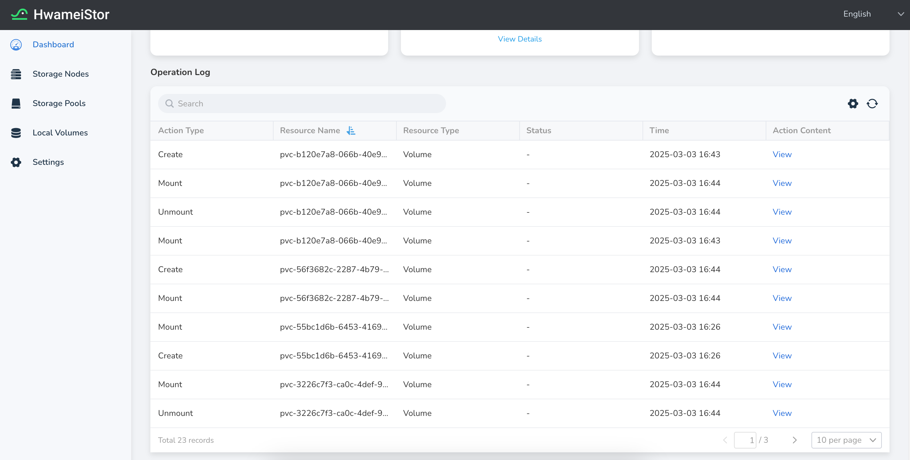
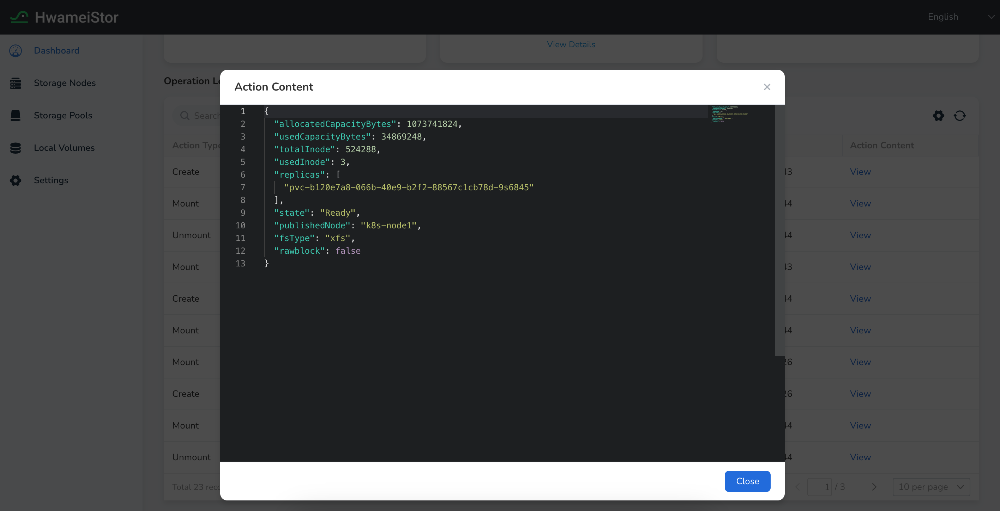

---
hide:
  - toc
---

# View Operation Log

To record the usage and operational history of the HwameiStor cluster system,
HwameiStor provides system Operation Log. These logs follow the HwameiStor
semantics, making them easy for users to review and parse.

The operation log records usage and operation information for each type of resource
in the HwameiStor. These resources include: Cluster, Node, StoragePool, Volume, and more.

The specific steps to view Operation Log are as follows:

1. In the left navigation bar, click **Container Management** -> **Clusters** ,
   then click a cluster name to enter the proper cluster. Next, click **Container Storage**
   -> **HwameiStor** to enter the **HwameiStor** page. At the bottom of the **Dashboard** page,
   you can see the **Operation Log** list.

2. The list displays the following fields: Operation Type, Resource Name, Resource Type,
   Status, Operation Time, and Operation Details.

    

    The supported resource types include:

    - Cluster  
    - StorageNode  
    - Disk  
    - DiskNode  
    - Pool  
    - Volume  
    - DiskVolume  

    Click **View** to check details about each operation.

    
