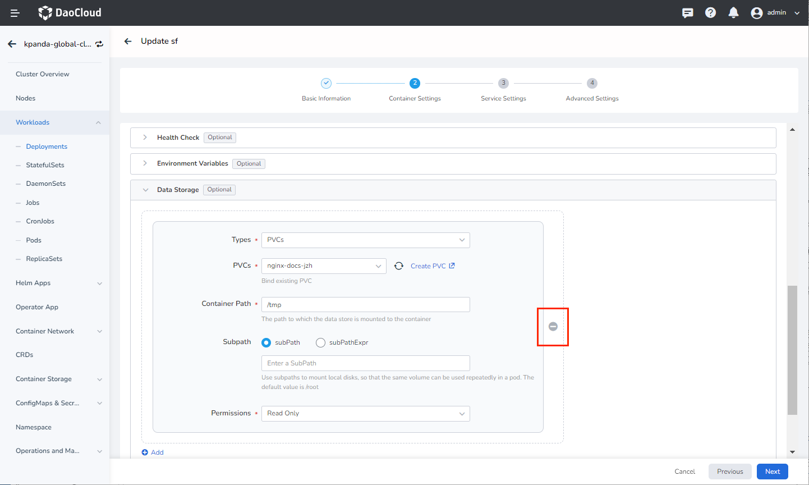
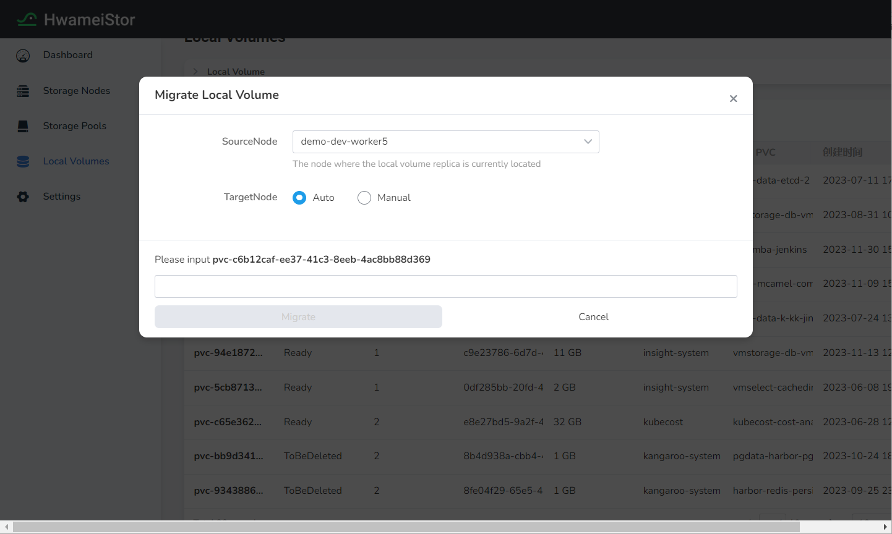

# Volume Migration

`Migrate` is an important operation and maintenance management feature in HwameiStor. When the copy of the node where the data volume bound to the application is located is damaged, the copy of the volume can be migrated to other nodes, and the application will be rescheduled after successfully migrating to the new node, and bound the data volume.

## Basic concept

`LocalVolumeGroup(LVG)` (data volume group) management is an important feature in HwameiStor. When the application Pod applies for multiple data volumes `PVC`, in order to ensure the correct operation of the Pod, these data volumes must have certain attributes, such as: the number of copies of the data volume, and the node where the copies are located. It is a very important capability in HwameiStor to correctly manage these associated data volumes through the data volume group management function.

## Prerequisites

LVG needs to be deployed in the Kubernetes system, and the deployment application needs to meet the following conditions:

* Support for lvm type volumes
* convertible type volume (need to add ConfigMap convertible: true in sc)
    * When the application Pod applies for multiple data volume PVC, the corresponding data volumes need to use the same configuration sc
    * When migrating based on LocalVolume granularity, data volumes belonging to the same LocalVolumeGroup will not be migrated together by default (if they are migrated together, you need to configure the switch MigrateAllVols: true)

## Interface steps

1. Create convertible `StorageClass`

    Install through the interface, please refer to [How to Create StorageClass](../../../kpanda/user-guide/storage/sc.md)

2. Create multiple `PVC`

    Create multiple PVC through the interface, please refer to [How to Create PVC](../../../kpanda/user-guide/storage/pvc.md)

3. Deploy Pod with multiple volumes

    Create applications through the interface, please refer to [How to Create Workloads](../../../kpanda/user-guide/workloads/create-deployment.md), and mount the two created PVCs.

4. Unbound Pod with multiple volumes

    Before migration, please unbound PVC. You can unbound them by `Editing Workloads`.

    

5. Create migration task

    Go to the corresponding cluster --> Click on the left `Container Storage` --> `Hwameistor` Enter the `Hwameistor` interface, select the locally unbound volume,
    The corresponding PVCs are `pvc-test01` and `pvc-test02`. Click on `...` and select `Migrate`, choose the `SourceNode` and `TargetNode`.

    `SourceNode`: The node where the local volume replica is located.

    `TargetNode`: After specifying, the original replica will be migrated to the target node. If `Auto` is chosen, the local volume replica will be automatically scheduled to other nodes.

    If two/multiple local volumes are bounded on the same application, the two volumes will automatically form a local volume group for migration.

    

6. Click on the corresponding local volume to enter the details and check the migration status.

## Oneline trail steps

1. Create convertible `StorageClass`

    ```console
    cd ../../deploy/
    kubectl apply -f storageclass-convertible-lvm.yaml
    ```

2. Create multiple `PVC`

    ```console
    kubectl apply -f pvc-multiple-lvm.yaml
    ```

3. Deploy the multi-volume Pod

    ```console
    kubectl apply -f nginx-multiple-lvm.yaml
    ```

4. Unbound the multi-volume Pod

    ```console
    kubectl patch deployment nginx-local-storage-lvm --patch '{"spec": {"replicas": 0}}' -n hwameistor
    ```

5. Create the migration task

    ```console
    cat > ./migrate_lv.yaml <<- EOF
    apiVersion: hwameistor.io/v1alpha1
    kind:LocalVolumeMigrate
    metadata:
      namespace: hwameistor
      name: <localVolumeMigrateName>
    spec:
      targetNodesNames:
      - <targetNodesName1>
      - <targetNodesName2>
      sourceNodesNames:
      - <sourceNodesName1>
      - <sourceNodesName2>
      volumeName: <volName>
      migrateAllVols: <true/false>
    EOF
    ```

    ```console
    kubectl apply -f ./migrate_lv.yaml
    ```

6. View migration status

    ```shell
    kubectl get LocalVolumeMigrate  -o yaml
    ```

    ```yaml
    apiVersion: v1
    items:
    - apiVersion: hwameistor.io/v1alpha1
      kind: LocalVolumeMigrate
      metadata:
      annotations:
      kubectl.kubernetes.io/last-applied-configuration: |
      {"apiVersion":"hwameistor.io/v1alpha1","kind":"LocalVolumeMigrate","metadata":{"annotations":{},"name":"localvolumemigrate-1","namespace":"hwameistor"},"spec":{"migrateAllVols":true,"sourceNodesNames":["dce-172-30-40-61"],"targetNodesNames":["172-30-45-223"],"volumeName":"pvc-1a0913ac-32b9-46fe-8258-39b4e3b696a4"}}
      creationTimestamp: "2022-07-07T12:34:31Z"
      generation: 1
      name: localvolumemigrate-1
      namespace: hwameistor
      resourceVersion: "12828637"
      uid: 78af7f1b-d701-4b03-84de-27fafca58764
      spec:
      abort: false
      migrateAllVols: true
      sourceNodesNames:
      - dce-172-30-40-61
        targetNodesNames:
      - 172-30-45-223
        volumeName: pvc-1a0913ac-32b9-46fe-8258-39b4e3b696a4
        status:
        replicaNumber: 1
        state: InProgress
        kind: List
        metadata:
        resourceVersion: ""
        selfLink: ""
    ```

7. View migration success status

    ```shell
    [root@172-30-45-222 deploy]# kubectl get lvr
    ```

    ```none
    NAME                                              CAPACITY     NODE            STATE   SYNCED   DEVICE                                                                  AGE
    pvc-1a0913ac-32b9-46fe-8258-39b4e3b696a4-9cdkkn   1073741824   172-30-45-223   Ready   true     /dev/LocalStorage_PoolHDD-HA/pvc-1a0913ac-32b9-46fe-8258-39b4e3b696a4   77s
    pvc-d9d3ae9f-64af-44de-baad-4c69b9e0744a-7ppmrx   1073741824   172-30-45-223   Ready   true     /dev/LocalStorage_PoolHDD-HA/pvc-d9d3ae9f-64af-44de-baad-4c69b9e0744a   77s
    ```

8. After successful migration, rebound the data volume Pod

    ```console
    kubectl patch deployment nginx-local-storage-lvm --patch '{"spec": {"replicas": 1}}' -n hwameistor
    ```
