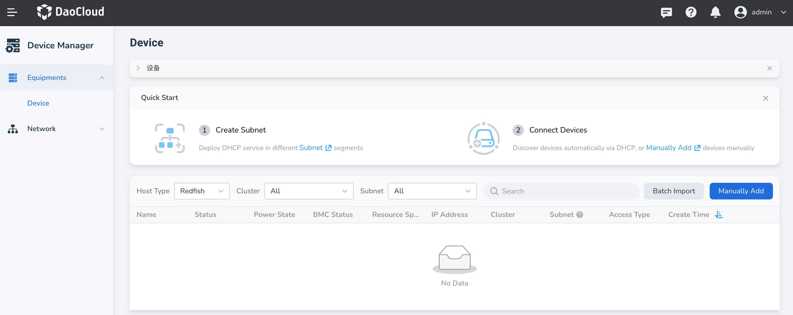

---
hide:
  - toc
---

# Manual Device Onboarding

By configuring the device IP address and authentication credentials, servers, switches, and other devices can be manually onboarded to the platform for management.

This guide describes the process for a single device. For rapid batch onboarding, please refer to [Batch Device Onboarding](./batch-access.md).

1. In the left navigation bar, click **Device Management** to enter the device management list page, then click the **Manual Onboard** button at the top right corner of the page.

    <!--  -->

2. Fill in the configuration information including device name, IP address, port, connection method, and username/password.

    <!--  -->

    - **Name**: 2–63 characters, must consist of lowercase letters, numbers, or "-", and must start with a letter and end with a letter or number
    - **Device Group**: Optional. You can assign devices to specific groups based on device type or other criteria for easier management.
    - **IP Address**: Management IP address of the device
    - **Port**: Port used to establish the connection with the device
    - **Connection Method**: Currently supports connecting via Redfish or SSH. If using Redfish, also configure PXE boot and HTTPS settings.
        - **PXE Boot Configuration**: Used to load the OS image over the network when the device starts. Select Redfish or IPMI protocol based on your environment.
        - **Enable HTTPS**: Whether to enable HTTPS for device communication.
    - **Authentication Account**:
        - **Use default username/password**: The system will automatically use the credentials configured when deploying the Topohub Helm application.
        - **Custom**: Manually enter the username and password.

3. After completing the configuration, click **OK** to finish onboarding the device. You will automatically return to the device list.

Next step: [Manage Devices](./manage-device.md)
