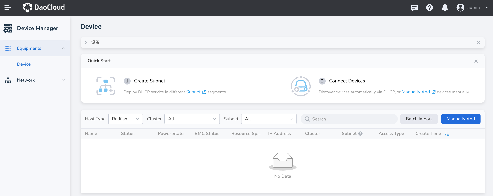
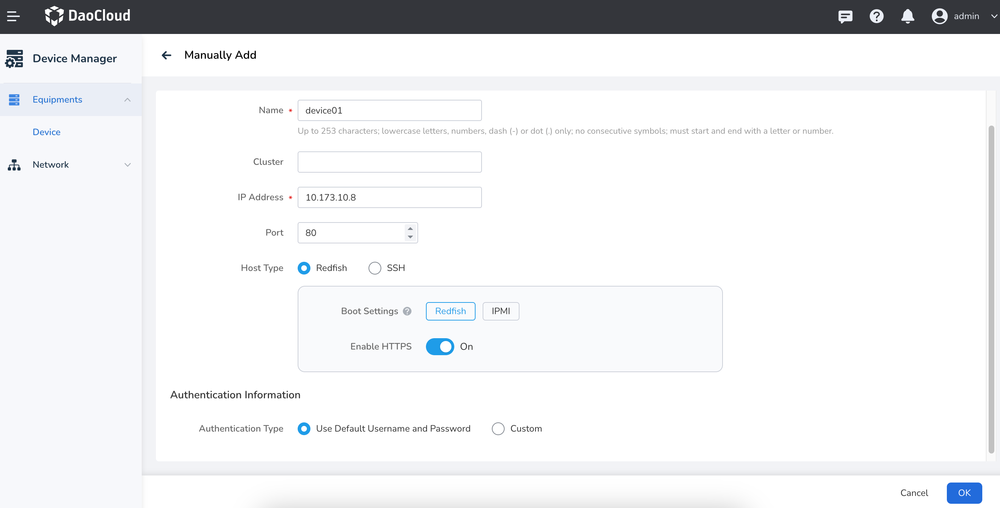

---
hide:
  - toc
---

# Manual Add Device

By configuring the device IP address and authentication credentials, servers, switches, and other devices can be manually onboarded to the platform for management.

This guide describes the process for a single device. For rapid batch onboarding, please refer to [Batch Add Device](./batch-access.md).

1. In the left navigation bar, click **Device** to enter the device list, then click the **Manual Add** button at the top right corner of the page.

    

2. Fill in the configuration including device name, IP address, port, host type, and username/password.

    

    | Field | Required | Description |
    |-------|----------|-------------|
    | Name | Yes | Up to 253 characters; lowercase letters, numbers, dash (-), or dot (.) only; no consecutive symbols; must start and end with a letter or number. |
    | Cluster | No | Optional. Assign devices to specific groups based on device type or other criteria for easier management. |
    | IP Address | Yes | Management IP address of the device. |
    | Port | Yes | Port used to establish the connection with the device. |
    | Host Type | Yes | Supports Redfish or SSH. If Redfish is selected, additional PXE boot and HTTPS settings are required. |
    | PXE Boot Configuration | Conditional | Required when using Redfish. Used to load the OS image over the network at startup; select Redfish or IPMI protocol based on your environment. |
    | Enable HTTPS | Conditional | Required when using Redfish. Specifies whether to use HTTPS for device communication. |
    | Authentication Info - Use default username/password | Optional | Automatically uses the credentials configured during Topohub Helm deployment. |
    | Authentication Info - Custom | Optional | Manually enter the username and password. |

3. After completing the configuration, click **OK** to finish onboarding the device. You will automatically return to the device list.

Next step: [Manage Devices](./manage-device.md)
