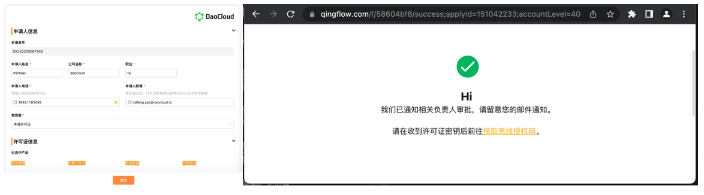
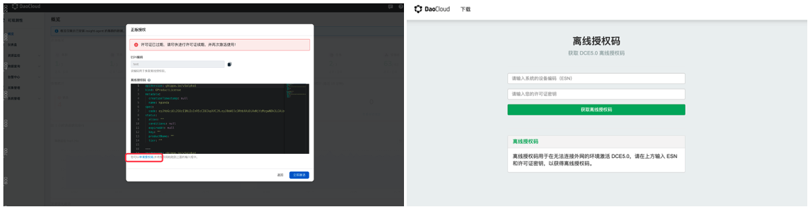
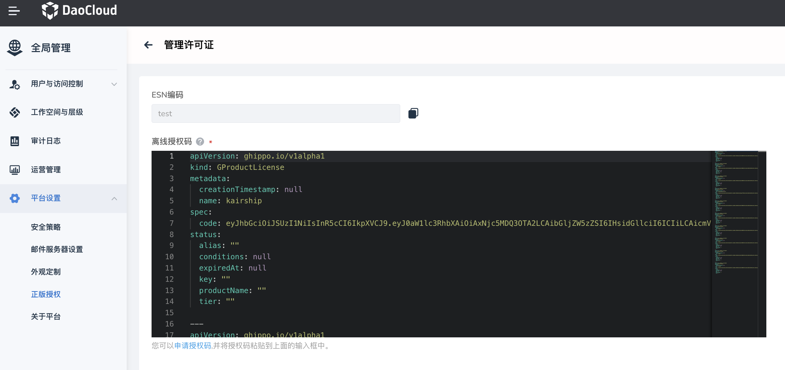

---
hide:
  - navigation
---

# Experience the Community Package

  
 Welcome to Install and Experience!

  
DaoCloud Enterprise Community Package 

DCE 5.0, with cloud-native infrastructure at its core, is supported by self-developed open-source components. It provides cloud-native computing, networking, storage, and other capabilities, supporting unified management of multi-cloud and multi-cluster lifecycles. It abstracts the complexity of underlying infrastructure, reduces the threshold for enterprises to use cloud-native applications, and improves application development efficiency.

  
Unlock the Community Package in Three Steps

## <strong>1st</strong> Installation Tutorial Link

!!! tip

    1. Choose the installation tutorial according to your situation.
    2. After successful installation, a login URL will be generated.
    3. Log in using the default account and password admin/changeme to apply for a free license.

### Online Installation

=== "Kind Cluster"

    **Applicable Scenarios:** Suitable for cloud-native beginners and enthusiasts who have limited machine resources and a shallow understanding of Kubernetes clusters.

    **Estimated Time:** 10-30 minutes

    **Background Description:** Kind is a tool used to quickly create and test Kubernetes clusters. It minimizes the dependencies on the environment and only requires Docker to be installed on the machine. Please note that this installation method only supports accessing DaoCloud Enterprise Community Edition through node ports.

    :material-run: [Start Online Installation of Kind Cluster](../install/community/kind/online.md)

=== "Standard Kubernetes Cluster"

    **Applicable Scenarios:** Suitable for technical personnel who have successfully set up standard Kubernetes clusters, have sufficient machine resources, and can build Kubernetes clusters.

    **Estimated Time:** 10-30 minutes

    **Background Description:** You need to have a certain understanding of Kubernetes and set up a standard Kubernetes cluster before starting the installation. The feature of this installation method is that it supports accessing DaoCloud Enterprise Community Edition through node ports and VIPs.

    :material-run: [Start Online Installation of Standard K8s Cluster](../install/community/k8s/online.md)

=== "Public Cloud Kubernetes Cluster"

    **Applicable Scenarios:** Suitable for users who have deployed business applications on multiple clouds and are facing multi-cloud management challenges.

    **Estimated Time:** 10-30 minutes

    **Background Description:** Create a Kubernetes cluster directly on a public cloud platform, and the remaining installation steps are the same as the online installation of a standard Kubernetes cluster. The feature of this installation method is that it supports accessing DaoCloud Enterprise Community Edition through the CLB (Cloud Load Balancer) provided by public cloud vendors and supports integration with mainstream Kubernetes distributions in the market.

    :material-run: [Start Online Installation of Public Cloud K8s Cluster](../install/community/k8s/online.md)

### Offline Installation

If you have limited network access, you can choose to perform an offline installation of the Kubernetes cluster.

**Applicable Scenarios:** Suitable for installation in a corporate intranet or other network-restricted environments.

**Estimated Time:** 10-30 minutes

**Background Description:** Offline installation does not require network access but requires downloading the installation package in advance.

:material-run: [Start Offline Installation](../install/community/k8s/offline.md)

## <strong>2nd</strong> Apply for a License Key

1. Click [here to apply for a free "DCE 5.0 Community Edition" license key](https://qingflow.com/f/58604bf8). The license key will be sent to your email.
   (Some email providers may intercept the email containing the license key. If you do not receive it after a long time, please check your spam folder).

    

2. While waiting for the email, follow the on-screen instructions to access the Community Edition login page (access it through the link obtained after successful installation) and click on `Apply for Authorization Code`.

    

3. As shown above, you also need to obtain the ESN (a unique device code for the cluster system). Here's how to get it:

    1. Log in to DCE Community Edition.
    2. Click on the left navigation bar `Global Management` -> `Platform Settings` -> `Genuine Authorization`.
    3. Click the `Manage License` button to open the `Manage License` page and copy the ESN code.

    

4. After receiving the license email, go back to the [Get Offline Authorization Code](https://license.daocloud.io/dce5-license) page. Enter the unique ESN of your device and the license key to obtain the offline authorization code.

    

5. Copy and paste the offline authorization code obtained in the previous step, go back to the ESN code retrieval page, and enter the offline authorization code in the code block at the bottom. Click on `Activate Now`. Congratulations! You can now explore the brand new DCE 5.0!

!!! note

    If you selected a short validity period when applying for the license and it has expired, you can click [here for more renewal options](../dce/license0.md#_1).

## <strong>3rd</strong> Embark on the Cloud-Native Journey

- [Cloud-Native Technology Practice Public Course](https://appu8cplrlw7661.h5.xiaoeknow.com): Suitable for beginners or junior cloud-native developers to learn about the development background, basic knowledge, and operational practices of cloud-native technology.
- [Video Tutorials](../videos/index.md): Covering the usage demonstrations of the three major functional modules: container management, global management, and observability. There are also tutorials demonstrating commercial edition features. Feel free to check them out.

Learn more about DaoCloud Enterprise Community Edition

[What is Container Management](../kpanda/intro/index.md){ .md-button .md-button--primary }
[What is Global Management](../ghippo/intro/index.md){ .md-button .md-button--primary }
[What is Observability](../insight/intro/index.md){ .md-button .md-button--primary }
