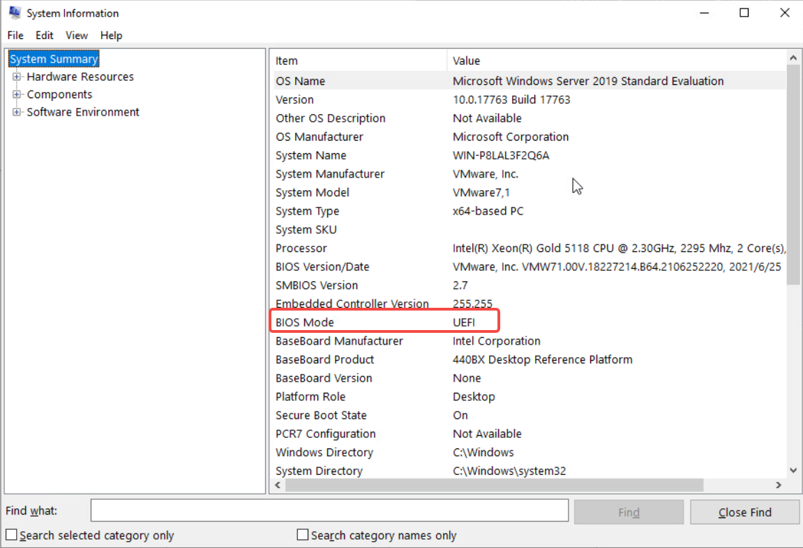
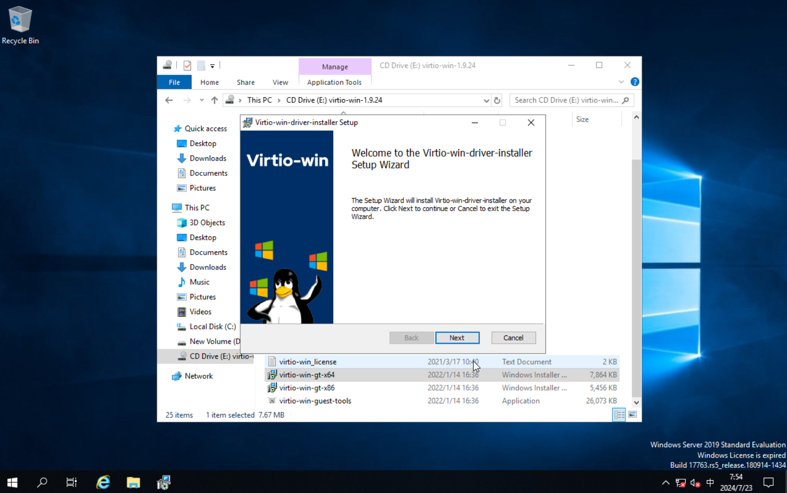
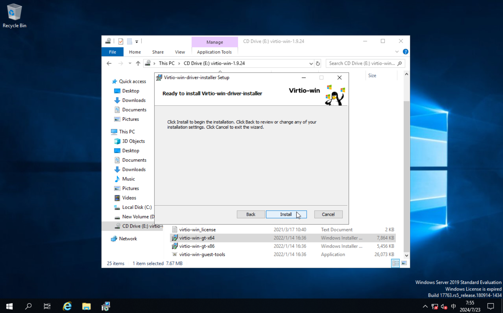
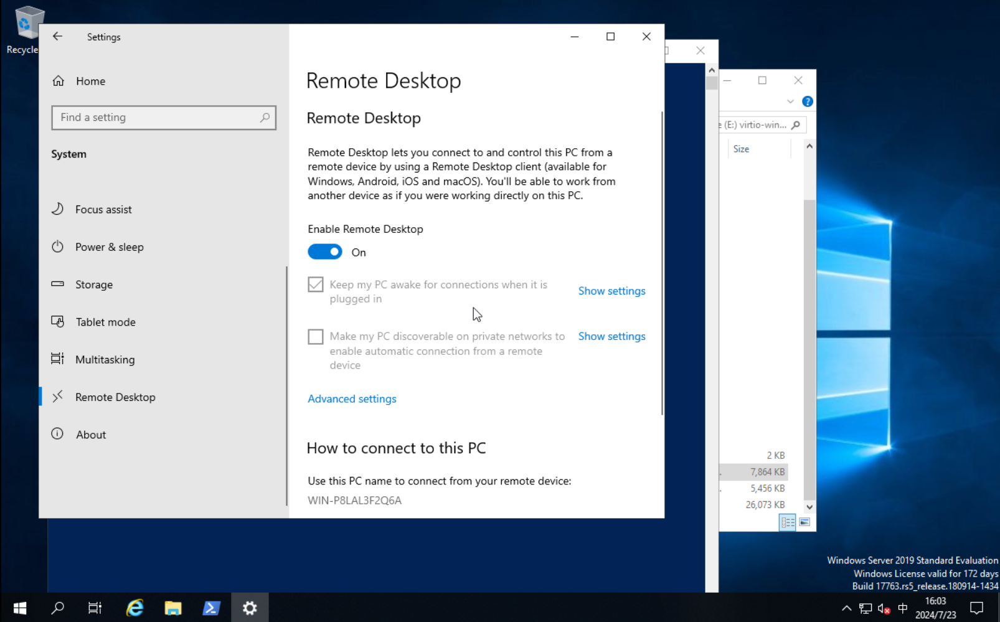
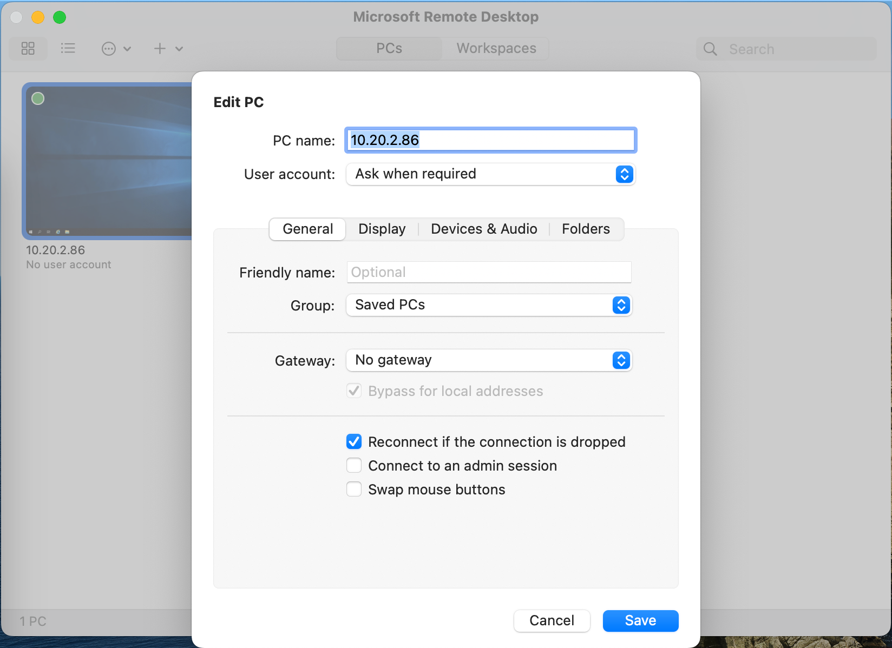
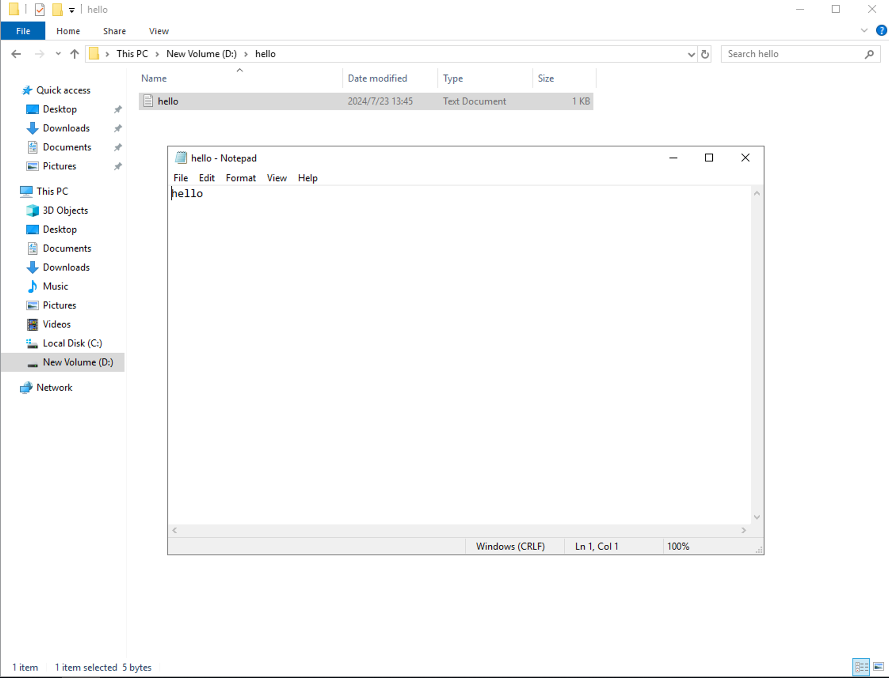

# Import a Windows Virtual Machine from the External Platform

This page provides a detailed introduction on how to import virtual machines from an external platform -- VMware, into the virtual machines of DCE 5.0 using the command line.

!!! info

    The external virtual platform on this page is VMware vSphere Client, abbreviated as vSphere. 
    Technically, it relies on kubevirt cdi for implementation. Before proceeding, the virtual machine 
    imported on vSphere needs to be shut down.
    Take a virtual machine of the Windows operating system as an example.

## Environment Preparation

Before importing, refer to the [Network Configuration](../vm/vm-network.md) to prepare the environment.

### Fetch Information of the Windows Virtual Machine

Similar to importing a virtual machine with a Linux operating system, refer to [Importing a Linux Virtual Machine with Ubuntu from an External Platform](import-ubuntu.md) to get the following information:

- vSphere account and password
- vSphere virtual machine information

### Check the Boot Type of Windows

When importing a virtual machine from an external platform into the DCE 5.0 virtualization platform, 
you need to configure it according to the boot type (BIOS or UEFI) to ensure it can boot and run correctly.

You can check whether Windows uses BIOS or UEFI through "System Summary." If it uses UEFI, you need to 
add the relevant information in the YAML file.



## Import Process

Prepare the `window.yaml` file and pay attention to the following configmaps:

- PVC booting Virtio drivers
- Disk bus type, set to SATA or Virtio depending on the boot type
- UEFI configuration (if UEFI is used)

<details>
<summary>Click to view the window.yaml example</summary>

```yaml title="window.yaml"
apiVersion: kubevirt.io/v1
kind: VirtualMachine
metadata:
  labels:
    virtnest.io/os-family: windows
    virtnest.io/os-version: "server2019"
  name: export-window-21
  namespace: default
spec:
  dataVolumeTemplates:
    - metadata:
        name: export-window-21-rootdisk
      spec:
        pvc:
          accessModes:
            - ReadWriteOnce
          resources:
            requests:
              storage: 22Gi
          storageClassName: local-path
        source:
          vddk:
            backingFile: "[A05-09-ShangPu-Local-DataStore] virtnest-export-window/virtnest-export-window.vmdk"
            url: "https://10.64.56.21"
            uuid: "421d40f2-21a2-cfeb-d5c9-e7f8abfc2faa"
            thumbprint: "D7:C4:22:E3:6F:69:DA:72:50:81:12:FA:42:18:3F:29:5C:7F:41:CA"
            secretRef: "vsphere21"
            initImageURL: "release.daocloud.io/virtnest/vddk:v8"
    - metadata:
        name: export-window-21-datadisk
      spec:
        pvc:
          accessModes:
            - ReadWriteOnce
          resources:
            requests:
              storage: 1Gi
          storageClassName: local-path
        source:
          vddk:
            backingFile: "[A05-09-ShangPu-Local-DataStore] virtnest-export-window/virtnest-export-window_1.vmdk"
            url: "https://10.64.56.21"
            uuid: "421d40f2-21a2-cfeb-d5c9-e7f8abfc2faa"
            thumbprint: "D7:C4:22:E3:6F:69:DA:72:50:81:12:FA:42:18:3F:29:5C:7F:41:CA"
            secretRef: "vsphere21"
            initImageURL: "release.daocloud.io/virtnest/vddk:v8"
    # <1>. PVC for booting Virtio drivers
    # ↓↓↓↓↓↓↓↓↓↓↓↓↓↓↓↓↓↓↓↓↓↓
    - metadata:
        name: virtio-disk
      spec:
        pvc:
          accessModes:
            - ReadWriteOnce
          resources:
            requests:
              storage: 10Mi
          storageClassName: local-path
        source:
          blank: {}
          # ↑↑↑↑↑↑↑↑↑↑↑↑↑↑↑↑↑↑↑↑↑↑
  running: true
  template:
    metadata:
      annotations:
        ipam.spidernet.io/ippools: '[{"cleangateway":false,"ipv4":["test86"]}]'
    spec:
      dnsConfig:
        nameservers:
        - 223.5.5.5
      domain:
        cpu:
          cores: 2
        memory:
          guest: 4Gi
        devices:
          disks:
            - bootOrder: 1
              disk:
                bus: sata   # <2> Disk bus type, set to SATA or Virtio depending on the boot type
              name: rootdisk
            - bootOrder: 2
              disk:
                bus: sata   # <2> Disk bus type, set to SATA or Virtio depending on the boot type
              name: datadisk
            # <1>. disk for booting Virtio drivers
            # ↓↓↓↓↓↓↓↓↓↓↓↓↓↓↓↓↓↓↓↓↓↓
            - bootOrder: 3
              disk:
                bus: virtio
              name: virtdisk
            - bootOrder: 4
              cdrom:
                bus: sata
              name: virtiocontainerdisk
            # ↑↑↑↑↑↑↑↑↑↑↑↑↑↑↑↑↑↑↑↑↑↑
          interfaces:
            - bridge: {}
              name: ovs-bridge0
        # <3> In the above section "Check the Boot Type of Windows"
        # If using UEFI, add the following information
        # ↓↓↓↓↓↓↓↓↓↓↓↓↓↓↓↓↓↓↓↓↓↓
        features:
          smm:
            enabled: true
        firmware:
          bootloader:
            efi:
              secureBoot: false
        # ↑↑↑↑↑↑↑↑↑↑↑↑↑↑↑↑↑↑↑↑↑↑
        machine:
          type: q35
        resources:
          requests:
            memory: 4Gi
      networks:
        - multus:
            default: true
            networkName: kube-system/test1
          name: ovs-bridge0
      volumes:
        - dataVolume:
            name: export-window-21-rootdisk
          name: rootdisk
        - dataVolume:
            name: export-window-21-datadisk
          name: datadisk      
        # <1> Volumes for booting Virtio drivers
        # ↓↓↓↓↓↓↓↓↓↓↓↓↓↓↓↓↓↓↓↓↓↓
        - dataVolume:
            name: virtio-disk
          name: virtdisk
        - containerDisk:
            image: release-ci.daocloud.io/virtnest/kubevirt/virtio-win:v4.12.12-5
          name: virtiocontainerdisk
        # ↑↑↑↑↑↑↑↑↑↑↑↑↑↑↑↑↑↑↑↑↑↑
```

</details>

### Install VirtIO Drivers via VNC

1. Access and connect to the virtual machine via VNC.
2. Download and install the appropriate VirtIO drivers based on the Windows version.
3. Enable Remote Desktop to facilitate future connections via RDP.
4. After installation, update the YAML file and reboot the virtual machine.







### Update YAML After Reboot

<details>
<summary>Click to view the modified `window.yaml` example</summary>

```yaml title="window.yaml"
# Delete fields marked with <1>, modify fields marked with <2>: change sata to virtio
apiVersion: kubevirt.io/v1
kind: VirtualMachine
metadata:
  labels:
    virtnest.io/os-family: windows
    virtnest.io/os-version: "server2019"
  name: export-window-21
  namespace: default
spec:
  dataVolumeTemplates:
    - metadata:
        name: export-window-21-rootdisk
      spec:
        pvc:
          accessModes:
            - ReadWriteOnce
          resources:
            requests:
              storage: 22Gi
          storageClassName: local-path
        source:
          vddk:
            backingFile: "[A05-09-ShangPu-Local-DataStore] virtnest-export-window/virtnest-export-window.vmdk"
            url: "https://10.64.56.21"
            uuid: "421d40f2-21a2-cfeb-d5c9-e7f8abfc2faa"
            thumbprint: "D7:C4:22:E3:6F:69:DA:72:50:81:12:FA:42:18:3F:29:5C:7F:41:CA"
            secretRef: "vsphere21"
            initImageURL: "release.daocloud.io/virtnest/vddk:v8"
    - metadata:
        name: export-window-21-datadisk
      spec:
        pvc:
          accessModes:
            - ReadWriteOnce
          resources:
            requests:
              storage: 1Gi
          storageClassName: local-path
        source:
          vddk:
            backingFile: "[A05-09-ShangPu-Local-DataStore] virtnest-export-window/virtnest-export-window_1.vmdk"
            url: "https://10.64.56.21"
            uuid: "421d40f2-21a2-cfeb-d5c9-e7f8abfc2faa"
            thumbprint: "D7:C4:22:E3:6F:69:DA:72:50:81:12:FA:42:18:3F:29:5C:7F:41:CA"
            secretRef: "vsphere21"
            initImageURL: "release.daocloud.io/virtnest/vddk:v8"
  running: true
  template:
    metadata:
      annotations:
        ipam.spidernet.io/ippools: '[{"cleangateway":false,"ipv4":["test86"]}]'
    spec:
      dnsConfig:
        nameservers:
        - 223.5.5.5
      domain:
        cpu:
          cores: 2
        memory:
          guest: 4Gi
        devices:
          disks:
            - bootOrder: 1
              disk:
                bus: virtio  # <2>
              name: rootdisk
            - bootOrder: 2
              disk:
                bus: virtio  # <2>
              name: datadisk
          interfaces:
            - bridge: {}
              name: ovs-bridge0
        # <3> In the above section "Check the Boot Type of Windows"
        # If using UEFI, add the following information
        # ↓↓↓↓↓↓↓↓↓↓↓↓↓↓↓↓↓↓↓↓↓↓
        features:
          smm:
            enabled: true
        firmware:
          bootloader:
            efi:
              secureBoot: false
        # ↑↑↑↑↑↑↑↑↑↑↑↑↑↑↑↑↑↑↑↑↑↑
        machine:
          type: q35
        resources:
          requests:
            memory: 4Gi
      networks:
        - multus:
            default: true
            networkName: kube-system/test1
          name: ovs-bridge0
      volumes:
        - dataVolume:
            name: export-window-21-rootdisk
          name: rootdisk
        - dataVolume:
            name: export-window-21-datadisk
          name: datadisk
```

</details>

### Access and Verify via RDP

- Use an RDP client to connect to the virtual machine. Log in with the default account `admin` and password `dangerous!123`.

    

- Verify network access and data disk data

    

## Differences Between Importing Linux and Windows Virtual Machines

- Windows may require UEFI configuration.
- Windows typically requires the installation of VirtIO drivers.
- Windows multi-disk imports usually do not require re-mounting of disks.