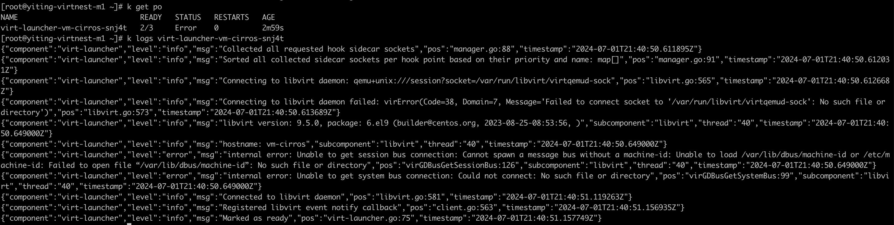

# VM Cannot Be Used Normally

If the created VM cannot be used normally, there are various reasons. Here are the troubleshooting directions:

## VM Creation Failed

When VM creation fails, check the detailed information of the VM in the target cluster:

```shell
kubectl -n your-namespace describe vm your-vm
```

If the detailed information involves storage such as PVC, PV, SC, etc., please check the SC status.
If the problem is not resolved, [consult developers](../../install/index.md#_4).

If the detailed information involves devices such as KVM, GPU, etc., please verify whether the target cluster nodes have completed [dependency checks](../install/install-dependency.md).
If all dependencies are installed, [consult developers](../../install/index.md#_4).

### Case 1

- Phenomenon: Error reported even with sufficient resources:

    

- Solution: [Enable hardware virtualization for nodes](../install/install-dependency.md#_3)

### Case 2


