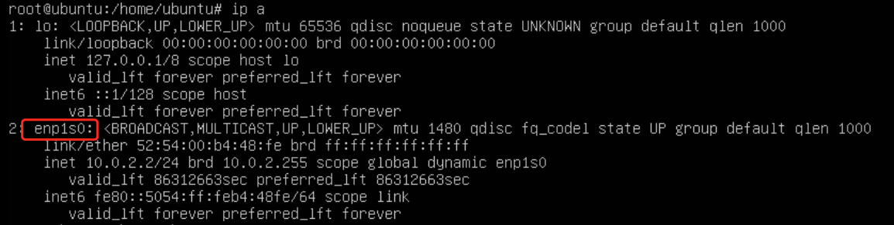

# Import a Virtual Machine with Ubuntu from an External Platform

This page provides a detailed introduction on how to import virtual machines from the external platform VMware into the virtual machines of DCE 5.0 through the command line.

!!! info

    The external virtual platform in this document is VMware vSphere Client, abbreviated as vSphere. Technically, it relies on kubevirt cdi for implementation. Before proceeding, the virtual machine imported on vSphere needs to be shut down.
    Take a virtual machine of the Ubuntu operating system as an example.

## Fetch Basic Information of vSphere Virtual Machine

1. vSphere URL: Fetch information on the URL of the target platform

2. vSphere SSL Certificate Thumbprint: Need to be fetched using openssl

    ```sh
    openssl s_client -connect 10.64.56.11:443 </dev/null | openssl x509 -in /dev/stdin -fingerprint -sha1 -noout
    ```
    Output will be similar to:
    ```output
    Can't use SSL_get_servername
    depth=0 CN = vcsa.daocloud.io
    verify error:num=20:unable to get local issuer certificate
    verify return:1
    depth=0 CN = vcsa.daocloud.io
    verify error:num=21:unable to verify the first certificate
    verify return:1
    depth=0 CN = vcsa.daocloud.io
    verify return:1
    DONE
    sha1 Fingerprint=C3:9D:D7:55:6A:43:11:2B:DE:BA:27:EA:3B:C2:13:AF:E4:12:62:4D  # Value needed
    ```

3. vSphere Account: Fetch account information for vSphere, and pay attention to permissions

4. vSphere Password: Fetch password information for vSphere

5. UUID of the virtual machine to be imported: Need to be fetched on the web page of vSphere

    - Access the Vsphere page, go to the details page of the virtual machine to be imported, click on __Edit Settings__ , open the browser's developer console at this point,
      click on __Network__ -> __Headers__ , find the URL as shown in the image below.
    
        <!-- Add image later -->

    - Click on __Response__ , locate __vmConfigContext__ -> __config__ , and finally find the target value __uuid__ .

        <!-- Add image later -->

6. Path of the vmdk file of the virtual machine to be imported

## Fetch Basic Information of vSphere Virtual Machine

1. Prepare vddk Image

    - Download vddk: Need to register an account on the [VMware website](https://developer.vmware.com/) to download
   
        Go to SDKs, click on "_Compute Virtualization_" in the section, and select the appropriate version of
        "_VMware Virtual Disk Development Kit (VDDK)_" for downloading.
   
         
   
        
   
        
   
    - Unpack and build into an image:
   
        - Unpack
       
            ```sh
            tar -xzf VMware-vix-disklib-<version>.x86_64.tar.gz
            ```
       
        - Create a Dockerfile
       
            ```sh
            FROM busybox:latest
            COPY vmware-vix-disklib-distrib /vmware-vix-disklib-distrib
            RUN mkdir -p /opt
            ENTRYPOINT ["cp", "-r", "/vmware-vix-disklib-distrib", "/opt"]
            EOF
            ```

        - Push the image to the repository

## Fetch vSphere Account Password Secret

```yaml
apiVersion: v1
kind: Secret
metadata:
  name: vsphere   # Can be changed
  labels:
    app: containerized-data-importer  # Do not change
    type: Opaque
    data:
      accessKeyId: "username-base64"
      secretKey: "password-base64"
```

## Configure kubevirt cdi configmap (vddk)

1. During the process of importing vSphere virtual machines into KubeVirt with CDI, the vddk component needs to be used.
   
2. Ensure that the namespace of the configmap is consistent with the namespace where CDI is located
  (the default namespace of Virtnest Agent is virtnest-system, in this example it is cdi).

    ```yaml
    apiVersion: v1
    kind: ConfigMap
    metadata:
      name: v2v-vmware
      namespace: cdi
      data:
        vddk-init-image: release-ci.daocloud.io/virtnest/vddk:v1
    ```

## Write kubevirt vm yaml to create vm

```yaml
    apiVersion: kubevirt.io/v1
    kind: VirtualMachine
    metadata:
      name: export-ubuntu-vddk
      namespace: default
    spec:
    dataVolumeTemplates:
        - metadata:
            name: systemdisk-export-ubuntu-vddk
            namespace: default
        spec:
            pvc:
            accessModes:
                - ReadWriteOnce
            resources:
                requests:
                storage: 20Gi
            storageClassName: local-path
            source:
            vddk:
                backingFile: "[esxi-d02-08-SSD] kubevirt-export-ubuntu-1/kubevirt-export-ubuntu-1.vmdk" # Disk from vSphere virtual machine basic information
                url: "https://10.64.56.11"   # vSphere URL
                uuid: "4234ea54-9b4b-b8ba-3de0-8612d8600648" # UUID from vSphere virtual machine basic information
                thumbprint: "C3:9D:D7:55:6A:43:11:2B:DE:BA:27:EA:3B:C2:13:AF:E4:12:62:4D" # vSphere SSL fingerprint
                secretRef: "vsphere"          # vSphere account password secret
    runStrategy: Always
    template:
        metadata:
        creationTimestamp: null
        spec:
        architecture: amd64
        domain:
            devices:
            disks:
                - disk:
                    bus: virtio
                bootOrder: 1
                name: systemdisk-export
            interfaces:
                - masquerade: {}
                name: default
            machine:
            type: q35
            resources:
            limits:
                cpu: "1"
                memory: 2Gi
            requests:
                cpu: "1"
                memory: 1Gi
        networks:
            - name: default
            pod: {}
        volumes:
            - dataVolume:
                name: systemdisk-export-ubuntu-vddk
            name: systemdisk-export
```

## Access VNC to verify successful operation

1. Modify the network configuration of the virtual machine

1. Check the current network

    When the actual import is completed, the configuration shown in the image below has been completed. However, it should be noted that the enp1s0 interface does not contain the inet field, so it cannot connect to the external network.
       
    

1. Configure netplan

    In the configuration shown in the image above, change the objects in ethernets to enp1s0 and obtain an IP address using DHCP.
        
    

1. Apply the netplan configuration to the system network configuration

    ```sh
    sudo netplan apply
    ```
 
1. Perform a ping test on the external network

    

1. Access the virtual machine on the node via SSH.

    
