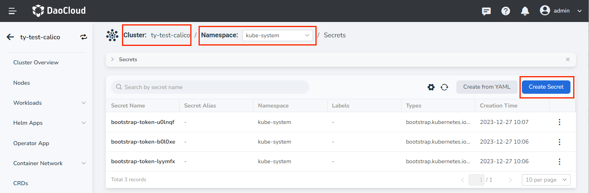
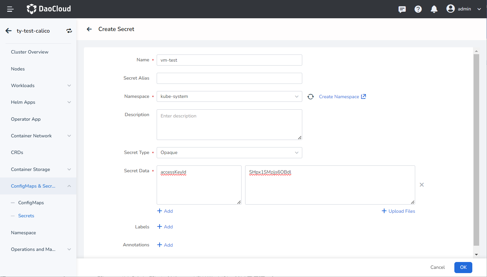
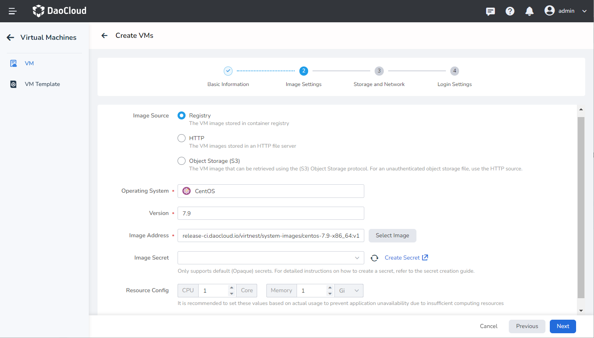

# Create Secret

When creating a virtual machine using Object Storage (S3) as the image source, sometimes you need to fill in a secret to get through S3's verification. The following will introduce how to create a secret that meets the requirements of the virtual machine.

## Procedure

1. Click on `Container Management` in the left navigation bar, then click on `Clusters`, enter the details of the cluster where the virtual machine is located, click on `ConfigMaps & Secrets`, select the `Secrets`, and click on `Create Secret`.

   

2. Enter the creation page, fill in the secret name, select the namespace that is the same as the virtual machine, and note that you need to select the default type `Opaque`. The secret data needs to follow the following principles

   - accessKeyId: Data represented in Base64 encoding
   - secretKey: Data represented in Base64 encoding

   

3. After successful creation, you can use the required secret when creating a virtual machine.

   
