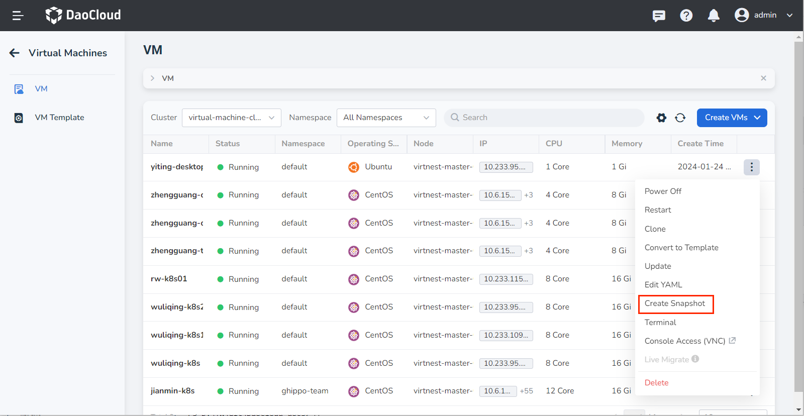
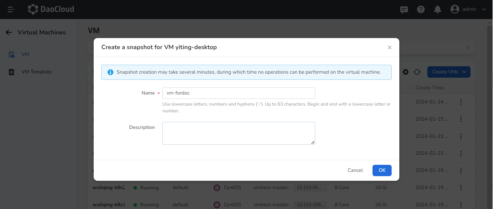
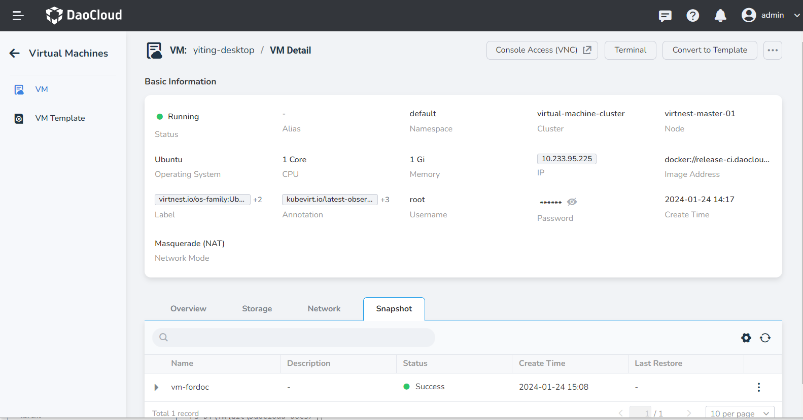
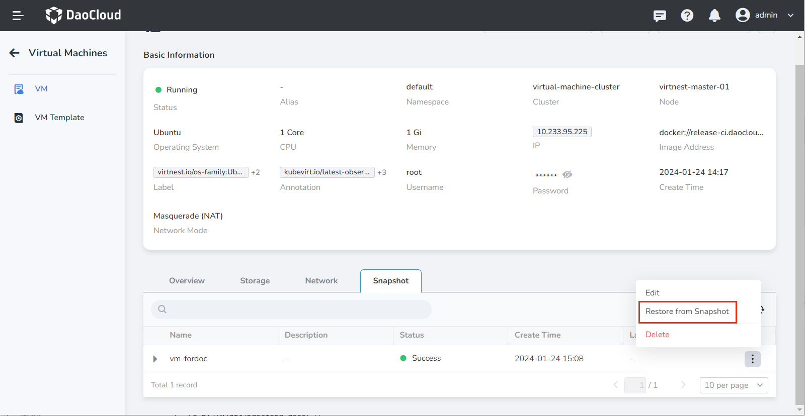
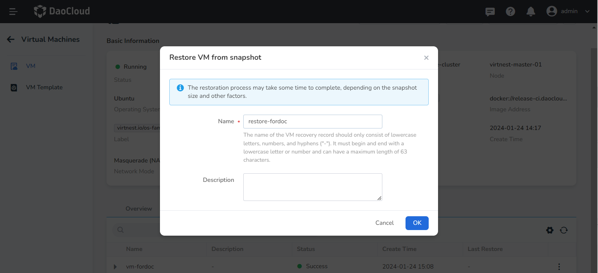

# Snapshot Management

This guide explains how to create snapshots for virtual machines and restore them.

You can create snapshots for virtual machines to save the current state of the virtual machine. A snapshot can be restored multiple times, and each time the virtual machine will be reverted to the state when the snapshot was created. Snapshots are commonly used for backup, recovery, rollback, etc.

## Prerequisites

Before using the snapshot feature, please ensure the following prerequisites are met:

- Only virtual machines in a non-error state can use the snapshot feature.
- If you need to use the snapshot feature, make sure that your StorageClass has created the proper VolumeSnapshotClass.

## Create a Snapshot

1. Click __Container Management__ in the left navigation menu, then click __Virtual Machines__ to access the list page. Click the __︙__ on the right side of the list for a virtual machine to perform snapshot operations (only available for non-error state virtual machines).

    

2. A dialog box will pop up, prompting you to input a name and description for the snapshot. Please note that the creation process may take a few minutes, during which you won't be able to perform any operations on the virtual machine.

    

3. After successfully creating the snapshot, you can view its details within the virtual machine's information section. Here, you have the option to edit the description, recover from the snapshot, delete it, among other operations.

    

## Restore from a Snapshot

1. Click __Restore from Snapshot__ and provide a name for the virtual machine recovery record. The recovery operation may take some time to complete, depending on the size of the snapshot and other factors. After a successful recovery, the virtual machine will be restored to the state when the snapshot was created.

    

2. After some time, you can scroll down to the snapshot information to view all the recovery records for the current snapshot. It also provides a way to locate the position of the recovery.

    
