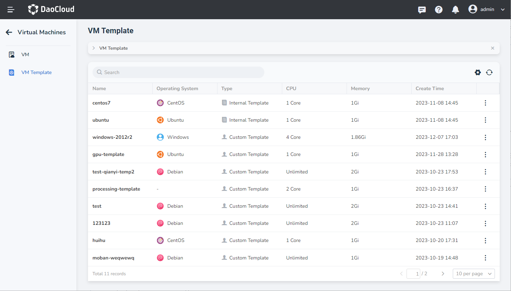
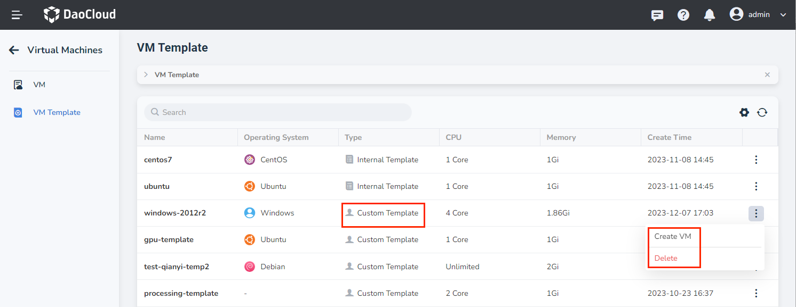
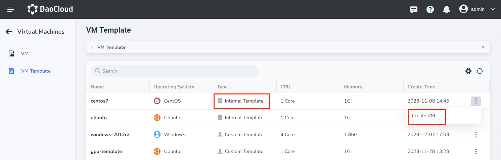
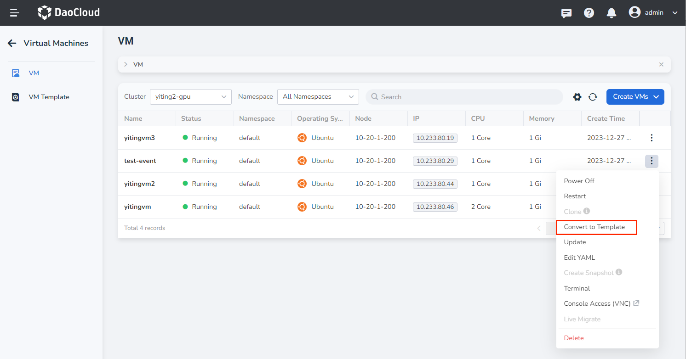
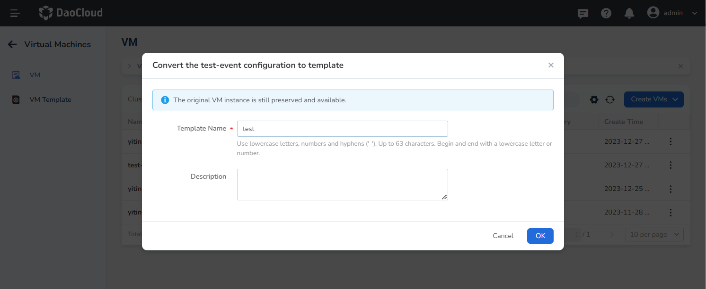

# VM Template

This guide explains the usage of internal VM templates and custom VM templates.

Using both internal and custom templates, users can easily create new VMs.
Additionally, we provide the ability to convert existing VMs into VM templates,
allowing users to manage and utilize resources more flexibly.

## VM Templates

1. Click `Container Management` in the left navigation menu, then click `VM Template` to access the `VM Template` page.

    

2. Click the `︙` on the right side of a template in the list. For internal templates, you can perform operations such as creating VMs and deleting the template. For custom templates, you can create VMs based on the template.

    

    

### Internal Templates

- The platform provides three internal templates, corresponding to the internal VMs.

### Custom Templates

Custom templates are created from VM configurations. The following steps explain how to convert a VM configuration into a template.

1. Click `Container Management` in the left navigation menu, then click `Virtual Machines` to access the list page. Click the `︙` on the right side of a VM in the list to convert the configuration into a template. Only running or stopped VMs can be converted.

    

2. Provide a name for the new template. A notification will indicate that the original VM will be preserved and remain available. After a successful conversion, a new entry will be added to the template list.

    
