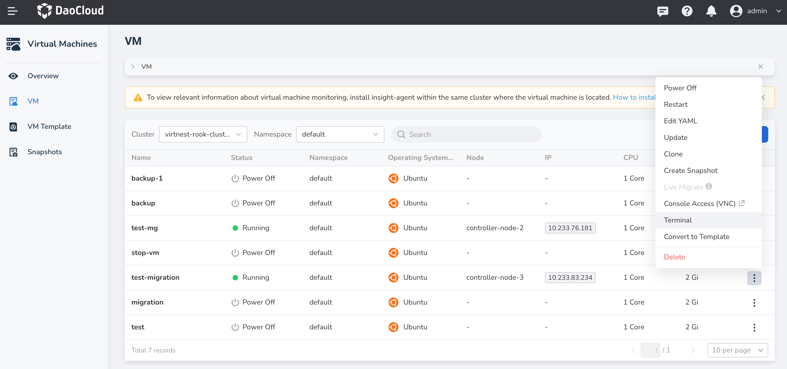

---
hide:
  - toc
MTPE: ModetaNiu
DATE: 2024-08-21
---

# Connect to Virtual Machines

This article will introduce two methods for connecting to virtual machines: Console Access (VNC) and Terminal Access.

## Terminal Access

Accessing virtual machines through the terminal provides more flexibility and lightweight access. However, 
it does not directly display the graphical interface, has limited interactivity, and does not support 
multiple concurrent terminal sessions.

In the left navigation bar, click __Virtual Machines__ -> __VM__ to enter the virtual machine list.  
If the virtual machine status is **Running** , click the __┇__ on the right side of the list,
and you can access the virtual machine through the **Terminal** .

## Console Access (VNC)

Accessing virtual machines through VNC allows you to access and control the full graphical interface of the 
remote computer. It provides a more interactive experience and allows intuitive operation of the remote device. 
However, it may have some performance impact, and it does not support multiple concurrent terminal sessions.

!!! tip 

    Choose VNC for Windows systems.

In the left navigation bar, click __Virtual Machines__ -> __VM__ to enter the virtual machine list.  
If the virtual machine status is **Running** , click the __┇__ on the right side of the list,
and you can access the virtual machine through the **Console Access (VNC)** .
